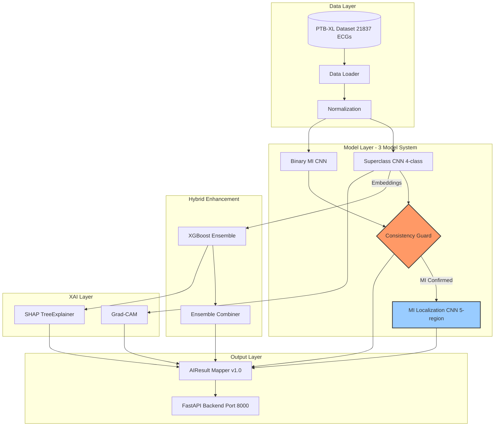
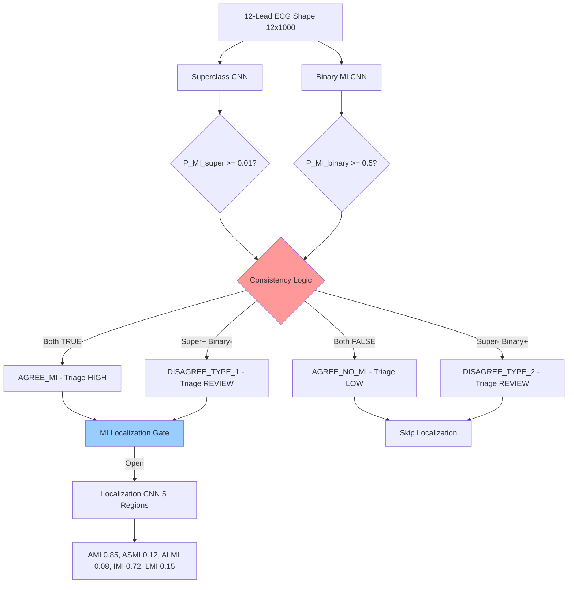
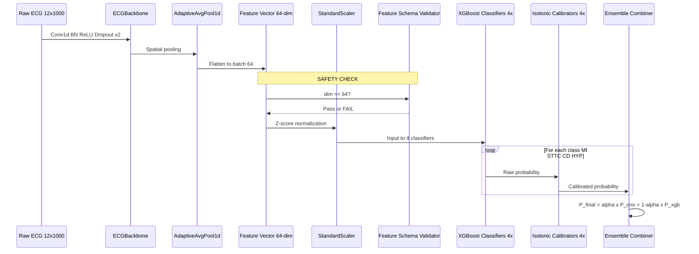
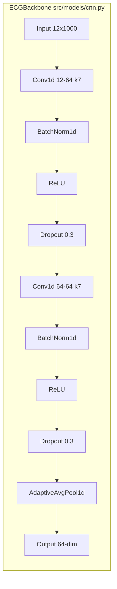

# CardioGuard-AI: ULTRA-DETAILED MASTER CONTEXT
> **Version:** 2.0.0 (Complete Production System)  
> **Updated:** 2026-01-17  
> **Purpose:** This is the "Theory of Everything" for CardioGuard-AI. Contains EVERY detail needed to:
> - Write an academic thesis
> - Generate professional diagrams  
> - Extend the codebase
> - Perform security audits
> - Train new team members

---

# TABLE OF CONTENTS
1. [Executive Summary](#1-executive-summary)
2. [Complete Architecture Diagrams](#2-complete-architecture-diagrams)
3. [Dataset: PTB-XL Deep Dive](#3-dataset-ptb-xl-deep-dive)
4. [Model Architecture Details](#4-model-architecture-details)
5. [Three-Model Orchestration System](#5-three-model-orchestration-system)
6. [Hybrid CNN-XGBoost Pipeline](#6-hybrid-cnn-xgboost-pipeline)
7. [MI Localization: The Derived Label System](#7-mi-localization-the-derived-label-system)
8. [Production Safety Mechanisms](#8-production-safety-mechanisms)
9. [XAI (Explainable AI) System](#9-xai-explainable-ai-system)
10. [API Contract: AIResult v1.0](#10-api-contract-airesult-v10)
11. [Complete File Structure](#11-complete-file-structure)
12. [Training Pipelines](#12-training-pipelines)
13. [Known Limitations](#13-known-limitations)
14. [Future Roadmap](#14-future-roadmap)
15. [Verification Commands](#15-verification-commands)

---

# 1. Executive Summary

## 1.1 What is CardioGuard-AI?
CardioGuard-AI is a **production-grade, hybrid, explainable AI system** for detecting Myocardial Infarction (MI) and other cardiac pathologies from 12-lead ECG signals.

## 1.2 Key Differentiators
| Feature | Description |
|---------|-------------|
| **Three-Model Orchestration** | Uses 3 specialized CNN models with cross-verification |
| **Consistency Guard** | Prevents false positives by comparing Binary MI vs Superclass predictions |
| **Hybrid Pipeline** | CNN features → XGBoost classifiers for enhanced precision |
| **Contract-Driven XAI** | Grad-CAM and SHAP are part of the API response, not afterthoughts |
| **Fail-Fast Safety** | System crashes on startup if checkpoints are invalid |

## 1.3 Clinical Task
- **Input:** 12-lead ECG signal (10 seconds @ 100Hz = 1000 samples per lead)
- **Primary Output:** Multi-label classification: MI, STTC, CD, HYP (+ derived NORM)
- **Secondary Output:** MI anatomical localization (AMI, ASMI, ALMI, IMI, LMI)

---

# 2. Complete Architecture Diagrams

## 2.1 High-Level System Overview


## 2.2 Three-Model Decision Flow (Detailed)


## 2.3 Hybrid CNN-XGBoost Pipeline


## 2.4 CNN Architecture (ECGBackbone)


---

# 3. Dataset: PTB-XL Deep Dive

## 3.1 Dataset Overview
| Property | Value |
|----------|-------|
| **Source** | PhysioNet PTB-XL |
| **Total Records** | 21,837 10-second ECGs |
| **Patients** | 18,885 unique patients |
| **Leads** | 12 standard leads |
| **Sampling Rates** | 100 Hz (used) and 500 Hz (available) |
| **Labels** | SCP codes with likelihood scores |

## 3.2 Data Split (Stratified by Patient)
```
Train: Folds 1-8 (17,469 records)
Val:   Fold 9   (2,189 records)
Test:  Fold 10  (2,179 records)
```

## 3.3 SCP Code to Superclass Mapping
**File:** `src/data/labels.py`

| Superclass | Definition | Example SCP Codes |
|------------|------------|-------------------|
| **NORM** | Normal ECG | NORM |
| **MI** | Myocardial Infarction | AMI, IMI, ASMI, ALMI, LMI, ILMI, IPLMI, IPMI, PMI, INJIN, INJAL, INJAS, INJIL, INJLA |
| **STTC** | ST/T Change | NDT, NST_, ISCA, ISCI, ISC_, STD_, STE_, etc. |
| **CD** | Conduction Disturbance | CLBBB, CRBBB, IRBBB, 1AVB, 2AVB, 3AVB, etc. |
| **HYP** | Hypertrophy | LVH, RVH, SEHYP, LAO/LAE, RAO/RAE, etc. |

## 3.4 NORM Derivation (Critical!)
> **NORM is NOT a classifier output. It is DERIVED.**

```python
norm_score = 1.0 - max(P_MI, P_STTC, P_CD, P_HYP)
norm_decision = not any(pathology_detected)
```

---

# 4. Model Architecture Details

## 4.1 ECGCNNConfig (Hyperparameters)
**File:** `src/models/cnn.py`

```python
@dataclass
class ECGCNNConfig:
    in_channels: int = 12      # 12-lead ECG
    num_filters: int = 64      # Feature dimension
    kernel_size: int = 7       # Temporal convolution kernel
    dropout: float = 0.3       # Regularization
    localization_output_dim: int = 2  # WARNING: This is for REGRESSION!
```

## 4.2 Model Variants

### 4.2.1 ECGCNN (Classification)
```python
class ECGCNN(nn.Module):
    backbone: ECGBackbone  # Shared feature extractor
    head: BinaryHead | MultiClassHead  # 1, 4, or 5 outputs
```

### 4.2.2 MultiTaskECGCNN (Classification + Regression)
```python
class MultiTaskECGCNN(nn.Module):
    backbone: ECGBackbone
    head: classification head
    localization_head: LocalizationHead  # 2 outputs (regression!)
```

> **WARNING:** `localization_output_dim=2` is for **temporal regression** (start/end boundaries), NOT MI localization classification!

## 4.3 Head Types
| Head | Output Dim | Use Case |
|------|------------|----------|
| `BinaryHead` | 1 | MI vs NORM |
| `MultiClassHead` | N | N-class classification |
| `FiveClassHead` | 5 | MI Localization regions |
| `LocalizationHead` | 2 | Temporal regression |

---

# 5. Three-Model Orchestration System

## 5.1 The Three Models

| Model | Checkpoint | Output Dim | Key Pattern | Task |
|-------|------------|------------|-------------|------|
| **Binary MI** | `ecgcnn.pt` | 1 | `1.classifier.weight` | MI vs NORM |
| **Superclass** | `ecgcnn_superclass.pt` | 4 | `head.weight` | Multi-label [MI,STTC,CD,HYP] |
| **MI Localization** | `ecgcnn_localization.pt` | 5 | `head.classifier.weight` | Anatomical regions |

## 5.2 Consistency Guard Logic
**File:** `src/pipeline/inference/consistency_guard.py`

```python
def check_consistency(
    superclass_mi_prob: float,
    binary_mi_prob: float,
    superclass_threshold: float = 0.01,  # High recall
    binary_threshold: float = 0.5,
) -> ConsistencyResult:
```

### Agreement Types
| Type | Super MI | Binary MI | Triage | Interpretation |
|------|----------|-----------|--------|----------------|
| AGREE_MI | ≥0.01 | ≥0.5 | HIGH | Confident MI |
| AGREE_NO_MI | <0.01 | <0.5 | LOW | Confident NORM |
| DISAGREE_TYPE_1 | ≥0.01 | <0.5 | REVIEW | Possible low-confidence MI |
| DISAGREE_TYPE_2 | <0.01 | ≥0.5 | REVIEW | Binary catches missed MI |

## 5.3 MI Localization Gate
```python
def should_run_localization(
    consistency: ConsistencyResult,
    gate_mode: str = "agreement"  # "agreement" | "any_mi" | "always"
) -> bool:
```

---

# 6. Hybrid CNN-XGBoost Pipeline

## 6.1 Why Hybrid?
- **CNN Strength:** Learns temporal patterns from raw waveforms
- **XGBoost Strength:** Excellent for tabular features, calibrated probabilities
- **Combined:** CNN extracts features → XGBoost classifies

## 6.2 Feature Extraction
```python
# In inference:
embeddings = cnn_model.backbone(signal_tensor)  # Shape: (1, 64)
```

## 6.3 XGBoost Models
**Location:** `logs/xgb_superclass/`
```
logs/xgb_superclass/
├── MI/
│   ├── xgb_model.json        # XGBoost model
│   └── calibrator.joblib     # Isotonic calibrator
├── STTC/
├── CD/
├── HYP/
├── scaler.joblib             # StandardScaler for features
└── feature_schema.json       # CRITICAL: Feature lock-in
```

## 6.4 Feature Schema (Safety)
**File:** `logs/xgb_superclass/feature_schema.json`
```json
{
  "version": "1.0.0",
  "feature_count": 64,
  "feature_names": ["cnn_feat_0", ..., "cnn_feat_63"],
  "embedder": {
    "type": "ECGCNN_backbone",
    "num_filters": 64
  }
}
```

## 6.5 Ensemble Formula
```python
P_final = α × P_cnn + (1 - α) × P_xgb
# α = 0.15 (90-10 validation optimal)
```

---

# 7. MI Localization: The Derived Label System

## 7.1 Label Space
**File:** `src/data/mi_localization.py`

| Property | Value |
|----------|-------|
| **Label Space ID** | `ptbxl_derived_anatomical_v1` |
| **Fingerprint** | `8ab274e06afa1be8` |
| **Number of Regions** | 5 |
| **Regions** | AMI, ASMI, ALMI, IMI, LMI |

## 7.2 SCP Code to Region Mapping
```python
MI_CODE_TO_REGIONS = {
    # Direct mappings
    "AMI": ["AMI"],
    "ASMI": ["ASMI"],
    "ALMI": ["ALMI"],
    "IMI": ["IMI"],
    "LMI": ["LMI"],
    
    # Combination mappings (multi-hot)
    "ILMI": ["IMI", "LMI"],     # Inferolateral
    "IPLMI": ["IMI", "LMI"],    # Inferoposterolateral
    "IPMI": ["IMI"],            # Inferoposterior
    
    # Subendocardial injury
    "INJIN": ["IMI"],
    "INJAL": ["ALMI"],
    "INJAS": ["ASMI"],
    "INJIL": ["IMI", "LMI"],
    "INJLA": ["LMI"],
}

EXCLUDED_MI_CODES = ["PMI"]  # Posterior MI excluded
```

## 7.3 Why Derived?
- PTB-XL has 13+ MI-related SCP codes
- We consolidate to 5 anatomical regions
- Some codes map to multiple regions (multi-hot)
- Fingerprint ensures mapping integrity at runtime

---

# 8. Production Safety Mechanisms

## 8.1 Fail-Fast Startup
**File:** `src/backend/main.py`

```python
@app.on_event("startup")
async def startup_event():
    # Validate BEFORE loading
    validate_all_checkpoints(strict=True)
    # Then load
    state.load_models()
```

## 8.2 Checkpoint Validation
**File:** `src/utils/checkpoint_validation.py`

| Check | Failure Mode |
|-------|--------------|
| Output dimension wrong | `CheckpointMismatchError` |
| Regression head used for classification | Rejected |
| MI mapping fingerprint changed | `MappingDriftError` |

## 8.3 Safe Model Loader
**File:** `src/utils/model_loader.py`

Handles schema differences:
- Sequential: `0.*, 1.*` keys
- ECGCNN: `backbone.*, head.classifier.*` keys
- Normalizes `head.weight` → `head.classifier.weight`

## 8.4 Feature Schema Validation
```python
def validate_feature_schema(embeddings_shape, schema, strict=True):
    if embeddings_shape[-1] != schema["feature_count"]:
        if strict:
            raise ValueError("Feature mismatch!")
```

---

# 9. XAI (Explainable AI) System

## 9.1 Available Methods
**Location:** `src/xai/`

| Method | File | Output |
|--------|------|--------|
| **Grad-CAM** | `gradcam.py` | Temporal heatmap |
| **SmoothGrad-CAM** | `gradcam.py` | Noise-averaged heatmap |
| **SHAP (XGBoost)** | `shap_xgb.py` | Feature importance |
| **SHAP (One-vs-Rest)** | `shap_ovr.py` | Per-class attribution |
| **Sanity Checks** | `sanity.py` | Model randomization tests |

## 9.2 Grad-CAM Implementation
```python
class GradCAM:
    def generate(self, inputs, class_index=None):
        # 1. Forward pass
        # 2. Backward pass to get gradients
        # 3. Weight activations by gradients
        # 4. ReLU and normalize
        return cam  # Shape: (1, 1000)
```

## 9.3 Artifact Discovery
```python
# In AIResult:
"explanations": {
    "enabled": True,
    "run_dir": "logs/xai_run_xxx",
    "artifacts": [
        {"type": "gradcam", "path": "gradcam_MI.png"},
        {"type": "shap", "path": "shap_summary.png"}
    ]
}
```

---

# 10. API Contract: AIResult v1.0

## 10.1 Full Schema
**File:** `src/contracts/airesult_mapper.py`

```json
{
  "identity": {
    "case_id": "string",
    "request_id": "uuid",
    "sample_id": "string",
    "created_at": "ISO8601"
  },
  "mode": "multilabel-superclass",
  "input": {
    "format": "npz",
    "sample_rate_hz": 100,
    "duration_sec": 10.0,
    "shape": [12, 1000],
    "leads": ["I","II","III","aVR","aVL","aVF","V1","V2","V3","V4","V5","V6"]
  },
  "predictions": {
    "multilabel": {
      "pathologies": [
        {"class": "MI", "probability": 0.85, "threshold": 0.5, "decision": true},
        {"class": "STTC", "probability": 0.12, "threshold": 0.5, "decision": false},
        {"class": "CD", "probability": 0.08, "threshold": 0.5, "decision": false},
        {"class": "HYP", "probability": 0.05, "threshold": 0.5, "decision": false}
      ],
      "norm": {
        "derived": true,
        "decision": false,
        "norm_score": 0.15,
        "derived_rule": "1 - max(pathology_probabilities)"
      }
    },
    "primary": {
      "label": "MI",
      "confidence": 0.85,
      "rule": "MI-first-then-priority"
    }
  },
  "localization": {
    "mi_detected": true,
    "label_space": "ptbxl_derived_anatomical_v1",
    "labels": ["AMI","ASMI","ALMI","IMI","LMI"],
    "mapping_fingerprint": "8ab274e06afa1be8",
    "mapping_source": "src/data/mi_localization.py",
    "subtypes": [
      {"code": "AMI", "probability": 0.85, "detected": true},
      {"code": "IMI", "probability": 0.72, "detected": true}
    ]
  },
  "triage": {
    "level": "HIGH",
    "rule": "MI detected"
  },
  "sources": {
    "cnn": {"MI": 0.82, ...},
    "xgb": {"MI": 0.88, ...},
    "ensemble": {"MI": 0.85, ...}
  },
  "explanations": {
    "enabled": true,
    "artifacts": [...]
  },
  "versions": {
    "cnn_checkpoint": "checkpoints/ecgcnn_superclass.pt",
    "airesult_version": "1.0.0"
  }
}
```

---

# 11. Complete File Structure

```
CardioGuard-AI/
├── checkpoints/
│   ├── ecgcnn.pt                    # Binary MI (145KB)
│   ├── ecgcnn_superclass.pt         # Superclass (433KB)
│   └── ecgcnn_localization.pt       # Localization (433KB)
│
├── src/
│   ├── config.py                    # PTBXLConfig, MI_CODES, etc.
│   ├── data/
│   │   ├── labels.py                # Label extraction functions
│   │   ├── mi_localization.py       # MI region mapping
│   │   └── signals.py               # Signal loading
│   ├── models/
│   │   └── cnn.py                   # ECGBackbone, ECGCNN, heads
│   ├── contracts/
│   │   ├── airesult_mapper.py       # AIResult v1.0
│   │   └── artifacts.py             # XAI artifact discovery
│   ├── pipeline/
│   │   ├── inference/
│   │   │   └── consistency_guard.py # Consistency logic
│   │   └── training/
│   │       └── train_superclass_cnn.py
│   ├── utils/
│   │   ├── checkpoint_validation.py # Fail-fast validation
│   │   └── model_loader.py          # Safe loading
│   ├── backend/
│   │   └── main.py                  # FastAPI app
│   └── xai/
│       ├── gradcam.py               # Grad-CAM
│       ├── shap_xgb.py              # SHAP for XGBoost
│       └── sanity.py                # Sanity checks
│
├── logs/
│   └── xgb_superclass/
│       ├── MI/xgb_model.json
│       ├── feature_schema.json      # Feature lock-in
│       └── scaler.joblib
│
├── tests/
│   ├── test_checkpoint_validation.py
│   ├── test_consistency_guard.py
│   └── test_airesult_mapper.py
│
└── artifacts/
    └── thresholds_superclass.json   # Optimized thresholds
```

---

# 12. Training Pipelines

## 12.1 Binary MI Training
```bash
python -m src.pipeline.training.train_binary_cnn \
    --epochs 50 \
    --lr 1e-3 \
    --batch_size 64
```

## 12.2 Superclass Training
```bash
python -m src.pipeline.training.train_superclass_cnn \
    --epochs 50 \
    --task superclass
```

## 12.3 MI Localization Training
```bash
python -m src.pipeline.training.train_localization \
    --pretrained checkpoints/ecgcnn_superclass.pt
```

## 12.4 XGBoost Training
```bash
python -m src.pipeline.training.train_xgboost \
    --cnn_checkpoint checkpoints/ecgcnn_superclass.pt
```

---

# 13. Known Limitations

| Limitation | Impact | Mitigation |
|------------|--------|------------|
| **PMI excluded** | Posterior MI not detected | Phase 2 planned |
| **12-lead required** | Cannot use reduced leads | Fail gracefully |
| **100Hz only** | 500Hz data requires resampling | Add resample |
| **No uncertainty** | No confidence intervals | MC Dropout planned |
| **NORM derived** | Not a direct classifier output | Documented in contract |

---

# 14. Future Roadmap

## Phase 2
- [ ] Add PMI detection (V7-V9 leads if available)
- [ ] Monte Carlo Dropout for uncertainty
- [ ] Multi-output localization instead of gated

## Phase 3
- [ ] RAG integration for clinical explanations
- [ ] LLM-generated patient summaries
- [ ] Real-time streaming inference

---

# 15. Verification Commands (PowerShell)

```powershell
# Run all tests
py -m pytest tests/ -v

# Check checkpoint dimensions
py -c "import torch; sd=torch.load('checkpoints/ecgcnn.pt', map_location='cpu'); print('Binary:', [k for k in sd.get('model_state_dict',sd) if 'classifier' in k])"

# Verify fingerprint
py -c "from src.utils.checkpoint_validation import compute_mapping_fingerprint; print('Fingerprint:', compute_mapping_fingerprint())"

# Start API
py -m uvicorn src.backend.main:app --reload --port 8000

# Health check
curl http://localhost:8000/health

# Predict (example)
curl -X POST http://localhost:8000/predict/superclass -F "file=@sample.npz"
```

---

> **END OF MASTER CONTEXT**
>
> This document is the complete "DNA" of CardioGuard-AI.
> Use it to instruct any LLM for:
> - Thesis writing
> - Diagram generation (Mermaid codes included)
> - Code refactoring
> - Security audits
> - New developer onboarding
