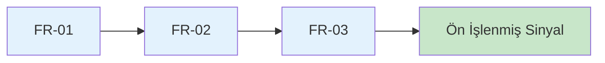
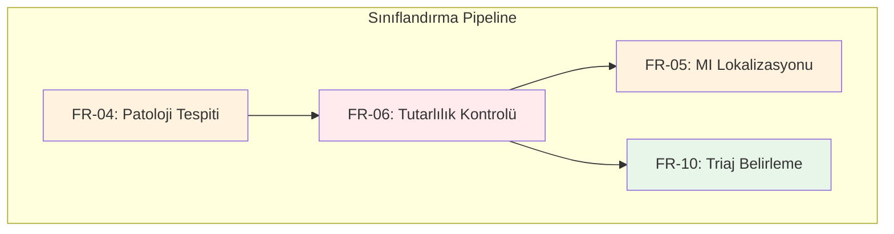
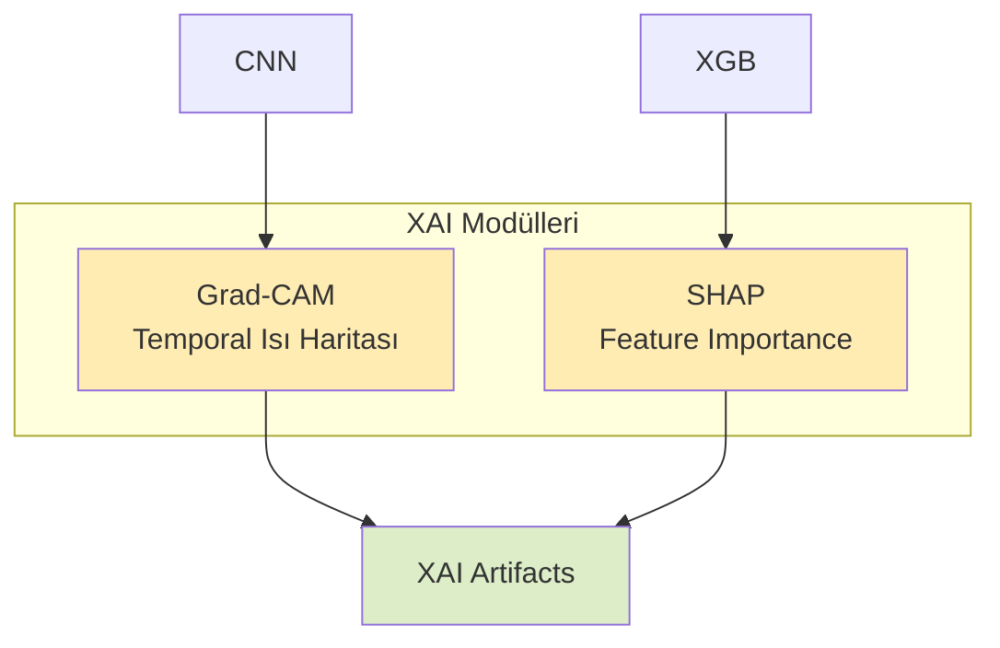
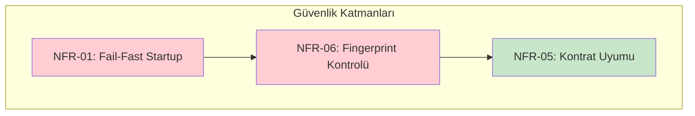
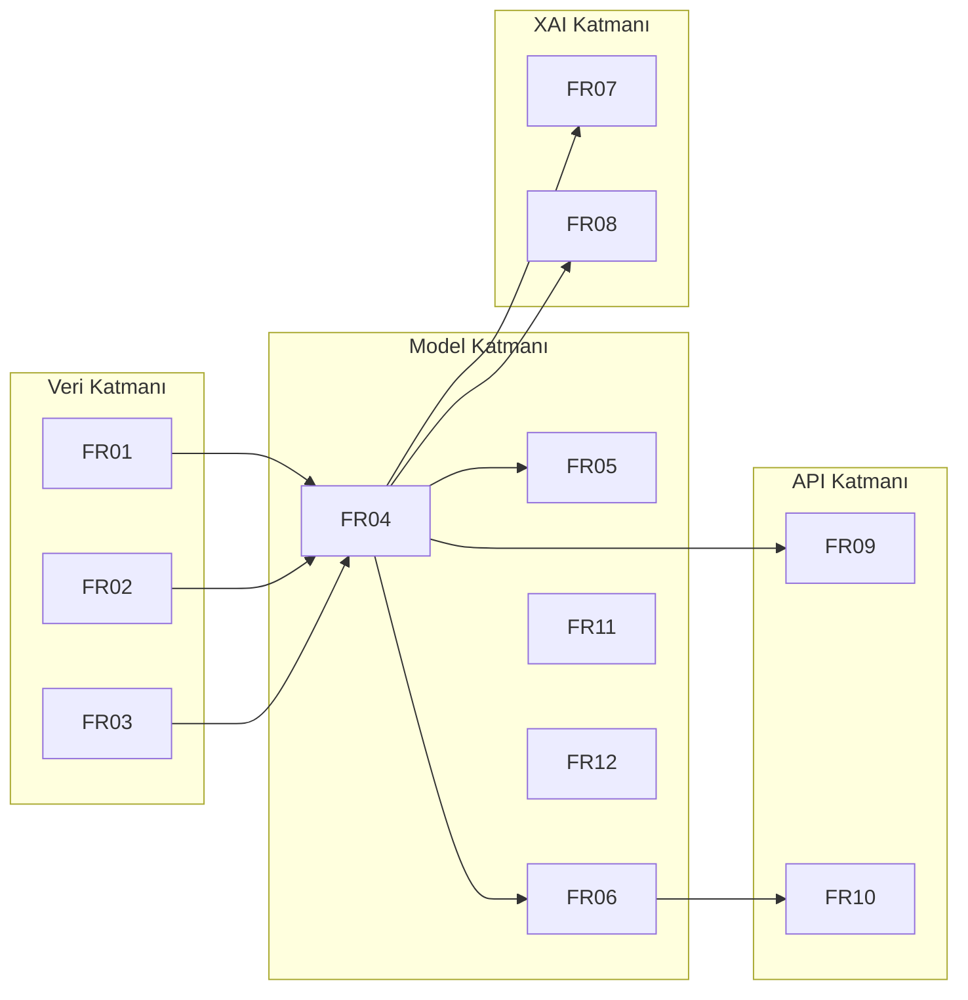

# CardioGuard-AI: Gereksinim Listesi
## (Requirements Specification)

---

## 📋 Doküman Bilgileri

| Özellik | Değer |
|---------|-------|
| **Proje Adı** | CardioGuard-AI |
| **Doküman Tipi** | Gereksinim Spesifikasyonu |
| **Versiyon** | 1.0.0 |
| **Tarih** | 2026-01-21 |
| **Durum** | Onaylı |

---

## 1. Giriş

### 1.1 Amaç
Bu doküman, CardioGuard-AI sisteminin tüm fonksiyonel ve fonksiyonel olmayan gereksinimlerini tanımlar. Sistem, 12-lead EKG sinyallerinden kardiyak patolojileri tespit eden hibrit bir yapay zeka platformudur.

### 1.2 Kapsam
- EKG sinyal işleme ve analizi
- Çoklu-etiket patoloji sınıflandırması
- MI anatomik lokalizasyonu
- Açıklanabilir yapay zeka (XAI) desteği
- REST API servisi

### 1.3 Tanımlar ve Kısaltmalar

| Kısaltma | Açıklama |
|----------|----------|
| **MI** | Myocardial Infarction (Miyokard Enfarktüsü) |
| **STTC** | ST/T Change (ST/T Değişikliği) |
| **CD** | Conduction Disturbance (İletim Bozukluğu) |
| **HYP** | Hypertrophy (Hipertrofi) |
| **NORM** | Normal EKG |
| **XAI** | Explainable AI (Açıklanabilir Yapay Zeka) |
| **CNN** | Convolutional Neural Network |
| **XGBoost** | Extreme Gradient Boosting |

---

## 2. Fonksiyonel Gereksinimler

### 2.1 Veri Yükleme ve İşleme



| ID | Gereksinim | Açıklama | Öncelik | Durum |
|----|------------|----------|---------|-------|
| **FR-01** | PTB-XL Veri Yükleme | Sistem, PTB-XL veri setinden EKG sinyallerini yükleyebilmelidir. WFDB formatı desteklenmelidir. | 🔴 Yüksek | ✅ Tamamlandı |
| **FR-02** | 12-Lead Sinyal İşleme | Sistem, 12-lead EKG sinyallerini işleyebilmelidir (1000 örnek × 12 kanal @ 100Hz). | 🔴 Yüksek | ✅ Tamamlandı |
| **FR-03** | Sinyal Normalizasyonu | Sistem, MinMax normalizasyonu ile her derivasyon için 0-1 aralığında ölçekleme yapabilmelidir. | 🔴 Yüksek | ✅ Tamamlandı |

---

### 2.2 Sınıflandırma ve Tahmin



| ID | Gereksinim | Açıklama | Öncelik | Durum |
|----|------------|----------|---------|-------|
| **FR-04** | Patoloji Sınıflandırması | Sistem, 4 patoloji sınıfını (MI, STTC, CD, HYP) çoklu-etiket olarak tespit edebilmelidir. Her sınıf için olasılık skoru ve karar çıktısı üretilmelidir. | 🔴 Yüksek | ✅ Tamamlandı |
| **FR-05** | MI Lokalizasyonu | Sistem, MI tespit edildiğinde 5 anatomik bölgeyi (AMI, ASMI, ALMI, IMI, LMI) lokalize edebilmelidir. Çoklu bölge tespiti desteklenmelidir. | 🔴 Yüksek | ✅ Tamamlandı |
| **FR-06** | Tutarlılık Kontrolü | Sistem, Binary MI ve Superclass MI modelleri arasında tutarlılık kontrolü yapabilmelidir. Uyumsuzluk durumunda REVIEW triajı atanmalıdır. | 🔴 Yüksek | ✅ Tamamlandı |
| **FR-10** | Triaj Seviyeleri | Sistem, tahmin sonuçlarına göre triaj seviyesi (HIGH/MEDIUM/LOW/REVIEW) belirleyebilmelidir. | 🔴 Yüksek | ✅ Tamamlandı |

---

### 2.3 Hibrit Model Pipeline

```mermaid
graph LR
    subgraph CNN
        E[Embedding<br/>64-dim]
    end
    
    subgraph XGBoost
        X1[XGB MI]
        X2[XGB STTC]
        X3[XGB CD]
        X4[XGB HYP]
    end
    
    subgraph Ensemble
        ENS[α×P_cnn + (1-α)×P_xgb]
    end
    
    E --> X1 & X2 & X3 & X4
    X1 & X2 & X3 & X4 --> ENS
    
    style E fill:#e1f5fe
    style ENS fill:#f3e5f5
```

| ID | Gereksinim | Açıklama | Öncelik | Durum |
|----|------------|----------|---------|-------|
| **FR-11** | NORM Türetme | Sistem, NORM skorunu `1 - max(P_MI, P_STTC, P_CD, P_HYP)` formülü ile türetebilmelidir. NORM bir classifier çıktısı değildir. | 🟡 Orta | ✅ Tamamlandı |
| **FR-12** | Ensemble Kombinasyonu | Sistem, CNN ve XGBoost olasılıklarını ağırlıklı ortalama ile birleştirebilmelidir (α = 0.15). | 🟡 Orta | ✅ Tamamlandı |

---

### 2.4 Açıklanabilirlik (XAI)



| ID | Gereksinim | Açıklama | Öncelik | Durum |
|----|------------|----------|---------|-------|
| **FR-07** | Grad-CAM Açıklamaları | Sistem, CNN modeli için Grad-CAM ile temporal açıklama haritaları üretebilmelidir. SmoothGrad-CAM desteği sağlanmalıdır. | 🟡 Orta | ✅ Tamamlandı |
| **FR-08** | SHAP Açıklamaları | Sistem, XGBoost modelleri için SHAP TreeExplainer ile özellik önem skorları üretebilmelidir. | 🟡 Orta | ✅ Tamamlandı |

---

### 2.5 API Servisi

| ID | Gereksinim | Açıklama | Öncelik | Durum |
|----|------------|----------|---------|-------|
| **FR-09** | REST API | Sistem, FastAPI üzerinden tahmin servisi sunabilmelidir. Endpoint'ler: `/predict/superclass`, `/predict/mi-localization`, `/health` | 🔴 Yüksek | ✅ Tamamlandı |

---

## 3. Fonksiyonel Olmayan Gereksinimler

### 3.1 Güvenilirlik ve Güvenlik



| ID | Gereksinim | Açıklama | Öncelik | Metrik |
|----|------------|----------|---------|--------|
| **NFR-01** | Fail-Fast Startup | Checkpoint doğrulama başlangıçta yapılmalı, hatalı checkpoint varsa sistem başlamamalıdır. | 🔴 Yüksek | Başlangıç süresi < 5s |
| **NFR-05** | Kontrat Uyumu | Tüm API çıktıları AIResult v1.0 kontratına uygun olmalıdır. | 🔴 Yüksek | %100 uyum |
| **NFR-06** | Mapping Fingerprint | MI lokalizasyon mapping fingerprint değişikliğinde sistem uyarı vermeli ve başlamamalıdır. | 🔴 Yüksek | Fingerprint: `8ab274e06afa1be8` |

---

### 3.2 Performans

| ID | Gereksinim | Açıklama | Öncelik | Metrik |
|----|------------|----------|---------|--------|
| **NFR-02** | API Yanıt Süresi | Tek tahmin için API yanıt süresi kabul edilebilir olmalıdır. | 🟡 Orta | < 500ms (CPU) |
| **NFR-03** | Model Boyutu | Toplam checkpoint boyutu optimize edilmelidir. | 🟢 Düşük | < 2MB |
| **NFR-04** | CPU Desteği | Sistem, GPU olmadan sadece CPU üzerinde çalışabilmelidir. | 🔴 Yüksek | PyTorch CPU backend |

---

## 4. Gereksinim İzlenebilirlik Matrisi



---

## 5. Kaynak Dosyalar

| Gereksinim | İlgili Dosya(lar) |
|------------|-------------------|
| FR-01, FR-02 | `src/data/signals.py`, `src/data/loader.py` |
| FR-03 | `src/data/signals.py` (normalize fonksiyonları) |
| FR-04 | `src/models/cnn.py`, `src/pipeline/training/train_superclass_cnn.py` |
| FR-05 | `src/data/mi_localization.py`, `src/pipeline/training/train_mi_localization.py` |
| FR-06 | `src/pipeline/inference/consistency_guard.py` |
| FR-07 | `src/xai/gradcam.py` |
| FR-08 | `src/xai/shap_xgb.py`, `src/xai/shap_ovr.py` |
| FR-09 | `src/backend/main.py` |
| FR-10 | `src/contracts/airesult_mapper.py` |
| FR-11 | `src/pipeline/inference/consistency_guard.py` (`derive_norm_from_superclass`) |
| FR-12 | `src/models/xgb.py` |
| NFR-01, NFR-06 | `src/utils/checkpoint_validation.py` |
| NFR-05 | `src/contracts/airesult_mapper.py` |

---

## 6. Onay

| Rol | İsim | Tarih | İmza |
|-----|------|-------|------|
| Proje Yöneticisi | | | |
| Teknik Lider | | | |
| QA Mühendisi | | | |

---

> **Not:** Bu doküman CardioGuard-AI v1.0.0 için geçerlidir. Gelecek versiyonlarda PMI (Posterior MI) desteği, Monte Carlo Dropout ile belirsizlik tahmini ve RAG entegrasyonu planlanmaktadır.
