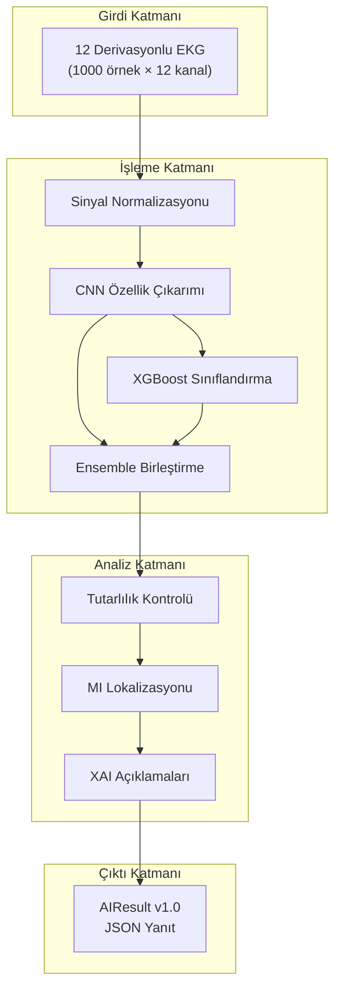
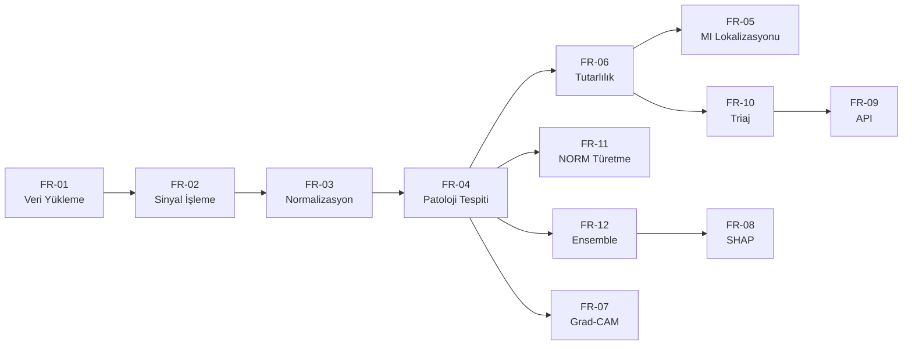

# CardioGuard-AI
# Yazılım Gereksinimleri Spesifikasyonu

---

**Proje Adı:** CardioGuard-AI  
**Doküman Tipi:** Yazılım Gereksinimleri Spesifikasyonu (SRS)  
**Versiyon:** 1.0.0  
**Tarih:** 21 Ocak 2026  
**Hazırlayan:** CardioGuard-AI Geliştirme Ekibi  
**Durum:** Onaylı

---

## İçindekiler

1. [Giriş](#1-giriş)
2. [Genel Açıklama](#2-genel-açıklama)
3. [Fonksiyonel Gereksinimler](#3-fonksiyonel-gereksinimler)
4. [Fonksiyonel Olmayan Gereksinimler](#4-fonksiyonel-olmayan-gereksinimler)
5. [Gereksinim İzlenebilirlik Matrisi](#5-gereksinim-izlenebilirlik-matrisi)
6. [Kaynak Dosya Eşlemeleri](#6-kaynak-dosya-eşlemeleri)
7. [Gelecek Geliştirmeler](#7-gelecek-geliştirmeler)

---

## 1. Giriş

### 1.1 Dokümanın Amacı

Bu doküman, CardioGuard-AI sisteminin tüm fonksiyonel ve fonksiyonel olmayan gereksinimlerini kapsamlı bir şekilde tanımlamaktadır. Doküman, yazılım geliştirme ekibi, test mühendisleri ve proje paydaşları için referans kaynağı olarak hazırlanmıştır.

### 1.2 Sistemin Kapsamı

CardioGuard-AI, 12 derivasyonlu elektrokardiyogram (EKG) sinyallerinden kardiyak patolojileri tespit eden hibrit bir yapay zeka platformudur. Sistem, derin öğrenme (CNN) ve geleneksel makine öğrenimi (XGBoost) yaklaşımlarını birleştirerek yüksek doğruluklu tanı desteği sağlamaktadır.

**Sistemin Temel Yetenekleri:**

- 12 derivasyonlu EKG sinyallerinin analizi
- Dört ana patoloji sınıfının çoklu etiketli tespiti (MI, STTC, CD, HYP)
- Miyokard enfarktüsü (MI) anatomik lokalizasyonu
- Açıklanabilir yapay zeka (XAI) ile karar şeffaflığı
- REST API üzerinden tahmin servisi

### 1.3 Tanımlar, Kısaltmalar ve Terimler

| Terim | Açıklama |
|-------|----------|
| **MI** | Myocardial Infarction - Miyokard Enfarktüsü. Kalp kasının kan akışının kesilmesi sonucu hasar görmesi durumu. |
| **STTC** | ST/T Change - ST/T Değişikliği. EKG'de ST segmenti ve T dalgasındaki anormallikler. |
| **CD** | Conduction Disturbance - İletim Bozukluğu. Kalbin elektriksel iletim sistemindeki anormallikler. |
| **HYP** | Hypertrophy - Hipertrofi. Kalp kasının anormal büyümesi. |
| **NORM** | Normal EKG. Herhangi bir patoloji bulgusu içermeyen kayıt. |
| **XAI** | Explainable AI - Açıklanabilir Yapay Zeka. Modelin karar sürecini görselleştiren teknikler. |
| **CNN** | Convolutional Neural Network - Evrişimsel Sinir Ağı. Zamansal sinyal analizi için kullanılan derin öğrenme mimarisi. |
| **XGBoost** | Extreme Gradient Boosting. Yüksek performanslı gradient boosting algoritması. |
| **PTB-XL** | PhysioNet PTB-XL Veritabanı. 21,837 kayıt içeren standart EKG veri seti. |
| **Grad-CAM** | Gradient-weighted Class Activation Mapping. CNN açıklaması için kullanılan görselleştirme tekniği. |
| **SHAP** | SHapley Additive exPlanations. Özellik önemini ölçen açıklama yöntemi. |
| **Triaj** | Hastaların aciliyet durumuna göre sınıflandırılması. |

### 1.4 Referanslar

| Referans | Açıklama |
|----------|----------|
| PTB-XL Veri Seti | Wagner et al., "PTB-XL, a large publicly available electrocardiography dataset", Scientific Data, 2020 |
| IEEE 830-1998 | Yazılım Gereksinimleri Spesifikasyonu Standardı |
| AIResult v1.0 | CardioGuard-AI API Kontrat Spesifikasyonu |

---

## 2. Genel Açıklama

### 2.1 Ürün Perspektifi

CardioGuard-AI, klinik karar destek sistemi olarak tasarlanmıştır. Sistem, mevcut hastane bilgi sistemleri (HIS) ve tıbbi görüntüleme yazılımları ile entegre çalışabilecek şekilde REST API tabanlı bir mimari üzerine inşa edilmiştir.

### 2.2 Ürün Fonksiyonları

Sistemin ana fonksiyonları aşağıdaki diyagramda özetlenmektedir:



### 2.3 Kullanıcı Sınıfları ve Özellikleri

| Kullanıcı Sınıfı | Özellikler | Beklentiler |
|------------------|------------|-------------|
| **Klinisyen** | Kardiyolog veya acil servis doktoru | Hızlı, güvenilir tanı desteği; açıklanabilir sonuçlar |
| **ML Mühendisi** | Yapay zeka uzmanı | Model eğitimi, performans optimizasyonu, checkpoint yönetimi |
| **Sistem Yöneticisi** | BT operasyon personeli | Sistem izleme, günlük yönetimi, sağlık kontrolleri |
| **Harici Sistemler** | HIS, PACS | API entegrasyonu, veri alışverişi |

### 2.4 Çalışma Ortamı

| Özellik | Değer |
|---------|-------|
| İşletim Sistemi | Linux (Ubuntu 20.04+), Windows Server 2019+ |
| Python Sürümü | 3.10+ |
| Framework | PyTorch 2.0+, FastAPI |
| Veritabanı | Dosya tabanlı (NPZ, JSON) |
| Donanım | CPU: 4+ çekirdek, RAM: 8+ GB, GPU: Opsiyonel |

### 2.5 Tasarım ve Uygulama Kısıtları

1. **Veri Gizliliği:** Hasta verileri KVKK/GDPR uyumlu işlenmelidir.
2. **Gerçek Zamanlı Performans:** API yanıt süresi 500ms'yi aşmamalıdır.
3. **Fail-Fast Yaklaşımı:** Hatalı checkpoint tespit edilirse sistem başlamamalıdır.
4. **Açıklanabilirlik:** Her tahmin için XAI açıklaması üretilebilmelidir.

---

## 3. Fonksiyonel Gereksinimler

### 3.1 Veri Yükleme ve İşleme Gereksinimleri

#### FR-01: PTB-XL Veri Yükleme

| Özellik | Değer |
|---------|-------|
| **Tanımlayıcı** | FR-01 |
| **Öncelik** | Yüksek |
| **Durum** | Tamamlandı |
| **Açıklama** | Sistem, PTB-XL veri setinden EKG sinyallerini yükleyebilmelidir. |

**Kabul Kriterleri:**
- WFDB formatındaki dosyalar okunabilmelidir.
- 100 Hz ve 500 Hz örnekleme hızları desteklenmelidir.
- Metadata (hasta yaşı, cinsiyeti, tanı kodları) çıkarılabilmelidir.

**Girdiler:** PTB-XL dizin yolu, metadata CSV dosyası
**Çıktılar:** Sinyal dizisi (numpy array), metadata DataFrame

---

#### FR-02: 12 Derivasyon Sinyal İşleme

| Özellik | Değer |
|---------|-------|
| **Tanımlayıcı** | FR-02 |
| **Öncelik** | Yüksek |
| **Durum** | Tamamlandı |
| **Açıklama** | Sistem, 12 derivasyonlu EKG sinyallerini işleyebilmelidir. |

**Teknik Detaylar:**
- Sinyal boyutu: 1000 örnek × 12 kanal
- Örnekleme frekansı: 100 Hz
- Kayıt süresi: 10 saniye
- Derivasyonlar: I, II, III, aVR, aVL, aVF, V1, V2, V3, V4, V5, V6

**Kabul Kriterleri:**
- Tüm 12 derivasyon paralel olarak yüklenebilmelidir.
- Eksik derivasyon durumunda hata döndürülmelidir.

---

#### FR-03: Sinyal Normalizasyonu

| Özellik | Değer |
|---------|-------|
| **Tanımlayıcı** | FR-03 |
| **Öncelik** | Yüksek |
| **Durum** | Tamamlandı |
| **Açıklama** | Sistem, MinMax normalizasyonu ile her derivasyon için 0-1 aralığında ölçekleme yapabilmelidir. |

**Normalizasyon Formülü:**
```
X_normalized = (X - X_min) / (X_max - X_min)
```

**Kabul Kriterleri:**
- Her derivasyon bağımsız olarak normalize edilmelidir.
- Çıktı değerleri [0, 1] aralığında olmalıdır.
- Sıfır bölme hatası önlenmelidir (X_max = X_min durumu).

---

### 3.2 Sınıflandırma ve Tahmin Gereksinimleri

#### FR-04: Patoloji Sınıflandırması

| Özellik | Değer |
|---------|-------|
| **Tanımlayıcı** | FR-04 |
| **Öncelik** | Yüksek |
| **Durum** | Tamamlandı |
| **Açıklama** | Sistem, dört patoloji sınıfını çoklu etiket olarak tespit edebilmelidir. |

**Desteklenen Patoloji Sınıfları:**

| Sınıf | Açıklama | PTB-XL Prevalans |
|-------|----------|------------------|
| MI | Miyokard Enfarktüsü | %25.1 (5,486 kayıt) |
| STTC | ST/T Değişikliği | %24.0 (5,250 kayıt) |
| CD | İletim Bozukluğu | %22.5 (4,907 kayıt) |
| HYP | Hipertrofi | %12.2 (2,655 kayıt) |

**Çıktı Formatı:**
- Her sınıf için olasılık skoru (0.0 - 1.0)
- Her sınıf için ikili karar (True/False)
- Eşik değerleri konfigüre edilebilir olmalıdır.

---

#### FR-05: MI Lokalizasyonu

| Özellik | Değer |
|---------|-------|
| **Tanımlayıcı** | FR-05 |
| **Öncelik** | Yüksek |
| **Durum** | Tamamlandı |
| **Açıklama** | Sistem, MI tespit edildiğinde beş anatomik bölgeyi lokalize edebilmelidir. |

**Desteklenen MI Bölgeleri:**

| Bölge | Açıklama | İlişkili SCP Kodları |
|-------|----------|---------------------|
| AMI | Anterior MI | AMI |
| ASMI | Anteroseptal MI | ASMI |
| ALMI | Anterolateral MI | ALMI |
| IMI | Inferior MI | IMI, ILMI, IPLMI |
| LMI | Lateral MI | LMI, ILMI, IPLMI |

**Kabul Kriterleri:**
- Çoklu bölge tespiti desteklenmelidir.
- Lokalizasyon sadece MI tespit edildiğinde çalışmalıdır.
- Bölge olasılıkları 0.0 - 1.0 aralığında olmalıdır.

---

#### FR-06: Tutarlılık Kontrolü

| Özellik | Değer |
|---------|-------|
| **Tanımlayıcı** | FR-06 |
| **Öncelik** | Yüksek |
| **Durum** | Tamamlandı |
| **Açıklama** | Sistem, Binary MI ve Superclass MI modelleri arasında tutarlılık kontrolü yapabilmelidir. |

**Uyum Tipleri:**

| Tip | Superclass MI | Binary MI | Triaj | Aksiyon |
|-----|---------------|-----------|-------|---------|
| AGREE_MI | Pozitif | Pozitif | Yüksek | Lokalizasyon çalıştır |
| AGREE_NO_MI | Negatif | Negatif | Düşük | Normal raporla |
| DISAGREE_TYPE_1 | Pozitif | Negatif | İnceleme | Lokalizasyon çalıştır |
| DISAGREE_TYPE_2 | Negatif | Pozitif | İnceleme | Manuel inceleme öner |

---

#### FR-09: REST API Servisi

| Özellik | Değer |
|---------|-------|
| **Tanımlayıcı** | FR-09 |
| **Öncelik** | Yüksek |
| **Durum** | Tamamlandı |
| **Açıklama** | Sistem, FastAPI framework üzerinden tahmin servisi sunabilmelidir. |

**API Uç Noktaları:**

| Uç Nokta | Metod | Açıklama |
|----------|-------|----------|
| /predict/superclass | POST | Çoklu etiket patoloji tahmini |
| /predict/mi-localization | POST | MI anatomik lokalizasyonu |
| /health | GET | Canlılık kontrolü |
| /ready | GET | Hazırlık kontrolü |

---

#### FR-10: Triaj Belirleme

| Özellik | Değer |
|---------|-------|
| **Tanımlayıcı** | FR-10 |
| **Öncelik** | Yüksek |
| **Durum** | Tamamlandı |
| **Açıklama** | Sistem, tahmin sonuçlarına göre triaj seviyesi belirleyebilmelidir. |

**Triaj Seviyeleri:**

| Seviye | Koşul | Renk Kodu | Aksiyon |
|--------|-------|-----------|---------|
| YÜKSEK | MI tespit (uyumlu) | Kırmızı | Acil değerlendirme |
| ORTA | Diğer patoloji | Sarı | Standart değerlendirme |
| DÜŞÜK | Normal | Yeşil | Rutin takip |
| İNCELEME | Model uyumsuzluğu | Turuncu | Manuel değerlendirme |

---

### 3.3 Hibrit Model Gereksinimleri

#### FR-11: NORM Türetme

| Özellik | Değer |
|---------|-------|
| **Tanımlayıcı** | FR-11 |
| **Öncelik** | Orta |
| **Durum** | Tamamlandı |
| **Açıklama** | Sistem, NORM skorunu diğer patoloji olasılıklarından türetebilmelidir. |

**Türetme Formülü:**
```
NORM_score = 1 - max(P_MI, P_STTC, P_CD, P_HYP)
```

**Önemli Not:** NORM, bağımsız bir sınıflandırıcı çıktısı değildir. Diğer dört patoloji sınıfının olasılıklarından türetilmektedir.

---

#### FR-12: Ensemble Kombinasyonu

| Özellik | Değer |
|---------|-------|
| **Tanımlayıcı** | FR-12 |
| **Öncelik** | Orta |
| **Durum** | Tamamlandı |
| **Açıklama** | Sistem, CNN ve XGBoost olasılıklarını ağırlıklı ortalama ile birleştirebilmelidir. |

**Ensemble Formülü:**
```
P_final = α × P_cnn + (1 - α) × P_xgb
```

**Varsayılan Ağırlık:** α = 0.15 (XGBoost ağırlıklı)

---

### 3.4 Açıklanabilirlik (XAI) Gereksinimleri

#### FR-07: Grad-CAM Açıklamaları

| Özellik | Değer |
|---------|-------|
| **Tanımlayıcı** | FR-07 |
| **Öncelik** | Orta |
| **Durum** | Tamamlandı |
| **Açıklama** | Sistem, CNN modeli için Grad-CAM ile zamansal açıklama haritaları üretebilmelidir. |

**Çıktı Formatı:**
- 1000 noktalık ısı haritası (sinyal uzunluğu)
- 0-1 aralığında normalize edilmiş değerler
- PNG görselleştirme (derivasyon başına overlay)

---

#### FR-08: SHAP Açıklamaları

| Özellik | Değer |
|---------|-------|
| **Tanımlayıcı** | FR-08 |
| **Öncelik** | Orta |
| **Durum** | Tamamlandı |
| **Açıklama** | Sistem, XGBoost modelleri için SHAP TreeExplainer ile özellik önem skorları üretebilmelidir. |

**Çıktı Formatı:**
- 64 özellik için SHAP değerleri
- Özet grafik (summary plot)
- Sınıf başına özellik önem sıralaması

---

## 4. Fonksiyonel Olmayan Gereksinimler

### 4.1 Güvenilirlik Gereksinimleri

#### NFR-01: Hızlı Başarısızlık (Fail-Fast)

| Özellik | Değer |
|---------|-------|
| **Tanımlayıcı** | NFR-01 |
| **Öncelik** | Yüksek |
| **Metrik** | Başlangıç süresi < 5 saniye |
| **Açıklama** | Checkpoint doğrulaması başlangıçta yapılmalı, hatalı checkpoint varsa sistem başlamamalıdır. |

**Doğrulama Kontrolleri:**
- Checkpoint dosyası varlığı
- Model çıktı boyutu uyumu
- Mapping fingerprint değişikliği

---

#### NFR-05: Kontrat Uyumu

| Özellik | Değer |
|---------|-------|
| **Tanımlayıcı** | NFR-05 |
| **Öncelik** | Yüksek |
| **Metrik** | %100 uyum |
| **Açıklama** | Tüm API çıktıları AIResult v1.0 kontratına uygun olmalıdır. |

---

#### NFR-06: Mapping Fingerprint

| Özellik | Değer |
|---------|-------|
| **Tanımlayıcı** | NFR-06 |
| **Öncelik** | Yüksek |
| **Metrik** | Fingerprint: 8ab274e06afa1be8 |
| **Açıklama** | MI lokalizasyon eşleme parmak izi değişikliğinde sistem uyarı vermeli ve başlamamalıdır. |

---

### 4.2 Performans Gereksinimleri

| ID | Gereksinim | Metrik | Ölçüm Yöntemi |
|----|------------|--------|---------------|
| NFR-02 | API Yanıt Süresi | < 500ms (CPU) | End-to-end latency |
| NFR-03 | Model Boyutu | < 2 MB toplam | Checkpoint dosya boyutları |
| NFR-04 | CPU Desteği | PyTorch CPU backend | GPU olmadan çalışabilirlik |

---

## 5. Gereksinim İzlenebilirlik Matrisi

### 5.1 Gereksinim Bağımlılıkları



### 5.2 Gereksinim Kategorileri Özeti

| Kategori | Gereksinim Sayısı | Tamamlanan | Oran |
|----------|-------------------|------------|------|
| Veri İşleme | 3 | 3 | %100 |
| Sınıflandırma | 4 | 4 | %100 |
| Hibrit Model | 2 | 2 | %100 |
| Açıklanabilirlik | 2 | 2 | %100 |
| API Servisi | 2 | 2 | %100 |
| Fonksiyonel Olmayan | 6 | 6 | %100 |
| **TOPLAM** | **19** | **19** | **%100** |

---

## 6. Kaynak Dosya Eşlemeleri

| Gereksinim | Kaynak Dosyalar | Modül |
|------------|-----------------|-------|
| FR-01, FR-02 | src/data/signals.py, src/data/loader.py | Veri Yükleme |
| FR-03 | src/data/signals.py | Normalizasyon |
| FR-04 | src/models/cnn.py, src/pipeline/training/train_superclass_cnn.py | Model |
| FR-05 | src/data/mi_localization.py, src/pipeline/training/train_mi_localization.py | Lokalizasyon |
| FR-06, FR-11 | src/pipeline/inference/consistency_guard.py | Tutarlılık |
| FR-07 | src/xai/gradcam.py | XAI |
| FR-08 | src/xai/shap_xgb.py, src/xai/shap_ovr.py | XAI |
| FR-09, FR-10 | src/backend/main.py, src/contracts/airesult_mapper.py | API |
| FR-12 | src/models/xgb.py | Ensemble |
| NFR-01, NFR-06 | src/utils/checkpoint_validation.py | Doğrulama |

---

## 7. Gelecek Geliştirmeler

### 7.1 Planlanan Gereksinimler (v2.0)

| ID | Gereksinim | Açıklama | Hedef Versiyon |
|----|------------|----------|----------------|
| FR-13 | RAG Entegrasyonu | Klinik kılavuzlar ile zenginleştirilmiş sonuçlar | v2.0 |
| FR-14 | Belirsizlik Tahmini | Monte Carlo Dropout ile güven aralığı | v2.0 |
| FR-15 | LLM Rapor Üretimi | Büyük dil modeli ile otomatik klinik rapor | v2.0 |
| FR-16 | PMI Desteği | Posterior MI lokalizasyonu | v2.0 |
| FR-17 | Canlı EKG Akışı | Gerçek zamanlı sinyal analizi | v2.0 |

### 7.2 Teknoloji Yol Haritası

| Özellik | Mevcut (v1.0) | Planlanan (v2.0) |
|---------|---------------|------------------|
| Model Mimarisi | CNN + XGBoost | + Transformer |
| Açıklama | Grad-CAM, SHAP | + Attention Maps |
| Raporlama | JSON | + LLM Narratives |
| Belirsizlik | Yok | MC Dropout |
| Bağlam | Yok | RAG |

---

## Onay Sayfası

| Rol | Ad Soyad | Tarih | İmza |
|-----|----------|-------|------|
| Proje Yöneticisi | | | |
| Teknik Lider | | | |
| Yazılım Mimarı | | | |
| Kalite Güvence Mühendisi | | | |
| Ürün Sahibi | | | |

---

## Revizyon Geçmişi

| Versiyon | Tarih | Değişiklik | Yazar |
|----------|-------|------------|-------|
| 1.0.0 | 21.01.2026 | İlk sürüm | CardioGuard-AI Ekibi |

---

**Doküman Sonu**
