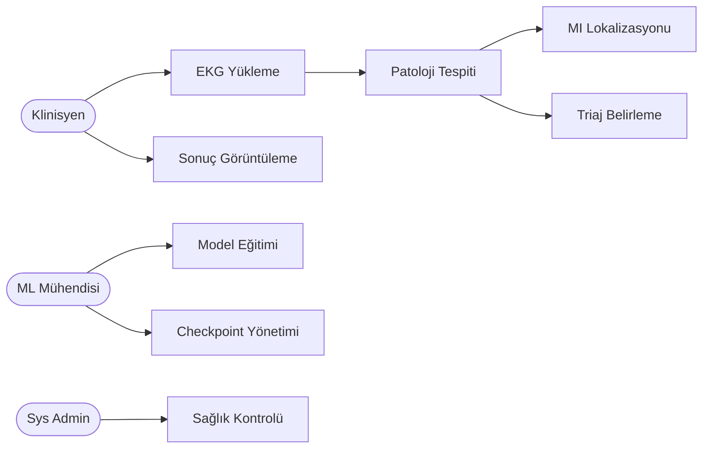

# CardioGuard-AI
# Kullanım Senaryoları Dokümanı

---

**Proje Adı:** CardioGuard-AI  
**Doküman Tipi:** Kullanım Senaryoları (Use Case)  
**Versiyon:** 1.0.0  
**Tarih:** 21 Ocak 2026

---

## 1. Kullanım Senaryoları Diyagramı

---

## 2. Aktörler

| Aktör | Açıklama |
|-------|----------|
| Klinisyen | EKG analizi talep eder, sonuçları yorumlar |
| ML Mühendisi | Model eğitimi ve optimizasyonu yapar |
| Sys Admin | Sistem izleme ve bakım yapar |

---

## 3. Kullanım Senaryoları

| ID | Ad | Aktör | Öncelik |
|----|-----|-------|---------|
| UC1 | EKG Yükleme | Klinisyen | Yüksek |
| UC2 | Patoloji Tespiti | Sistem | Yüksek |
| UC3 | MI Lokalizasyonu | Sistem | Yüksek |
| UC4 | Sonuç Görüntüleme | Klinisyen | Yüksek |
| UC6 | Model Eğitimi | ML Mühendisi | Yüksek |
| UC7 | Checkpoint Yönetimi | ML Mühendisi | Orta |
| UC8 | Sağlık Kontrolü | Sys Admin | Orta |
| UC9 | Triaj Belirleme | Sistem | Yüksek |

---

## 4. Senaryo Akışları

### UC1: EKG Yükleme
1. Klinisyen EKG dosyasını seçer
2. Sistem format kontrolü yapar
3. Sistem sinyali normalize eder
4. Patoloji tespiti başlar

### UC2: Patoloji Tespiti
1. CNN modeli çıkarım yapar
2. XGBoost tahmin üretir
3. Ensemble birleştirme yapılır
4. Tutarlılık kontrolü yapılır

### UC3: MI Lokalizasyonu
- **Tetikleme:** MI tespit edilirse
- **Çıktı:** 5 bölge (AMI, ASMI, ALMI, IMI, LMI)

### UC9: Triaj Belirleme

| Sonuç | Triaj |
|-------|-------|
| MI Tespit | Yüksek |
| Diğer Patoloji | Orta |
| Normal | Düşük |

---

## 5. Planlanan Senaryolar (v2.0)

| ID | Ad | Açıklama |
|----|-----|----------|
| UC10 | RAG Entegrasyonu | Klinik kılavuzlarla zenginleştirme |
| UC11 | LLM Rapor | Otomatik klinik rapor üretimi |

---

## Onay Sayfası

| Rol | Ad Soyad | Tarih | İmza |
|-----|----------|-------|------|
| Proje Yöneticisi | | | |
| Teknik Lider | | | |

---

**Doküman Sonu**
