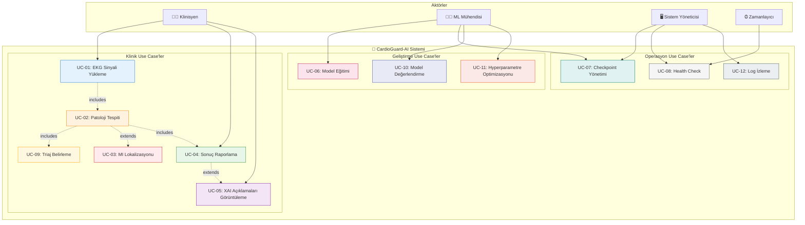
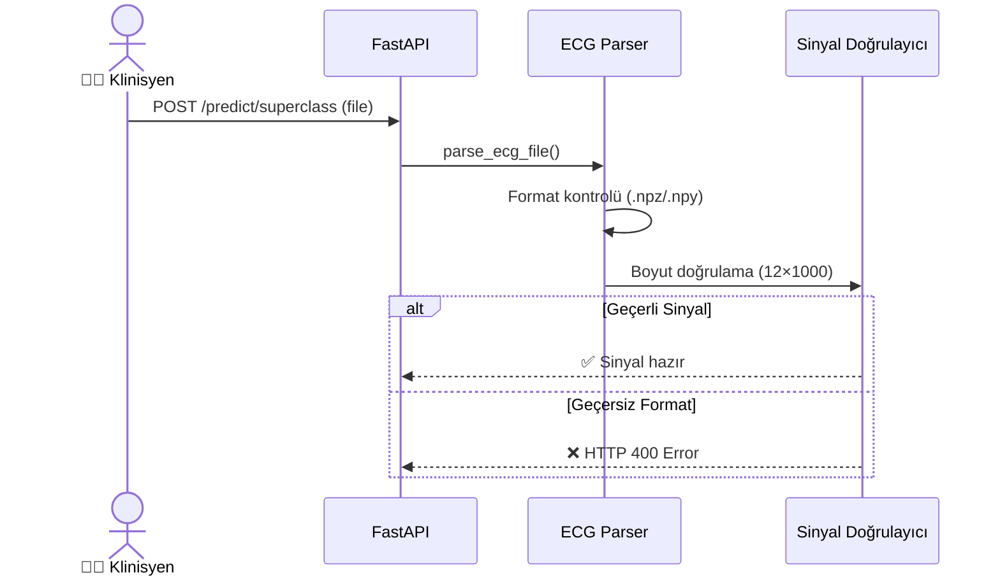
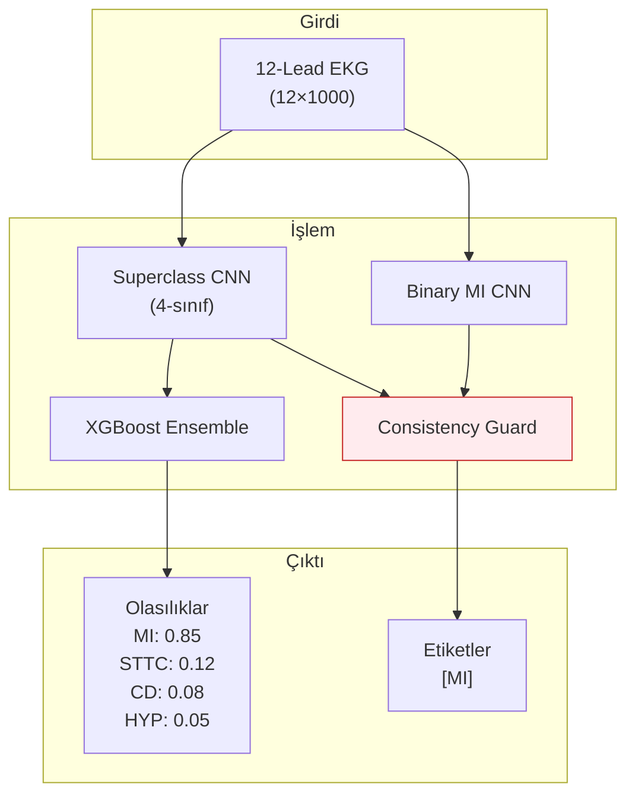
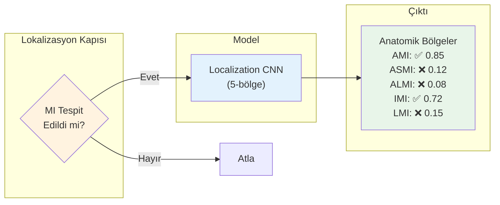
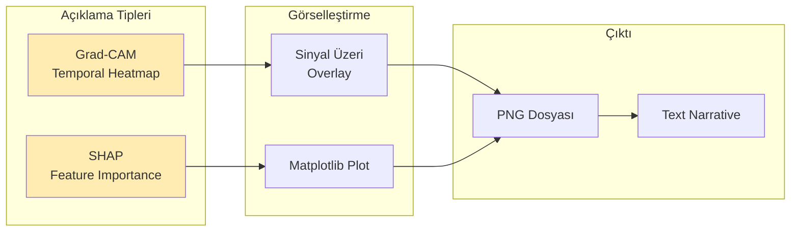
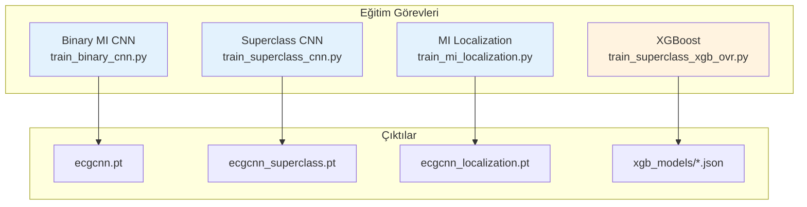
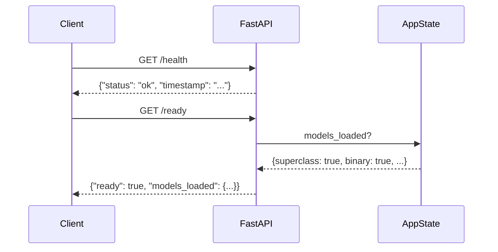
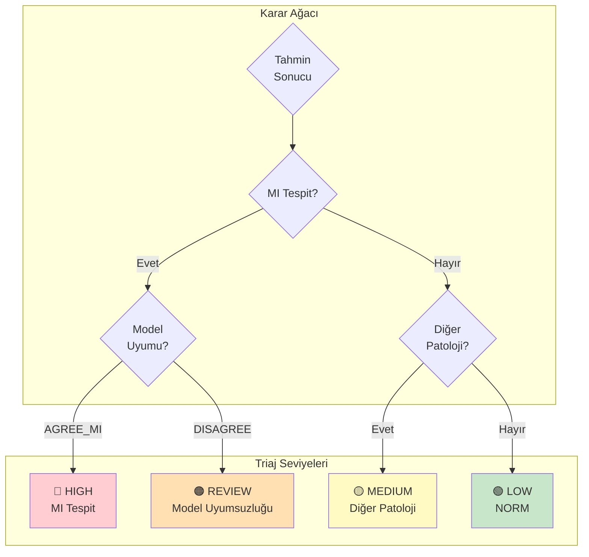
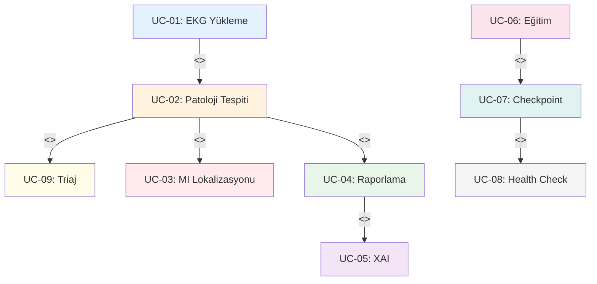

# CardioGuard-AI: Use Case Diyagramı
## (Kullanım Senaryoları)

---

## 📋 Doküman Bilgileri

| Özellik | Değer |
|---------|-------|
| **Proje Adı** | CardioGuard-AI |
| **Doküman Tipi** | Use Case Diyagramı |
| **Versiyon** | 1.0.0 |
| **Tarih** | 2026-01-21 |

---

## 1. Aktörler

### 1.1 Birincil Aktörler

| Aktör | Açıklama | Rol |
|-------|----------|-----|
| 👨‍⚕️ **Klinisyen** | Hastane doktoru veya kardiyolog | EKG analizi talep eder, sonuçları yorumlar |
| 🧑‍💻 **ML Mühendisi** | Makine öğrenimi uzmanı | Model eğitimi ve optimizasyonu yapar |
| 🖥️ **Sistem Yöneticisi** | IT operasyon personeli | Sistem bakımı ve izleme yapar |

### 1.2 İkincil Aktörler

| Aktör | Açıklama | Rol |
|-------|----------|-----|
| ⏰ **Zamanlayıcı** | Otomatik görev planlayıcı | Periyodik görevleri tetikler |
| 📊 **Harici Sistemler** | Hastane bilgi sistemi (HIS) | Veri entegrasyonu sağlar |

---

## 2. Use Case Diyagramı



---

## 3. Use Case Detayları

### UC-01: EKG Sinyali Yükleme



| Özellik | Değer |
|---------|-------|
| **ID** | UC-01 |
| **İsim** | EKG Sinyali Yükleme |
| **Aktör** | Klinisyen |
| **Ön Koşul** | Kullanıcı sisteme bağlı |
| **Son Koşul** | Sinyal işlenmeye hazır |
| **Temel Akış** | 1. Kullanıcı EKG dosyasını seçer<br/>2. Sistem formatı doğrular<br/>3. Sistem boyutu kontrol eder<br/>4. Sinyal normalize edilir |
| **Alternatif Akış** | - Geçersiz format: Hata mesajı göster<br/>- Yanlış boyut: Hata mesajı göster |

---

### UC-02: Patoloji Tespiti



| Özellik | Değer |
|---------|-------|
| **ID** | UC-02 |
| **İsim** | Patoloji Tespiti |
| **Aktör** | Sistem (UC-01 tarafından tetiklenir) |
| **Ön Koşul** | EKG sinyali yüklenmiş ve normalize edilmiş |
| **Son Koşul** | Patoloji olasılıkları ve etiketler üretilmiş |
| **Temel Akış** | 1. CNN modeli ileri geçiş<br/>2. XGBoost tahmin<br/>3. Ensemble kombinasyonu<br/>4. Tutarlılık kontrolü<br/>5. Etiket belirleme |

---

### UC-03: MI Lokalizasyonu



| Özellik | Değer |
|---------|-------|
| **ID** | UC-03 |
| **İsim** | MI Lokalizasyonu |
| **Aktör** | Sistem (UC-02 sonrası koşullu) |
| **Ön Koşul** | MI tespit edilmiş (AGREE_MI veya DISAGREE_TYPE_1) |
| **Son Koşul** | Anatomik MI bölgeleri belirlenmiş |
| **Temel Akış** | 1. MI gate kontrolü<br/>2. Lokalizasyon CNN çalıştır<br/>3. 5 bölge için olasılık üret<br/>4. Eşik üzeri bölgeleri işaretle |
| **Bölgeler** | AMI (Anterior), ASMI (Anteroseptal), ALMI (Anterolateral), IMI (Inferior), LMI (Lateral) |

---

### UC-04: Sonuç Raporlama

```mermaid
graph TB
    subgraph Girdiler
        PREDS["Tahminler"]
        TRIAGE["Triaj Seviyesi"]
        XAI_OUT["XAI Artifacts"]
    end
    
    subgraph Mapper["AIResult Mapper v1.0"]
        MAP["JSON Dönüşümü"]
    end
    
    subgraph Çıktı
        JSON["```json
{
  identity: {...},
  predictions: {...},
  localization: {...},
  triage: {...},
  explanations: {...}
}
```"]
    end
    
    PREDS & TRIAGE & XAI_OUT --> MAP --> JSON
    
    style MAP fill:#f3e5f5
```

| Özellik | Değer |
|---------|-------|
| **ID** | UC-04 |
| **İsim** | Sonuç Raporlama |
| **Aktör** | Klinisyen |
| **Ön Koşul** | Tüm tahminler tamamlanmış |
| **Son Koşul** | AIResult v1.0 formatında rapor üretilmiş |
| **Çıktı Alanları** | identity, mode, input, predictions, localization, triage, sources, explanations, versions |

---

### UC-05: XAI Açıklamaları Görüntüleme



| Özellik | Değer |
|---------|-------|
| **ID** | UC-05 |
| **İsim** | XAI Açıklamaları Görüntüleme |
| **Aktör** | Klinisyen |
| **Ön Koşul** | Tahmin tamamlanmış, XAI aktif |
| **Son Koşul** | Görsel açıklamalar üretilmiş |
| **Artifact Tipleri** | gradcam_MI.png, shap_summary.png, narrative.md |

---

### UC-06: Model Eğitimi



| Özellik | Değer |
|---------|-------|
| **ID** | UC-06 |
| **İsim** | Model Eğitimi |
| **Aktör** | ML Mühendisi |
| **Ön Koşul** | PTB-XL veri seti mevcut |
| **Son Koşul** | Checkpoint dosyaları üretilmiş |
| **Eğitim Parametreleri** | epochs=50, lr=1e-3, batch_size=64 |

---

### UC-07: Checkpoint Yönetimi

| Özellik | Değer |
|---------|-------|
| **ID** | UC-07 |
| **İsim** | Checkpoint Yönetimi |
| **Aktörler** | ML Mühendisi, Sistem Yöneticisi |
| **Ön Koşul** | Checkpoint dosyaları mevcut |
| **Son Koşul** | Checkpoint'ler doğrulanmış ve yüklenmiş |
| **Alt Use Case'ler** | - Checkpoint doğrulama<br/>- Checkpoint güncelleme<br/>- Rollback |

---

### UC-08: Health Check



| Özellik | Değer |
|---------|-------|
| **ID** | UC-08 |
| **İsim** | Health Check |
| **Aktörler** | Sistem Yöneticisi, Zamanlayıcı |
| **Endpoint'ler** | `/health`, `/ready` |
| **Amaç** | Sistem ve model durumunu izleme |

---

### UC-09: Triaj Belirleme



| Özellik | Değer |
|---------|-------|
| **ID** | UC-09 |
| **İsim** | Triaj Belirleme |
| **Aktör** | Sistem (otomatik) |
| **Seviyeleri** | HIGH, MEDIUM, LOW, REVIEW |
| **Kural** | MI → HIGH, Diğer Patoloji → MEDIUM, NORM → LOW, Uyumsuzluk → REVIEW |

---

## 4. Use Case İlişkileri



---

## 5. Öncelik Matrisi

| Use Case | Öncelik | Zorunluluk | Versiyon |
|----------|---------|------------|----------|
| UC-01 | Yüksek | Zorunlu | v1.0 |
| UC-02 | Yüksek | Zorunlu | v1.0 |
| UC-03 | Yüksek | Zorunlu | v1.0 |
| UC-04 | Yüksek | Zorunlu | v1.0 |
| UC-05 | Orta | Önerilen | v1.0 |
| UC-06 | Yüksek | Zorunlu | v1.0 |
| UC-07 | Yüksek | Zorunlu | v1.0 |
| UC-08 | Orta | Önerilen | v1.0 |
| UC-09 | Yüksek | Zorunlu | v1.0 |
| UC-10 | Orta | Önerilen | v1.1 |
| UC-11 | Düşük | Opsiyonel | v2.0 |
| UC-12 | Düşük | Opsiyonel | v1.1 |

---

> **Not:** Gelecek versiyonlarda RAG entegrasyonu (UC-13), Monte Carlo Dropout ile belirsizlik tahmini (UC-14) ve Canlı EKG Streaming (UC-15) use case'leri eklenecektir.
