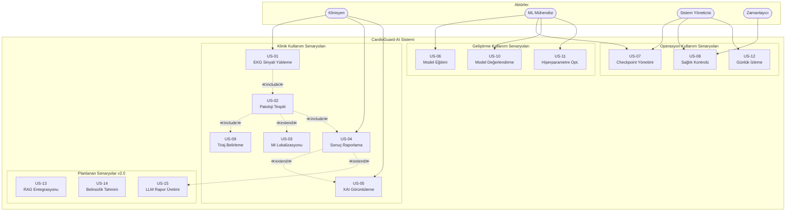

# CardioGuard-AI
# Kullanım Senaryoları Diyagramı

---

**Proje Adı:** CardioGuard-AI  
**Doküman Tipi:** Kullanım Senaryoları (Use Case) Dokümanı  
**Versiyon:** 1.0.0  
**Tarih:** 21 Ocak 2026  
**Hazırlayan:** CardioGuard-AI Geliştirme Ekibi

---

## İçindekiler

1. [Aktörler](#1-aktörler)
2. [Kullanım Senaryoları Diyagramı](#2-kullanım-senaryoları-diyagramı)
3. [Senaryo Detayları](#3-senaryo-detayları)
4. [İlişkiler ve Öncelikler](#4-ilişkiler-ve-öncelikler)

---

## 1. Aktörler

| Aktör | Tip | Açıklama | Rol |
|-------|-----|----------|-----|
| Klinisyen | Birincil | Hastane doktoru veya kardiyolog | EKG analizi talep eder, sonuçları yorumlar |
| ML Mühendisi | Birincil | Makine öğrenimi uzmanı | Model eğitimi ve optimizasyonu yapar |
| Sistem Yöneticisi | Birincil | BT operasyon personeli | Sistem bakımı ve izleme yapar |
| Zamanlayıcı | İkincil | Otomatik görev planlayıcı | Periyodik görevleri tetikler |

---

## 2. Kullanım Senaryoları Diyagramı

---

## 3. Senaryo Detayları

### 3.1 Klinik Senaryolar

| ID | Ad | Aktör | Ön Koşul | Son Koşul |
|----|-----|-------|----------|-----------|
| US-01 | EKG Sinyali Yükleme | Klinisyen | Kullanıcı sisteme bağlı | Sinyal normalize edilmiş |
| US-02 | Patoloji Tespiti | Sistem | Sinyal yüklenmiş | Olasılıklar üretilmiş |
| US-03 | MI Lokalizasyonu | Sistem | MI tespit edilmiş | Bölgeler belirlenmiş |
| US-04 | Sonuç Raporlama | Klinisyen | Tahmin tamamlanmış | AIResult üretilmiş |
| US-05 | XAI Görüntüleme | Klinisyen | XAI etkin | Görsel açıklamalar hazır |
| US-09 | Triaj Belirleme | Sistem | Tutarlılık kontrolü yapılmış | Triaj seviyesi atanmış |

### 3.2 Geliştirme Senaryoları

| ID | Ad | Aktör | Ön Koşul | Son Koşul |
|----|-----|-------|----------|-----------|
| US-06 | Model Eğitimi | ML Mühendisi | PTB-XL veri seti hazır | Checkpoint dosyaları üretilmiş |
| US-10 | Model Değerlendirme | ML Mühendisi | Model eğitilmiş | Metrikler hesaplanmış |
| US-11 | Hiperparametre Opt. | ML Mühendisi | Baseline model mevcut | Optimal parametreler bulunmuş |

### 3.3 Operasyon Senaryoları

| ID | Ad | Aktör | Ön Koşul | Son Koşul |
|----|-----|-------|----------|-----------|
| US-07 | Checkpoint Yönetimi | ML Müh. / Sys Admin | Checkpoint dosyaları mevcut | Modeller doğrulanmış |
| US-08 | Sağlık Kontrolü | Sistem Yöneticisi | API çalışıyor | Durum bilgisi alınmış |
| US-12 | Günlük İzleme | Sistem Yöneticisi | Loglama aktif | Günlükler incelenmiş |

### 3.4 Planlanan Senaryolar (v2.0)

| ID | Ad | Açıklama | Hedef Versiyon |
|----|-----|----------|----------------|
| US-13 | RAG Entegrasyonu | Klinik kılavuzlar ile zenginleştirilmiş sonuçlar | v2.0 |
| US-14 | Belirsizlik Tahmini | Monte Carlo Dropout ile güven aralığı | v2.0 |
| US-15 | LLM Rapor Üretimi | Büyük dil modeli ile otomatik klinik rapor | v2.0 |

---

## 4. İlişkiler ve Öncelikler

### 4.1 Senaryo İlişkileri

| Kaynak | Hedef | İlişki Tipi | Açıklama |
|--------|-------|-------------|----------|
| US-01 | US-02 | ≪include≫ | EKG yükleme, patoloji tespitini tetikler |
| US-02 | US-09 | ≪include≫ | Patoloji tespiti, triaj belirlemeyi tetikler |
| US-02 | US-03 | ≪extend≫ | MI tespit edilirse lokalizasyon çalışır |
| US-02 | US-04 | ≪include≫ | Tahmin sonrası raporlama yapılır |
| US-04 | US-05 | ≪extend≫ | XAI etkinse açıklamalar gösterilir |
| US-04 | US-15 | ≪extend≫ | LLM aktifse otomatik rapor üretilir |

### 4.2 Öncelik Matrisi

| Öncelik | Senaryolar | Durum |
|---------|------------|-------|
| Yüksek | US-01, US-02, US-03, US-04, US-06, US-07, US-09 | ✓ Tamamlandı |
| Orta | US-05, US-08, US-10, US-12 | ✓ Tamamlandı |
| Düşük | US-11 | ✓ Tamamlandı |
| Planlanan | US-13, US-14, US-15 | ○ v2.0'da |

---

## Onay Sayfası

| Rol | Ad Soyad | Tarih | İmza |
|-----|----------|-------|------|
| Proje Yöneticisi | | | |
| Teknik Lider | | | |
| Kalite Güvence Mühendisi | | | |

---

**Doküman Sonu**
