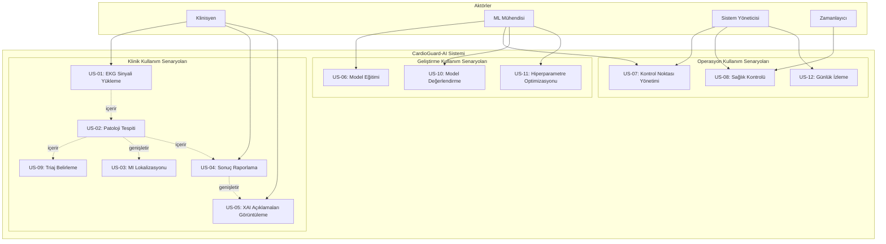
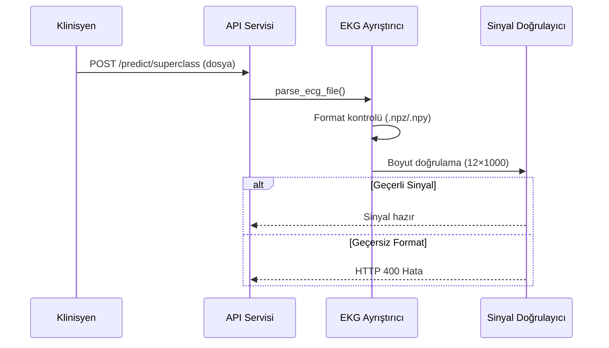
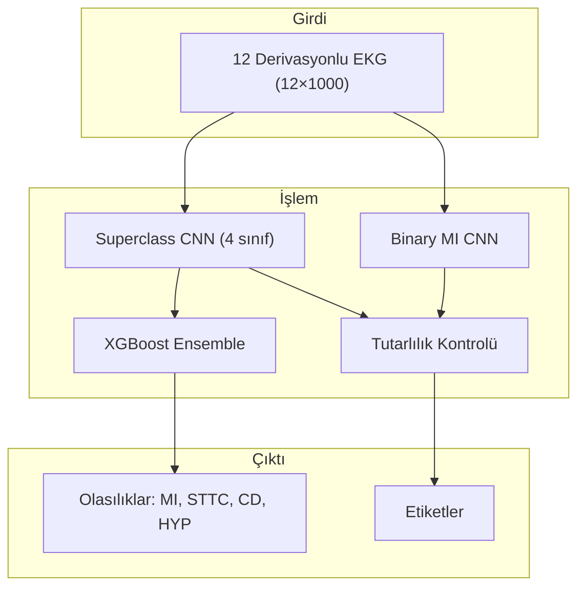
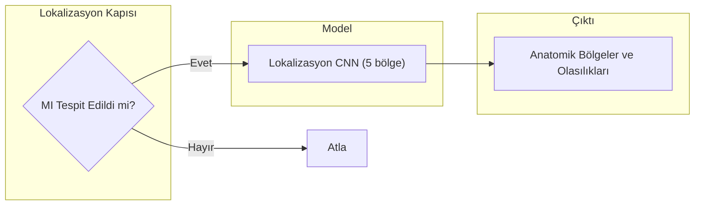
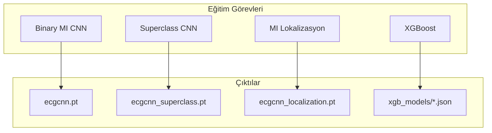
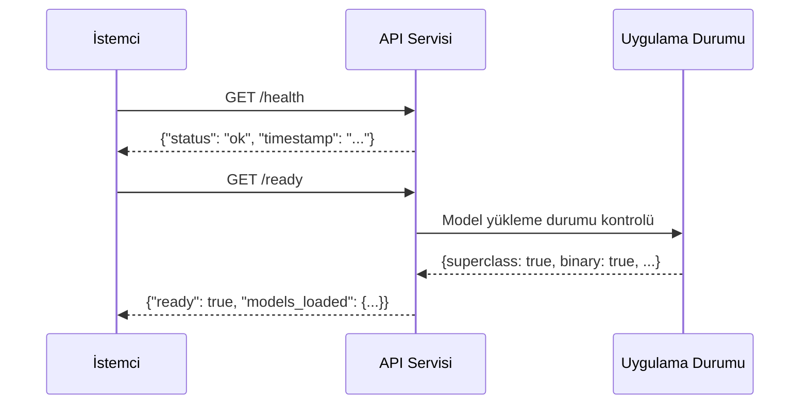
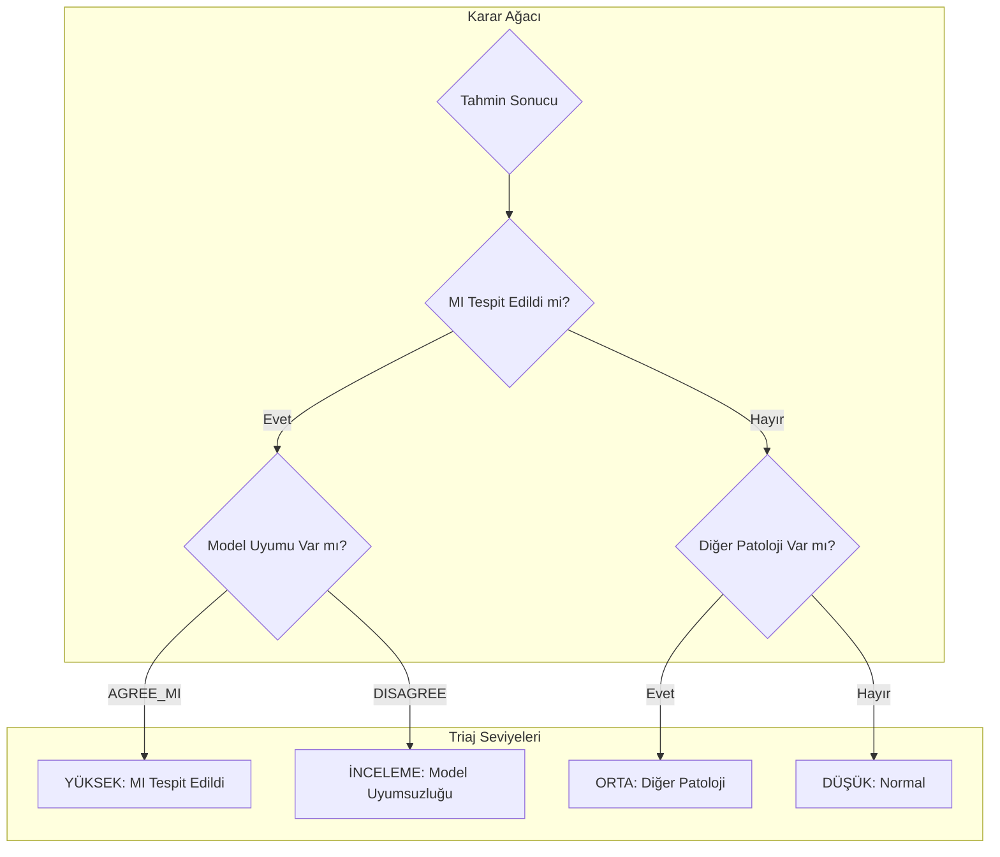
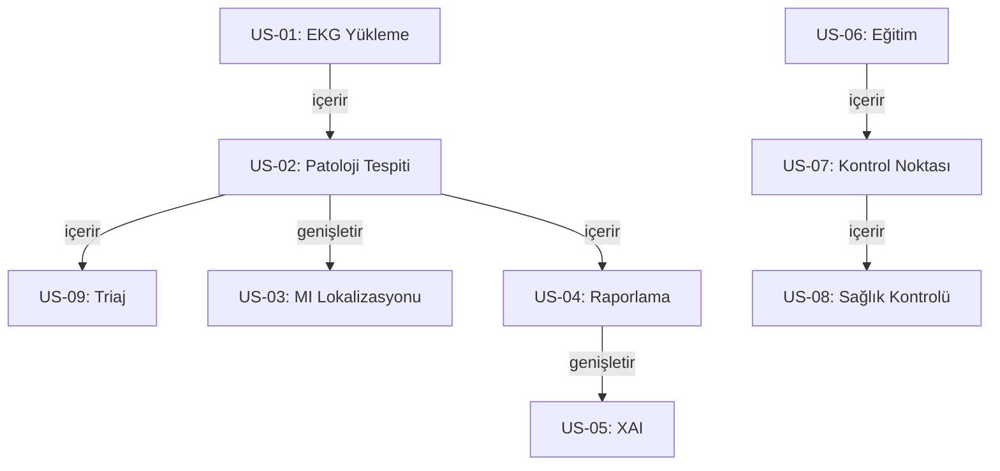

# CardioGuard-AI
# Kullanım Senaryoları Diyagramı

---

**Proje Adı:** CardioGuard-AI  
**Doküman Tipi:** Kullanım Senaryoları (Use Case) Dokümanı  
**Versiyon:** 1.0.0  
**Tarih:** 21 Ocak 2026  
**Hazırlayan:** CardioGuard-AI Geliştirme Ekibi

---

## İçindekiler

1. [Aktörler](#1-aktörler)
2. [Kullanım Senaryoları Diyagramı](#2-kullanım-senaryoları-diyagramı)
3. [Kullanım Senaryosu Detayları](#3-kullanım-senaryosu-detayları)
4. [Kullanım Senaryosu İlişkileri](#4-kullanım-senaryosu-ilişkileri)
5. [Öncelik Matrisi](#5-öncelik-matrisi)

---

## 1. Aktörler

### 1.1 Birincil Aktörler

| Aktör | Açıklama | Rol |
|-------|----------|-----|
| Klinisyen | Hastane doktoru veya kardiyolog | EKG analizi talep eder, sonuçları yorumlar |
| Makine Öğrenimi Mühendisi | Yapay zeka uzmanı | Model eğitimi ve optimizasyonu yapar |
| Sistem Yöneticisi | Bilgi teknolojileri operasyon personeli | Sistem bakımı ve izleme yapar |

### 1.2 İkincil Aktörler

| Aktör | Açıklama | Rol |
|-------|----------|-----|
| Zamanlayıcı Servisi | Otomatik görev planlayıcı | Periyodik görevleri tetikler |
| Harici Sistemler | Hastane bilgi sistemi (HIS) | Veri entegrasyonu sağlar |

---

## 2. Kullanım Senaryoları Diyagramı

---

## 3. Kullanım Senaryosu Detayları

### 3.1 US-01: EKG Sinyali Yükleme

| Özellik | Değer |
|---------|-------|
| Tanımlayıcı | US-01 |
| Ad | EKG Sinyali Yükleme |
| Aktör | Klinisyen |
| Ön Koşul | Kullanıcı sisteme bağlı olmalıdır |
| Son Koşul | Sinyal işlenmeye hazır duruma getirilir |
| Temel Akış | 1. Kullanıcı EKG dosyasını seçer. 2. Sistem dosya formatını doğrular. 3. Sistem sinyal boyutunu kontrol eder. 4. Sinyal normalize edilir. |
| Alternatif Akış | Geçersiz format durumunda hata mesajı gösterilir. Yanlış boyut durumunda hata mesajı gösterilir. |

**Akış Diyagramı:**

---

### 3.2 US-02: Patoloji Tespiti

| Özellik | Değer |
|---------|-------|
| Tanımlayıcı | US-02 |
| Ad | Patoloji Tespiti |
| Aktör | Sistem (US-01 tarafından tetiklenir) |
| Ön Koşul | EKG sinyali yüklenmiş ve normalize edilmiş olmalıdır |
| Son Koşul | Patoloji olasılıkları ve etiketler üretilir |
| Temel Akış | 1. CNN modeli ileri geçiş yapar. 2. XGBoost tahmin üretir. 3. Ensemble kombinasyonu uygulanır. 4. Tutarlılık kontrolü yapılır. 5. Etiketler belirlenir. |

**İşlem Akışı:**

---

### 3.3 US-03: MI Lokalizasyonu

| Özellik | Değer |
|---------|-------|
| Tanımlayıcı | US-03 |
| Ad | MI Lokalizasyonu |
| Aktör | Sistem (US-02 sonrası koşullu olarak çalışır) |
| Ön Koşul | MI tespit edilmiş olmalıdır (AGREE_MI veya DISAGREE_TYPE_1) |
| Son Koşul | Anatomik MI bölgeleri belirlenir |
| Temel Akış | 1. MI kapısı kontrol edilir. 2. Lokalizasyon CNN çalıştırılır. 3. Beş bölge için olasılık üretilir. 4. Eşik üzeri bölgeler işaretlenir. |
| Bölgeler | AMI (Anterior), ASMI (Anteroseptal), ALMI (Anterolateral), IMI (Inferior), LMI (Lateral) |

**Karar Akışı:**

---

### 3.4 US-04: Sonuç Raporlama

| Özellik | Değer |
|---------|-------|
| Tanımlayıcı | US-04 |
| Ad | Sonuç Raporlama |
| Aktör | Klinisyen |
| Ön Koşul | Tüm tahminler tamamlanmış olmalıdır |
| Son Koşul | AIResult v1.0 formatında rapor üretilir |
| Çıktı Alanları | Kimlik bilgileri, mod, girdi, tahminler, lokalizasyon, triaj, kaynaklar, açıklamalar, versiyonlar |

---

### 3.5 US-05: XAI Açıklamaları Görüntüleme

| Özellik | Değer |
|---------|-------|
| Tanımlayıcı | US-05 |
| Ad | Açıklanabilir Yapay Zeka Görüntüleme |
| Aktör | Klinisyen |
| Ön Koşul | Tahmin tamamlanmış ve XAI etkinleştirilmiş olmalıdır |
| Son Koşul | Görsel açıklamalar üretilir |
| Çıktı Türleri | Grad-CAM ısı haritası (PNG), SHAP özet grafiği (PNG), Metin açıklaması (MD) |

---

### 3.6 US-06: Model Eğitimi

| Özellik | Değer |
|---------|-------|
| Tanımlayıcı | US-06 |
| Ad | Model Eğitimi |
| Aktör | Makine Öğrenimi Mühendisi |
| Ön Koşul | PTB-XL veri seti mevcut olmalıdır |
| Son Koşul | Kontrol noktası dosyaları üretilir |
| Eğitim Parametreleri | Epok sayısı: 50, öğrenme oranı: 0.001, yığın boyutu: 64 |

**Eğitim Akışı:**

---

### 3.7 US-07: Kontrol Noktası Yönetimi

| Özellik | Değer |
|---------|-------|
| Tanımlayıcı | US-07 |
| Ad | Kontrol Noktası Yönetimi |
| Aktörler | Makine Öğrenimi Mühendisi, Sistem Yöneticisi |
| Ön Koşul | Kontrol noktası dosyaları mevcut olmalıdır |
| Son Koşul | Kontrol noktaları doğrulanmış ve yüklenmiş olmalıdır |
| Alt Senaryolar | Kontrol noktası doğrulama, kontrol noktası güncelleme, geri alma |

---

### 3.8 US-08: Sağlık Kontrolü

| Özellik | Değer |
|---------|-------|
| Tanımlayıcı | US-08 |
| Ad | Sağlık Kontrolü |
| Aktörler | Sistem Yöneticisi, Zamanlayıcı Servisi |
| Uç Noktalar | /health, /ready |
| Amaç | Sistem ve model durumunu izleme |

**Kontrol Akışı:**

---

### 3.9 US-09: Triaj Belirleme

| Özellik | Değer |
|---------|-------|
| Tanımlayıcı | US-09 |
| Ad | Triaj Belirleme |
| Aktör | Sistem (otomatik) |
| Seviyeler | Yüksek (HIGH), Orta (MEDIUM), Düşük (LOW), İnceleme (REVIEW) |
| Kural | MI tespiti durumunda Yüksek, diğer patolojilerde Orta, normal durumda Düşük, model uyumsuzluğunda İnceleme |

**Karar Ağacı:**

---

## 4. Kullanım Senaryosu İlişkileri

### 4.1 İlişki Diyagramı

### 4.2 İlişki Türleri

| İlişki | Kaynak | Hedef | Açıklama |
|--------|--------|-------|----------|
| İçerir (include) | US-01 | US-02 | EKG yükleme, patoloji tespitini tetikler |
| İçerir (include) | US-02 | US-09 | Patoloji tespiti, triaj belirlemeyi tetikler |
| Genişletir (extend) | US-02 | US-03 | MI tespit edilirse lokalizasyon çalışır |
| İçerir (include) | US-02 | US-04 | Patoloji tespiti sonrası raporlama yapılır |
| Genişletir (extend) | US-04 | US-05 | XAI etkinse açıklamalar gösterilir |

---

## 5. Öncelik Matrisi

| Kullanım Senaryosu | Öncelik | Zorunluluk | Hedef Versiyon |
|-------------------|---------|------------|----------------|
| US-01: EKG Yükleme | Yüksek | Zorunlu | v1.0 |
| US-02: Patoloji Tespiti | Yüksek | Zorunlu | v1.0 |
| US-03: MI Lokalizasyonu | Yüksek | Zorunlu | v1.0 |
| US-04: Sonuç Raporlama | Yüksek | Zorunlu | v1.0 |
| US-05: XAI Görüntüleme | Orta | Önerilen | v1.0 |
| US-06: Model Eğitimi | Yüksek | Zorunlu | v1.0 |
| US-07: Kontrol Noktası Yönetimi | Yüksek | Zorunlu | v1.0 |
| US-08: Sağlık Kontrolü | Orta | Önerilen | v1.0 |
| US-09: Triaj Belirleme | Yüksek | Zorunlu | v1.0 |
| US-10: Model Değerlendirme | Orta | Önerilen | v1.1 |
| US-11: Hiperparametre Optimizasyonu | Düşük | Opsiyonel | v2.0 |
| US-12: Günlük İzleme | Düşük | Opsiyonel | v1.1 |

---

## Onay Sayfası

| Rol | Ad Soyad | Tarih | İmza |
|-----|----------|-------|------|
| Proje Yöneticisi | | | |
| Teknik Lider | | | |
| Kalite Güvence Mühendisi | | | |

---

**Doküman Sonu**

*Gelecek versiyonlarda RAG entegrasyonu (US-13), Monte Carlo Dropout ile belirsizlik tahmini (US-14) ve Canlı EKG Akışı (US-15) kullanım senaryoları eklenecektir.*
