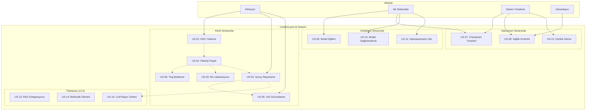
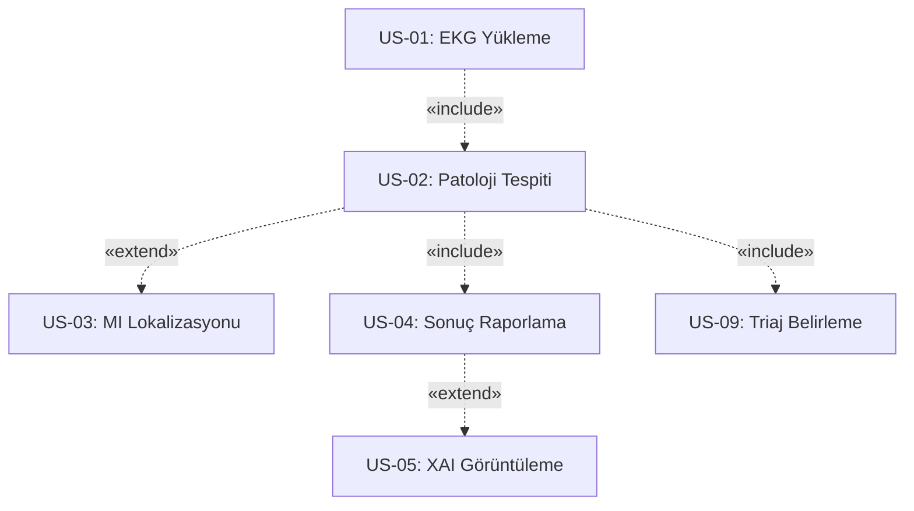

# CardioGuard-AI
# Kullanım Senaryoları Diyagramı

---

**Proje Adı:** CardioGuard-AI  
**Doküman Tipi:** Kullanım Senaryoları (Use Case) Dokümanı  
**Versiyon:** 1.0.0  
**Tarih:** 21 Ocak 2026  
**Hazırlayan:** CardioGuard-AI Geliştirme Ekibi

---

## 1. Kullanım Senaryoları Diyagramı

---

## 2. Aktörler

| Aktör | Tip | Açıklama |
|-------|-----|----------|
| Klinisyen | Birincil | Hastane doktoru veya kardiyolog, EKG analizi talep eder |
| ML Mühendisi | Birincil | Yapay zeka uzmanı, model eğitimi ve optimizasyonu yapar |
| Sistem Yöneticisi | Birincil | BT operasyon personeli, sistem bakımı yapar |
| Zamanlayıcı | İkincil | Otomatik görev planlayıcı, periyodik kontroller yapar |

---

## 3. Mevcut Kullanım Senaryoları (v1.0)

### 3.1 Klinik Senaryolar

| ID | Ad | Aktör | Öncelik |
|----|-----|-------|---------|
| US-01 | EKG Sinyali Yükleme | Klinisyen | Yüksek |
| US-02 | Patoloji Tespiti | Sistem | Yüksek |
| US-03 | MI Lokalizasyonu | Sistem | Yüksek |
| US-04 | Sonuç Raporlama | Klinisyen | Yüksek |
| US-05 | XAI Açıklamaları Görüntüleme | Klinisyen | Orta |
| US-09 | Triaj Belirleme | Sistem | Yüksek |

### 3.2 Geliştirme Senaryoları

| ID | Ad | Aktör | Öncelik |
|----|-----|-------|---------|
| US-06 | Model Eğitimi | ML Mühendisi | Yüksek |
| US-10 | Model Değerlendirme | ML Mühendisi | Orta |
| US-11 | Hiperparametre Optimizasyonu | ML Mühendisi | Düşük |

### 3.3 Operasyon Senaryoları

| ID | Ad | Aktör | Öncelik |
|----|-----|-------|---------|
| US-07 | Kontrol Noktası Yönetimi | ML Müh. / Sys Admin | Yüksek |
| US-08 | Sağlık Kontrolü | Sistem Yöneticisi | Orta |
| US-12 | Günlük İzleme | Sistem Yöneticisi | Düşük |

---

## 4. Planlanan Kullanım Senaryoları (v2.0)

| ID | Ad | Açıklama | Hedef Versiyon |
|----|-----|----------|----------------|
| US-13 | RAG Entegrasyonu | Klinik kılavuzlar ve tıbbi literatür ile zenginleştirilmiş sonuçlar | v2.0 |
| US-14 | Belirsizlik Tahmini | Monte Carlo Dropout ile tahmin güven aralığı | v2.0 |
| US-15 | LLM Rapor Üretimi | Büyük dil modeli ile otomatik klinik rapor oluşturma | v2.0 |

---

## 5. Senaryo İlişkileri

### 5.1 İlişki Diyagramı (UML Notasyonu)

### 5.2 İlişki Tablosu

| Kaynak | Hedef | İlişki | Koşul |
|--------|-------|--------|-------|
| US-01 | US-02 | include | Her zaman |
| US-02 | US-09 | include | Her zaman |
| US-02 | US-03 | extend | MI tespit edilirse |
| US-02 | US-04 | include | Her zaman |
| US-04 | US-05 | extend | XAI etkinse |

---

## 6. Senaryo Detayları

### US-01: EKG Sinyali Yükleme

| Özellik | Değer |
|---------|-------|
| Ön Koşul | Kullanıcı sisteme bağlı |
| Son Koşul | Sinyal işlenmeye hazır |
| Temel Akış | Dosya seçimi → Format doğrulama → Boyut kontrolü → Normalizasyon |

### US-02: Patoloji Tespiti

| Özellik | Değer |
|---------|-------|
| Ön Koşul | Sinyal normalize edilmiş |
| Son Koşul | Olasılıklar ve etiketler üretilmiş |
| Temel Akış | CNN çıkarımı → XGBoost tahmini → Ensemble → Tutarlılık kontrolü |

### US-03: MI Lokalizasyonu

| Özellik | Değer |
|---------|-------|
| Ön Koşul | MI tespit edilmiş |
| Son Koşul | Anatomik bölgeler belirlenmiş |
| Bölgeler | AMI, ASMI, ALMI, IMI, LMI |

### US-09: Triaj Belirleme

| Sonuç | Triaj Seviyesi |
|-------|----------------|
| MI Tespit (Uyumlu) | YÜKSEK |
| MI Tespit (Uyumsuz) | İNCELEME |
| Diğer Patoloji | ORTA |
| Normal | DÜŞÜK |

---

## 7. Öncelik Matrisi

| Öncelik | Senaryolar | Versiyon |
|---------|------------|----------|
| Yüksek | US-01, US-02, US-03, US-04, US-06, US-07, US-09 | v1.0 |
| Orta | US-05, US-08, US-10 | v1.0 |
| Düşük | US-11, US-12 | v1.1 |
| Planlanan | US-13, US-14, US-15 | v2.0 |

---

## Onay Sayfası

| Rol | Ad Soyad | Tarih | İmza |
|-----|----------|-------|------|
| Proje Yöneticisi | | | |
| Teknik Lider | | | |

---

**Doküman Sonu**
