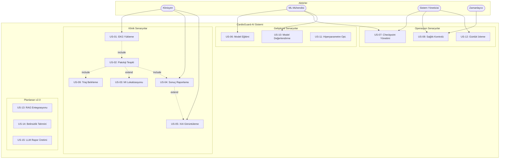

# CardioGuard-AI
# Kullanım Senaryoları Dokümanı

---

**Proje Adı:** CardioGuard-AI  
**Doküman Tipi:** Kullanım Senaryoları (Use Case) Dokümanı  
**Versiyon:** 1.0.0  
**Tarih:** 21 Ocak 2026  
**Hazırlayan:** CardioGuard-AI Geliştirme Ekibi

---

## 1. Aktörler

### 1.1 Aktör Tanımları

| Aktör | Tip | Açıklama | Sorumluluklar |
|-------|-----|----------|---------------|
| **Klinisyen** | Birincil | Kardiyolog veya acil servis doktoru | EKG yükleme, sonuç yorumlama, XAI inceleme |
| **ML Mühendisi** | Birincil | Makine öğrenimi uzmanı | Model eğitimi, performans optimizasyonu |
| **Sistem Yöneticisi** | Birincil | BT operasyon personeli | Sistem izleme, günlük analizi |
| **Zamanlayıcı** | İkincil | Otomatik görev planlayıcı | Periyodik sağlık kontrolleri |
| **Harici Sistemler** | İkincil | HIS, PACS, LIS | Veri entegrasyonu |

---

## 2. Kullanım Senaryoları Diyagramı

---

## 3. Senaryo Detayları

### US-01: EKG Sinyali Yükleme

| Özellik | Değer |
|---------|-------|
| **Tanımlayıcı** | US-01 |
| **Aktör** | Klinisyen |
| **Öncelik** | Yüksek |
| **Ön Koşul** | Kullanıcı sisteme bağlı |
| **Son Koşul** | Sinyal normalize edilmiş |

**Temel Akış:**
1. Klinisyen EKG dosyasını seçer (.npz/.npy)
2. Sistem format kontrolü yapar
3. Sistem boyut doğrulaması yapar (12×1000)
4. Sistem MinMax normalizasyonu uygular
5. US-02 Patoloji Tespiti tetiklenir

**Alternatif Akışlar:**
- 2a. Geçersiz format → HTTP 400 hatası
- 3a. Yanlış boyut → HTTP 400 hatası

---

### US-02: Patoloji Tespiti

| Özellik | Değer |
|---------|-------|
| **Tanımlayıcı** | US-02 |
| **Aktör** | Sistem |
| **Öncelik** | Yüksek |
| **Ön Koşul** | Sinyal yüklenmiş |
| **Son Koşul** | Olasılıklar üretilmiş |

**Hibrit Pipeline:**

| Aşama | Model | Giriş | Çıkış |
|-------|-------|-------|-------|
| 1 | Superclass CNN | Sinyal | 4 sınıf olasılığı |
| 2 | Binary MI CNN | Sinyal | MI olasılığı |
| 3 | XGBoost (×4) | 64-dim gömme | 4 sınıf olasılığı |
| 4 | Ensemble | P_cnn, P_xgb | P_final |

**Ensemble Formülü:** `P = 0.15 × P_cnn + 0.85 × P_xgb`

---

### US-03: MI Lokalizasyonu

| Özellik | Değer |
|---------|-------|
| **Tanımlayıcı** | US-03 |
| **Aktör** | Sistem |
| **Öncelik** | Yüksek |
| **Ön Koşul** | MI tespit edilmiş |
| **Son Koşul** | Bölgeler belirlenmiş |

**Anatomik Bölgeler:**

| Bölge | Açıklama | Koroner Arter |
|-------|----------|---------------|
| AMI | Anterior MI | LAD |
| ASMI | Anteroseptal MI | LAD septal |
| ALMI | Anterolateral MI | LAD/LCx |
| IMI | Inferior MI | RCA/LCx |
| LMI | Lateral MI | LCx |

---

### US-04: Sonuç Raporlama

| Özellik | Değer |
|---------|-------|
| **Tanımlayıcı** | US-04 |
| **Aktör** | Klinisyen |
| **Çıktı Formatı** | AIResult v1.0 JSON |

**Rapor Bölümleri:**
- identity: Tanımlama bilgileri
- predictions: Patoloji olasılıkları
- localization: MI bölgeleri
- triage: Triaj seviyesi
- explanations: XAI dosya yolları

---

### US-09: Triaj Belirleme

**Triaj Karar Matrisi:**

| Tahmin | Tutarlılık | Triaj | Aksiyon |
|--------|------------|-------|---------|
| MI | AGREE_MI | YÜKSEK | Acil konsültasyon |
| MI | DISAGREE | İNCELEME | Kıdemli değerlendirme |
| Diğer | - | ORTA | Standart değerlendirme |
| Normal | AGREE_NO_MI | DÜŞÜK | Rutin takip |

---

## 4. Senaryo İlişkileri

| Kaynak | Hedef | İlişki | Koşul |
|--------|-------|--------|-------|
| US-01 | US-02 | include | Her zaman |
| US-02 | US-09 | include | Her zaman |
| US-02 | US-03 | extend | MI tespit edilirse |
| US-02 | US-04 | include | Her zaman |
| US-04 | US-05 | extend | XAI etkinse |

---

## 5. Öncelik Matrisi

| Öncelik | Senaryolar | Versiyon |
|---------|------------|----------|
| Yüksek | US-01, US-02, US-03, US-04, US-06, US-07, US-09 | v1.0 |
| Orta | US-05, US-08, US-10 | v1.0 |
| Düşük | US-11, US-12 | v1.1 |
| Planlanan | US-13, US-14, US-15 | v2.0 |

---

## 6. Planlanan Senaryolar (v2.0)

| ID | Ad | Açıklama |
|----|-----|----------|
| US-13 | RAG Entegrasyonu | Klinik kılavuzlar ile zenginleştirilmiş sonuçlar |
| US-14 | Belirsizlik Tahmini | Monte Carlo Dropout ile güven aralığı |
| US-15 | LLM Rapor Üretimi | Büyük dil modeli ile otomatik klinik rapor |

---

## Onay Sayfası

| Rol | Ad Soyad | Tarih | İmza |
|-----|----------|-------|------|
| Proje Yöneticisi | | | |
| Teknik Lider | | | |

---

**Doküman Sonu**
