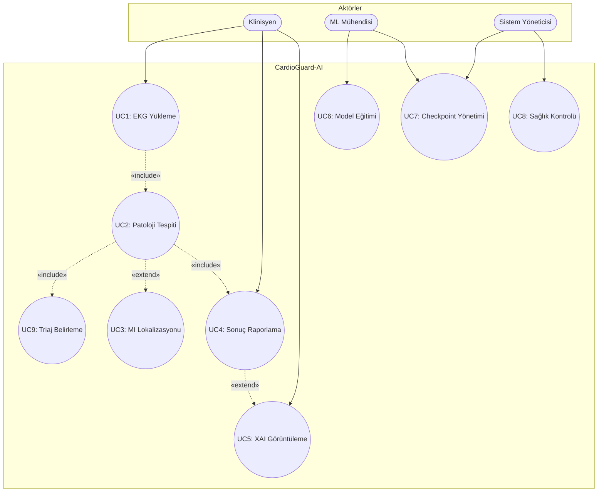

# CardioGuard-AI
# Kullanım Senaryoları Dokümanı

---

**Proje Adı:** CardioGuard-AI  
**Doküman Tipi:** Kullanım Senaryoları (Use Case)  
**Versiyon:** 1.0.0  
**Tarih:** 21 Ocak 2026

---

## 1. Kullanım Senaryoları Diyagramı

---

## 2. Aktörler

| Aktör | Tip | Açıklama |
|-------|-----|----------|
| Klinisyen | Birincil | EKG analizi talep eder, sonuçları yorumlar |
| ML Mühendisi | Birincil | Model eğitimi ve optimizasyonu yapar |
| Sistem Yöneticisi | Birincil | Sistem izleme ve bakım yapar |

---

## 3. Kullanım Senaryoları Özeti

| ID | Senaryo | Aktör | Öncelik | Durum |
|----|---------|-------|---------|-------|
| UC1 | EKG Sinyali Yükleme | Klinisyen | Yüksek | Tamamlandı |
| UC2 | Patoloji Tespiti | Sistem | Yüksek | Tamamlandı |
| UC3 | MI Lokalizasyonu | Sistem | Yüksek | Tamamlandı |
| UC4 | Sonuç Raporlama | Klinisyen | Yüksek | Tamamlandı |
| UC5 | XAI Görüntüleme | Klinisyen | Orta | Tamamlandı |
| UC6 | Model Eğitimi | ML Mühendisi | Yüksek | Tamamlandı |
| UC7 | Checkpoint Yönetimi | ML Müh./SysAdmin | Yüksek | Tamamlandı |
| UC8 | Sağlık Kontrolü | Sistem Yöneticisi | Orta | Tamamlandı |
| UC9 | Triaj Belirleme | Sistem | Yüksek | Tamamlandı |

---

## 4. Senaryo İlişkileri

| Kaynak | Hedef | İlişki | Açıklama |
|--------|-------|--------|----------|
| UC1 | UC2 | «include» | EKG yükleme, tespiti tetikler |
| UC2 | UC9 | «include» | Tespit, triaj belirler |
| UC2 | UC3 | «extend» | MI varsa lokalizasyon çalışır |
| UC2 | UC4 | «include» | Tespit sonrası raporlama |
| UC4 | UC5 | «extend» | XAI etkinse açıklamalar |

---

## 5. Senaryo Detayları

### UC1: EKG Sinyali Yükleme

| Özellik | Değer |
|---------|-------|
| Ön Koşul | Kullanıcı sisteme bağlı |
| Son Koşul | Sinyal normalize edilmiş |
| Akış | Dosya seçimi → Format kontrolü → Normalizasyon |

### UC2: Patoloji Tespiti

| Özellik | Değer |
|---------|-------|
| Ön Koşul | Sinyal yüklenmiş |
| Son Koşul | Olasılıklar üretilmiş |
| Sınıflar | MI, STTC, CD, HYP |

### UC3: MI Lokalizasyonu

| Özellik | Değer |
|---------|-------|
| Tetikleme | MI tespit edilirse |
| Bölgeler | AMI, ASMI, ALMI, IMI, LMI |

### UC9: Triaj Belirleme

| Tahmin | Triaj Seviyesi |
|--------|----------------|
| MI Tespit | YÜKSEK |
| Diğer Patoloji | ORTA |
| Normal | DÜŞÜK |
| Model Uyumsuzluğu | İNCELEME |

---

## 6. Planlanan Senaryolar (v2.0)

| ID | Senaryo | Açıklama |
|----|---------|----------|
| UC10 | RAG Entegrasyonu | Klinik kılavuzlarla zenginleştirme |
| UC11 | Belirsizlik Tahmini | Monte Carlo Dropout |
| UC12 | LLM Rapor Üretimi | Otomatik klinik rapor |

---

## Onay Sayfası

| Rol | Ad Soyad | Tarih | İmza |
|-----|----------|-------|------|
| Proje Yöneticisi | | | |
| Teknik Lider | | | |

---

**Doküman Sonu**
