# CardioGuard-AI: Class Diyagramı
## (Sınıf Diyagramı)

---

## 📋 Doküman Bilgileri

| Özellik | Değer |
|---------|-------|
| **Proje Adı** | CardioGuard-AI |
| **Doküman Tipi** | Class Diyagramı |
| **Versiyon** | 1.0.0 |
| **Tarih** | 2026-01-21 |

---

## 1. Genel Bakış

CardioGuard-AI sistemi aşağıdaki ana paketlerden oluşur:

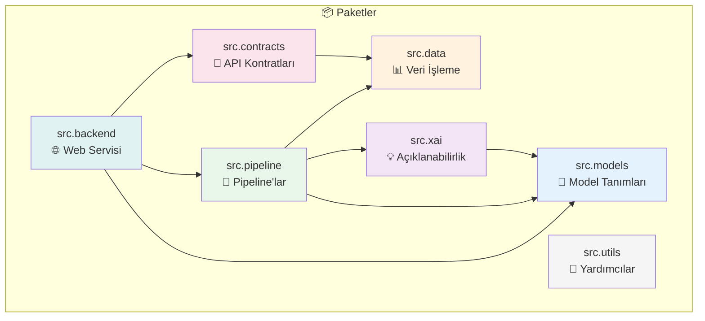

---

## 2. Model Paketi (src.models)

### 2.1 Tam Class Diyagramı

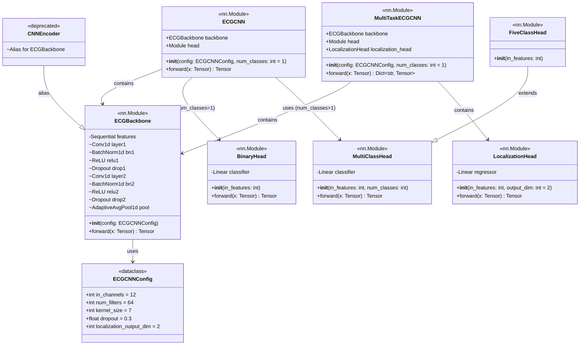

### 2.2 Model Varyantları

| Model | Çıktı Boyutu | Head Tipi | Kullanım |
|-------|--------------|-----------|----------|
| **Binary MI** | 1 | BinaryHead | MI vs NORM sınıflandırması |
| **Superclass** | 4 | MultiClassHead | [MI, STTC, CD, HYP] çoklu-etiket |
| **Localization** | 5 | FiveClassHead | [AMI, ASMI, ALMI, IMI, LMI] bölge tespiti |

---

## 3. Data Paketi (src.data)

### 3.1 Class Diyagramı

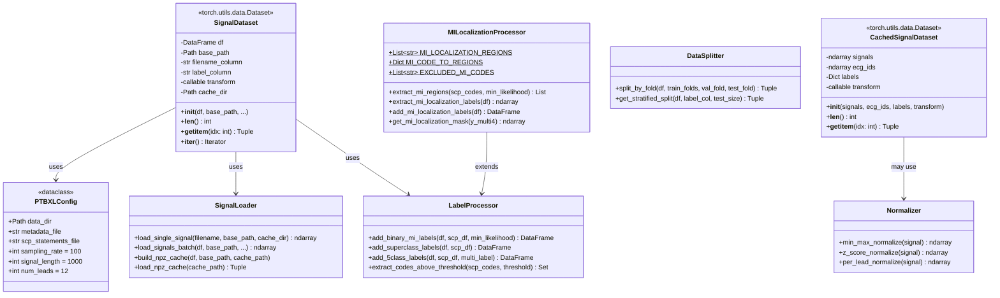

### 3.2 Veri Akışı

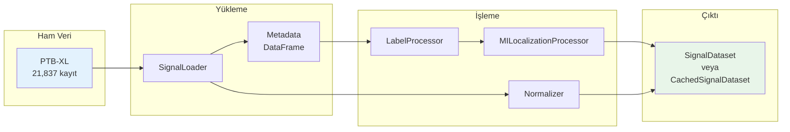

---

## 4. Pipeline Paketi (src.pipeline)

### 4.1 Inference Pipeline

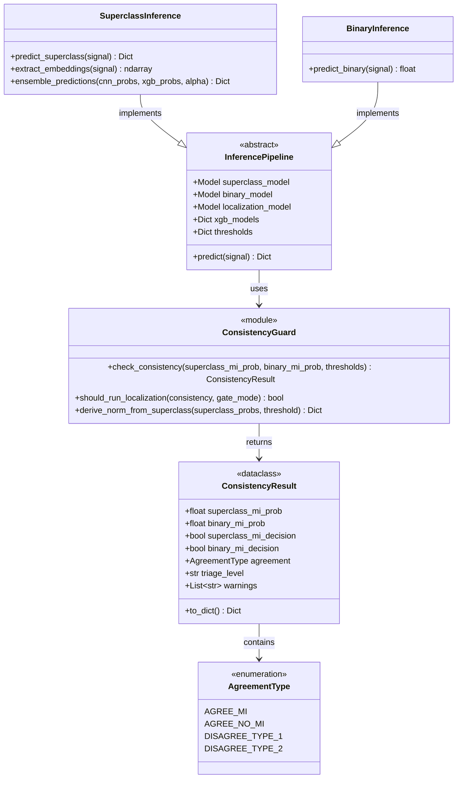

### 4.2 Training Pipeline

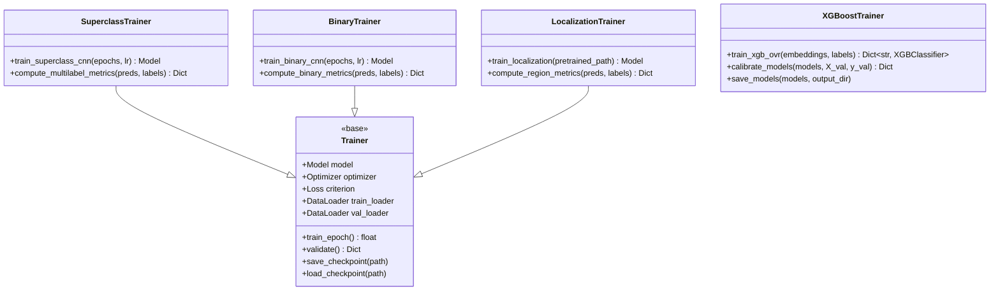

---

## 5. XAI Paketi (src.xai)

### 5.1 Class Diyagramı

```mermaid
classDiagram
    direction TB
    
    class GradCAM {
        -Module model
        -Module target_layer
        -Tensor gradients
        -Tensor activations
        +__init__(model, target_layer)
        -_register_hooks()
        +generate(inputs, class_index) ndarray
    }
    
    class SHAPExplainer {
        <<abstract>>
        +explain(model, X) ndarray
    }
    
    class SHAPXGBExplainer {
        -TreeExplainer explainer
        +__init__(model)
        +explain_single(x) ndarray
        +explain_batch(X) ndarray
        +get_feature_importance() Dict
    }
    
    class SHAPOVRExplainer {
        -Dict~str, TreeExplainer~ explainers
        +__init__(models_dict)
        +explain_per_class(x) Dict~str, ndarray~
    }
    
    class SanityChecker {
        +randomize_model_weights(model, layer_name) Module
        +compare_explanations(original, randomized) Dict
        +run_sanity_check(model, inputs) bool
    }
    
    class XAIVisualizer {
        +plot_gradcam_overlay(signal, cam, class_name) Figure
        +plot_shap_summary(shap_values, feature_names) Figure
        +save_artifacts(run_dir)
    }
    
    class XAIReporter {
        +generate_narrative(predictions, explanations) str
        +create_report(run_dir) Path
    }
    
    SHAPXGBExplainer --|> SHAPExplainer
    SHAPOVRExplainer --|> SHAPExplainer
    XAIVisualizer --> GradCAM : visualizes
    XAIVisualizer --> SHAPExplainer : visualizes
    XAIReporter --> XAIVisualizer : uses
```

### 5.2 Açıklama Akışı

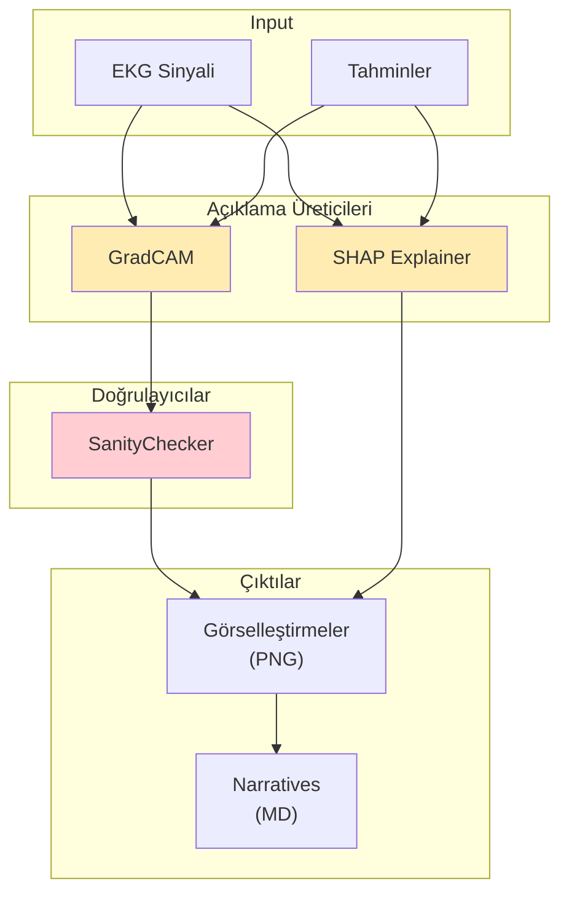

---

## 6. Contracts Paketi (src.contracts)

### 6.1 Class Diyagramı

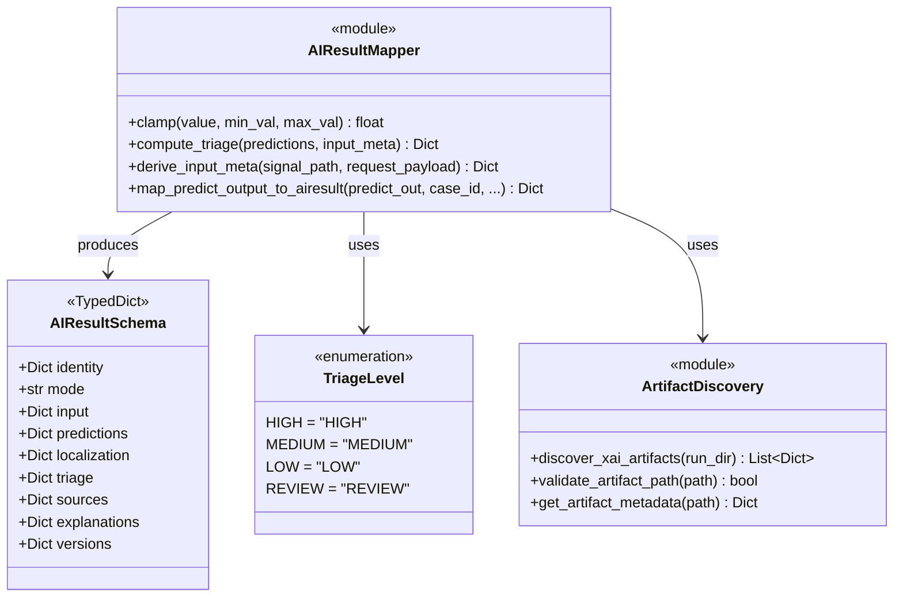

---

## 7. Backend Paketi (src.backend)

### 7.1 Class Diyagramı

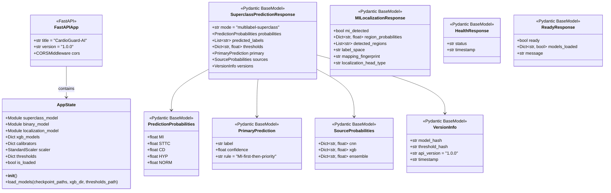

### 7.2 API Endpoint'leri

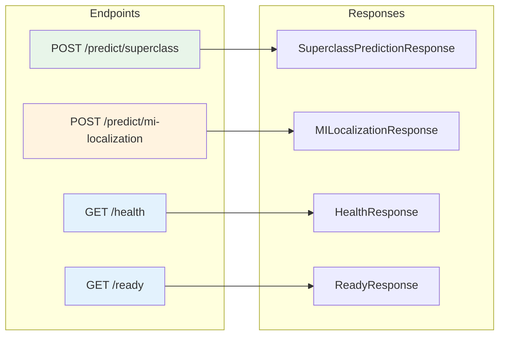

---

## 8. Utils Paketi (src.utils)

### 8.1 Class Diyagramı

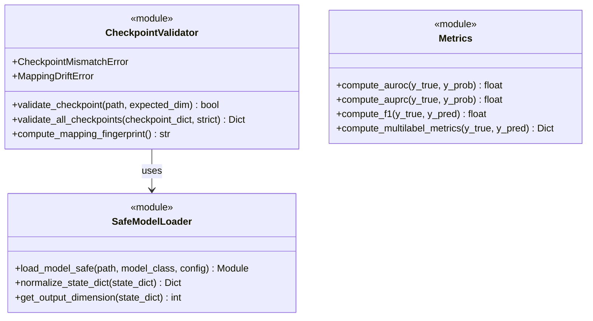

---

## 9. Bağımlılık Grafiği

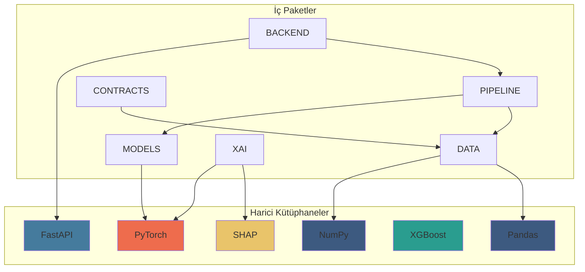

---

## 10. Tasarım Prensipleri

### 10.1 SOLID Prensipleri

| Prensip | Uygulama |
|---------|----------|
| **Single Responsibility** | Her sınıf tek bir sorumluluğa sahip (ör. GradCAM sadece heatmap üretir) |
| **Open/Closed** | Head sınıfları genişletilebilir (FiveClassHead extends MultiClassHead) |
| **Liskov Substitution** | Tüm Head sınıfları nn.Module'den türetilmiş ve değiştirilebilir |
| **Interface Segregation** | Küçük, odaklı arayüzler (SHAPExplainer abstract class) |
| **Dependency Inversion** | Üst seviye modüller soyutlamalara bağımlı |

### 10.2 Tasarım Desenleri

| Desen | Kullanım Yeri |
|-------|---------------|
| **Factory** | `build_classification_head()`, `build_sequential_cnn()` |
| **Strategy** | Farklı Head tipleri (BinaryHead, MultiClassHead) |
| **Singleton** | AppState (global state) |
| **Observer** | GradCAM hook mekanizması |
| **Facade** | AIResultMapper (karmaşık mapping işlemini basitleştirir) |

---

> **Not:** Bu class diyagramı CardioGuard-AI v1.0.0 mimarisini yansıtmaktadır. Gelecek versiyonlarda Transformer-based modeller ve RAG entegrasyonu için yeni sınıflar eklenecektir.
