# CardioGuard-AI
# Sınıf Diyagramı

---

**Proje Adı:** CardioGuard-AI  
**Doküman Tipi:** Sınıf Diyagramı (Class Diagram)  
**Versiyon:** 1.0.0  
**Tarih:** 21 Ocak 2026  
**Hazırlayan:** CardioGuard-AI Geliştirme Ekibi

---

## İçindekiler

1. [Genel Bakış](#1-genel-bakış)
2. [Model Paketi](#2-model-paketi)
3. [Veri Paketi](#3-veri-paketi)
4. [Pipeline Paketi](#4-pipeline-paketi)
5. [XAI Paketi](#5-xai-paketi)
6. [Kontrat Paketi](#6-kontrat-paketi)
7. [Backend Paketi](#7-backend-paketi)
8. [Yardımcı Paket](#8-yardımcı-paket)
9. [Bağımlılık Grafiği](#9-bağımlılık-grafiği)
10. [Tasarım Prensipleri](#10-tasarım-prensipleri)

---

## 1. Genel Bakış

CardioGuard-AI sistemi aşağıdaki ana paketlerden oluşmaktadır:

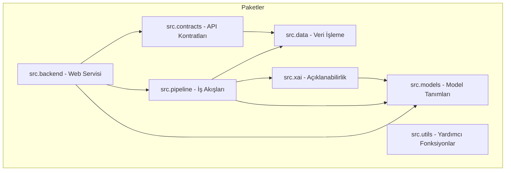

---

## 2. Model Paketi (src.models)

### 2.1 Sınıf Diyagramı

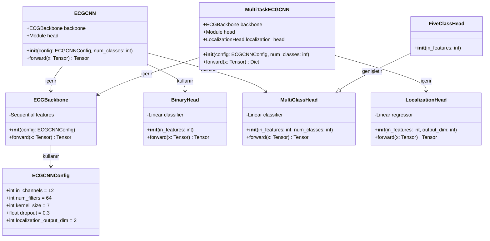

### 2.2 Model Varyantları

| Model | Çıktı Boyutu | Kafa Tipi | Kullanım Amacı |
|-------|--------------|-----------|----------------|
| Binary MI | 1 | BinaryHead | MI ve Normal sınıflandırma |
| Superclass | 4 | MultiClassHead | MI, STTC, CD, HYP çoklu etiket |
| Lokalizasyon | 5 | FiveClassHead | AMI, ASMI, ALMI, IMI, LMI bölge tespiti |

### 2.3 Sınıf Açıklamaları

| Sınıf | Açıklama |
|-------|----------|
| ECGCNNConfig | Model yapılandırma parametrelerini tutan veri sınıfı |
| ECGBackbone | Evrişimsel sinir ağı omurgası, 64 boyutlu gömme vektörü üretir |
| BinaryHead | İkili sınıflandırma için tek çıktılı doğrusal katman |
| MultiClassHead | Çoklu sınıf sınıflandırma için n çıktılı doğrusal katman |
| FiveClassHead | Beş sınıflı sınıflandırma için özelleştirilmiş kafa |
| LocalizationHead | Regresyon çıktısı için doğrusal katman |
| ECGCNN | Tam EKG sınıflandırma modeli |
| MultiTaskECGCNN | Çoklu görev modeli (sınıflandırma ve lokalizasyon) |

---

## 3. Veri Paketi (src.data)

### 3.1 Sınıf Diyagramı

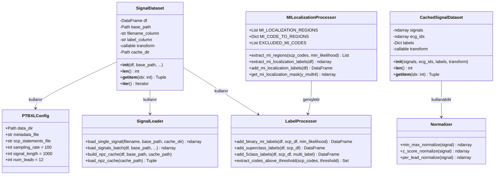

### 3.2 Veri Akışı

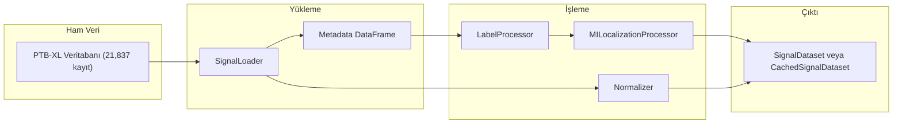

---

## 4. Pipeline Paketi (src.pipeline)

### 4.1 Çıkarım Pipeline Sınıfları

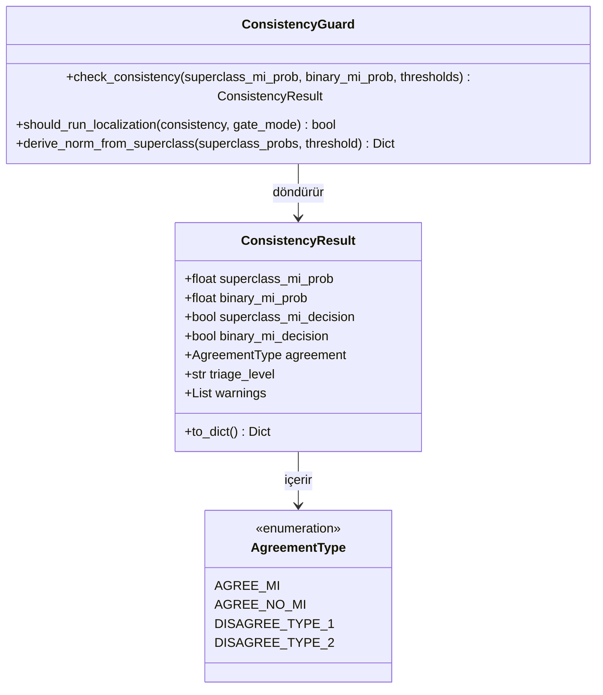

### 4.2 Eğitim Pipeline Sınıfları

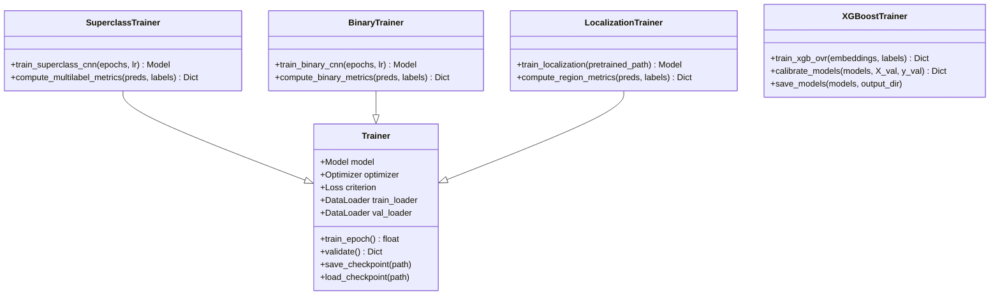

### 4.3 Uyum Tipi Açıklamaları

| Uyum Tipi | Super MI | Binary MI | Triaj | Yorum |
|-----------|----------|-----------|-------|-------|
| AGREE_MI | Pozitif | Pozitif | Yüksek | Her iki model MI tespit etti |
| AGREE_NO_MI | Negatif | Negatif | Düşük | Her iki model MI tespit etmedi |
| DISAGREE_TYPE_1 | Pozitif | Negatif | İnceleme | Düşük güvenlikli MI |
| DISAGREE_TYPE_2 | Negatif | Pozitif | İnceleme | Superclass kaçırmış olabilir |

---

## 5. XAI Paketi (src.xai)

### 5.1 Sınıf Diyagramı

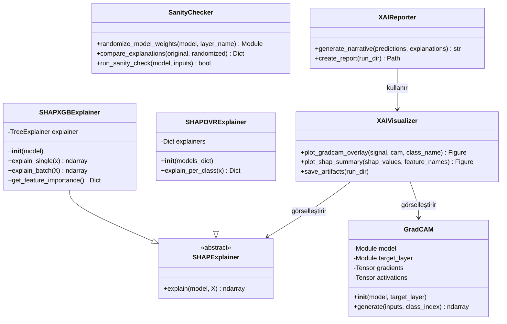

### 5.2 Açıklama Akışı

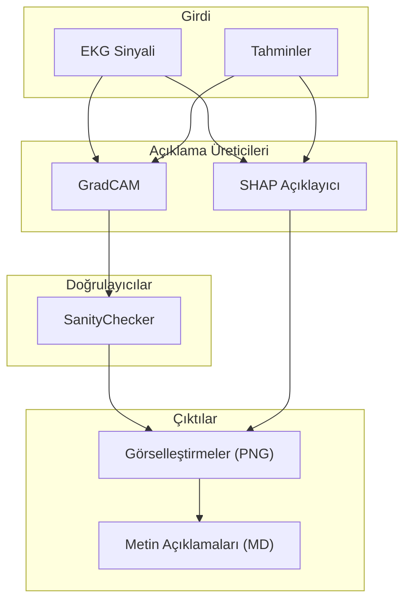

---

## 6. Kontrat Paketi (src.contracts)

### 6.1 Sınıf Diyagramı

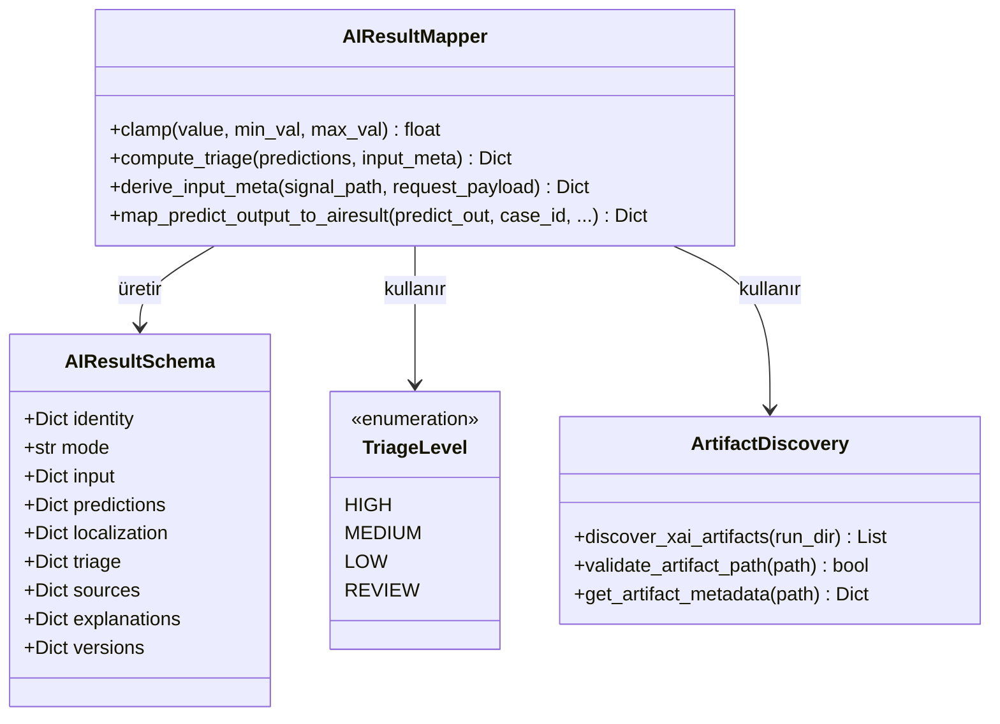

---

## 7. Backend Paketi (src.backend)

### 7.1 Sınıf Diyagramı

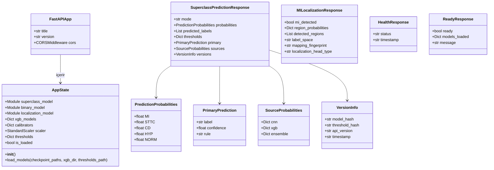

### 7.2 API Uç Noktaları

| Uç Nokta | Metod | Yanıt Sınıfı | Açıklama |
|----------|-------|--------------|----------|
| /predict/superclass | POST | SuperclassPredictionResponse | Çoklu etiket patoloji tahmini |
| /predict/mi-localization | POST | MILocalizationResponse | MI anatomik lokalizasyonu |
| /health | GET | HealthResponse | Canlılık kontrolü |
| /ready | GET | ReadyResponse | Hazırlık kontrolü |

---

## 8. Yardımcı Paket (src.utils)

### 8.1 Sınıf Diyagramı

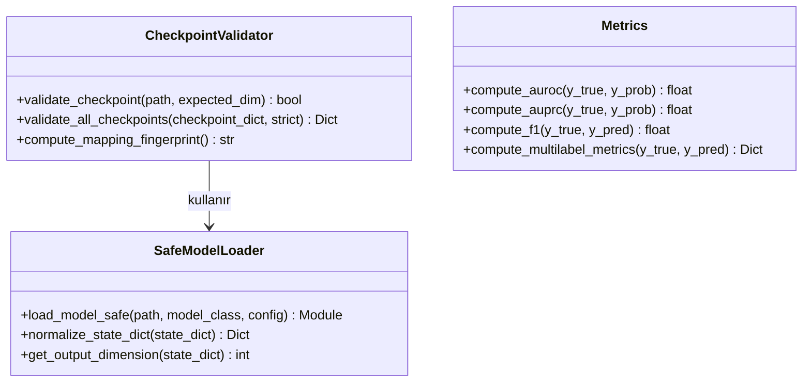

### 8.2 İstisna Sınıfları

| İstisna | Açıklama |
|---------|----------|
| CheckpointMismatchError | Kontrol noktası boyut uyuşmazlığı |
| MappingDriftError | MI eşleme parmak izi değişikliği |

---

## 9. Bağımlılık Grafiği

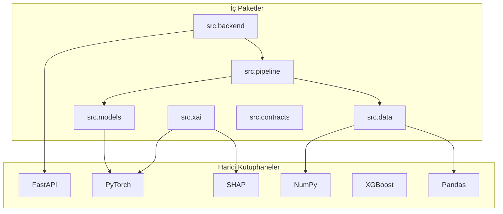

---

## 10. Tasarım Prensipleri

### 10.1 SOLID Prensipleri Uygulaması

| Prensip | Açıklama | Uygulama Örneği |
|---------|----------|-----------------|
| Tek Sorumluluk | Her sınıf tek bir sorumluluğa sahiptir | GradCAM yalnızca ısı haritası üretir |
| Açık/Kapalı | Sınıflar genişletmeye açık, değişikliğe kapalıdır | FiveClassHead, MultiClassHead sınıfını genişletir |
| Liskov Yerine Koyma | Alt sınıflar üst sınıfların yerine kullanılabilir | Tüm Head sınıfları nn.Module türevlidir |
| Arayüz Ayrımı | Küçük, odaklı arayüzler | SHAPExplainer soyut sınıfı |
| Bağımlılık Tersine Çevirme | Yüksek seviye modüller soyutlamalara bağımlıdır | Pipeline, Model arayüzlerine bağımlıdır |

### 10.2 Uygulanan Tasarım Desenleri

| Desen | Kullanım Yeri | Açıklama |
|-------|---------------|----------|
| Fabrika (Factory) | build_classification_head() | Tip parametresine göre uygun head sınıfı oluşturur |
| Strateji (Strategy) | Head sınıfları | Farklı sınıflandırma stratejileri |
| Tekil (Singleton) | AppState | Global uygulama durumu |
| Gözlemci (Observer) | GradCAM hook mekanizması | İleri ve geri yayılım olaylarını dinler |
| Cephe (Facade) | AIResultMapper | Karmaşık eşleme işlemini basitleştirir |

---

## Onay Sayfası

| Rol | Ad Soyad | Tarih | İmza |
|-----|----------|-------|------|
| Yazılım Mimarı | | | |
| Teknik Lider | | | |
| Kalite Güvence Mühendisi | | | |

---

**Doküman Sonu**

*Bu sınıf diyagramı CardioGuard-AI v1.0.0 mimarisini yansıtmaktadır. Gelecek versiyonlarda Transformer tabanlı modeller ve RAG entegrasyonu için yeni sınıflar eklenecektir.*
