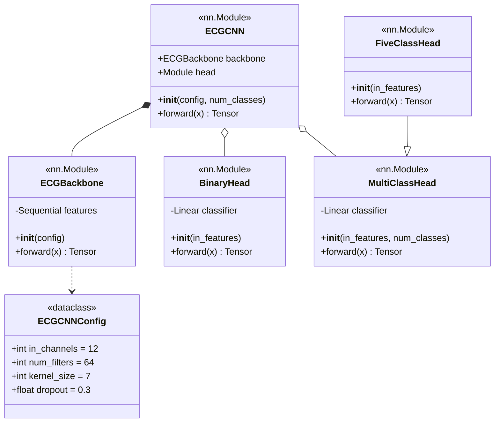
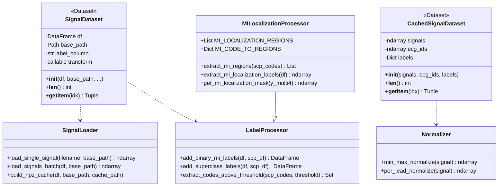
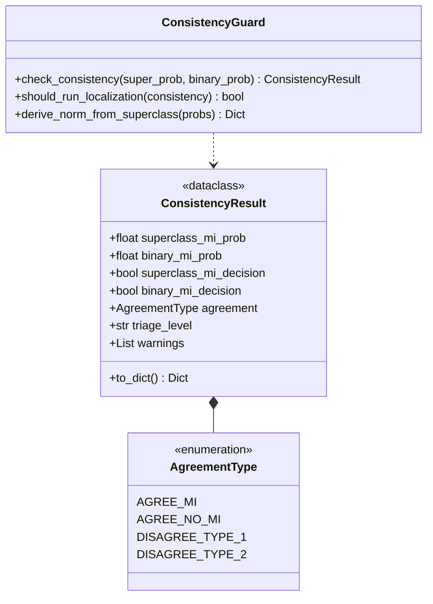
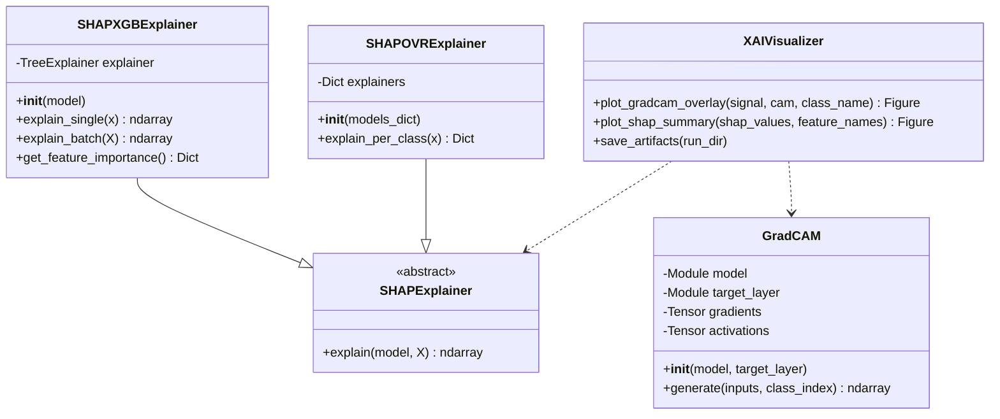
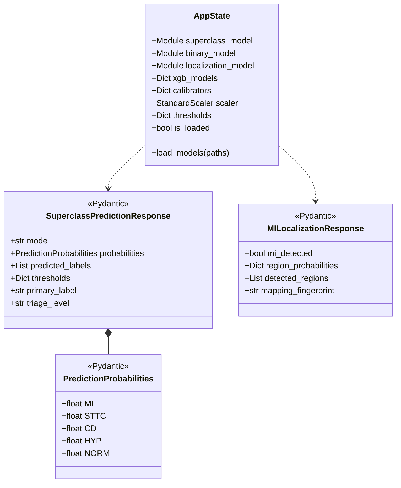
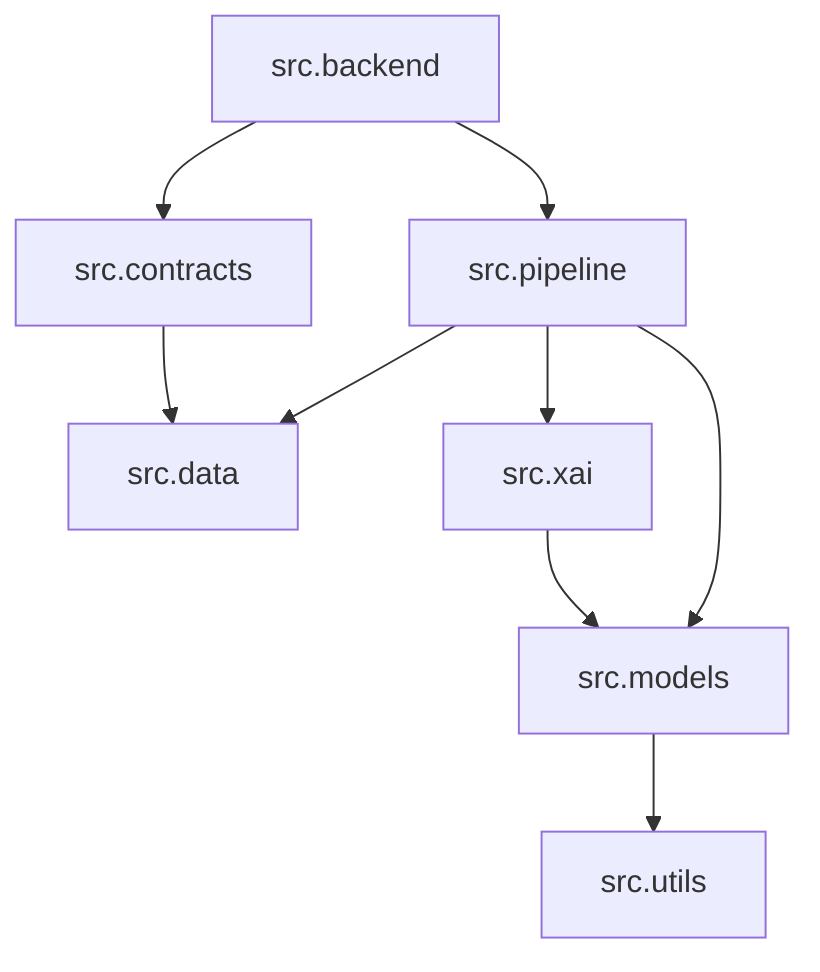
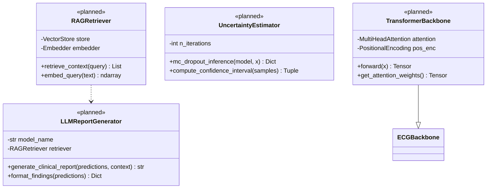

# CardioGuard-AI
# Sınıf Diyagramı

---

**Proje Adı:** CardioGuard-AI  
**Doküman Tipi:** Sınıf Diyagramı (Class Diagram)  
**Versiyon:** 1.0.0  
**Tarih:** 21 Ocak 2026  
**Hazırlayan:** CardioGuard-AI Geliştirme Ekibi

---

## İçindekiler

1. [Model Paketi](#1-model-paketi)
2. [Veri Paketi](#2-veri-paketi)
3. [Pipeline Paketi](#3-pipeline-paketi)
4. [XAI Paketi](#4-xai-paketi)
5. [Backend Paketi](#5-backend-paketi)
6. [Paket Bağımlılıkları](#6-paket-bağımlılıkları)
7. [Planlanan Sınıflar](#7-planlanan-sınıflar)

---

## 1. Model Paketi (src.models)

### Model Varyantları

| Model | Çıktı | Head Tipi | Kullanım |
|-------|-------|-----------|----------|
| Binary MI | 1 | BinaryHead | MI vs Normal sınıflandırma |
| Superclass | 4 | MultiClassHead | MI, STTC, CD, HYP çoklu-etiket |
| Lokalizasyon | 5 | FiveClassHead | AMI, ASMI, ALMI, IMI, LMI bölge tespiti |

---

## 2. Veri Paketi (src.data)

---

## 3. Pipeline Paketi (src.pipeline)

### Uyum Tipleri Açıklaması

| Tip | Super MI | Binary MI | Triaj | Yorum |
|-----|----------|-----------|-------|-------|
| AGREE_MI | Pozitif | Pozitif | Yüksek | Her iki model MI tespit etti |
| AGREE_NO_MI | Negatif | Negatif | Düşük | Her iki model normal buldu |
| DISAGREE_TYPE_1 | Pozitif | Negatif | İnceleme | Düşük güvenlikli MI |
| DISAGREE_TYPE_2 | Negatif | Pozitif | İnceleme | Olası kaçırılmış MI |

---

## 4. XAI Paketi (src.xai)

---

## 5. Backend Paketi (src.backend)

---

## 6. Paket Bağımlılıkları

---

## 7. Planlanan Sınıflar (v2.0)

---

## 8. UML Notasyonu

| Sembol | Anlam |
|--------|-------|
| `*--` | Kompozisyon (parça bütüne bağımlı) |
| `o--` | Agregasyon (parça bağımsız yaşayabilir) |
| `--|>` | Kalıtım (generalization) |
| `..>` | Bağımlılık (dependency) |
| `-->` | Birliktelik (association) |

---

## Onay Sayfası

| Rol | Ad Soyad | Tarih | İmza |
|-----|----------|-------|------|
| Yazılım Mimarı | | | |
| Teknik Lider | | | |
| Kalite Güvence Mühendisi | | | |

---

**Doküman Sonu**
