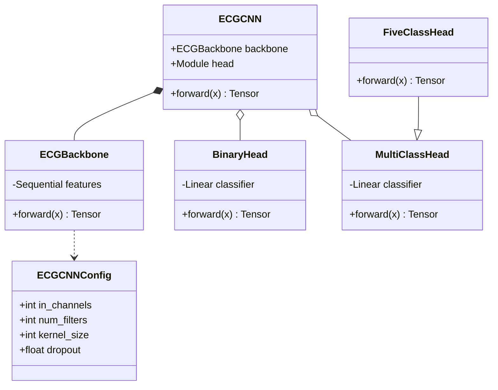
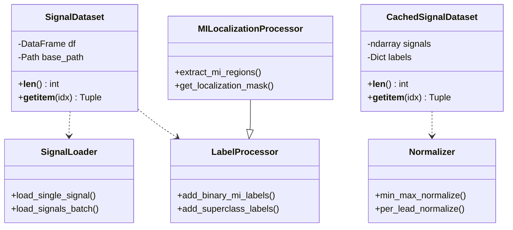
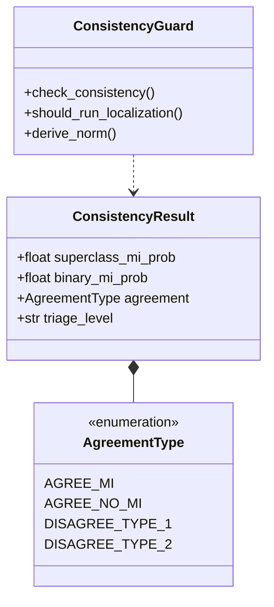
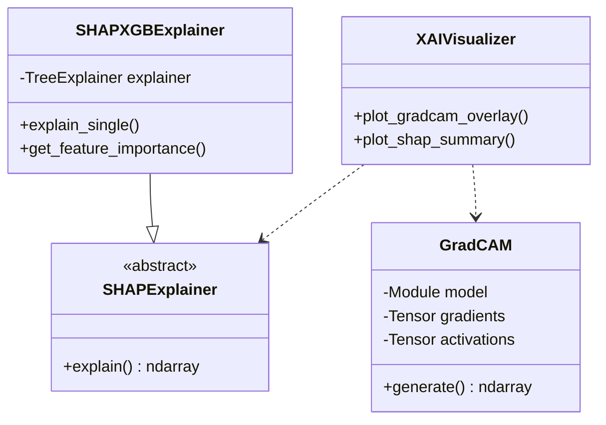
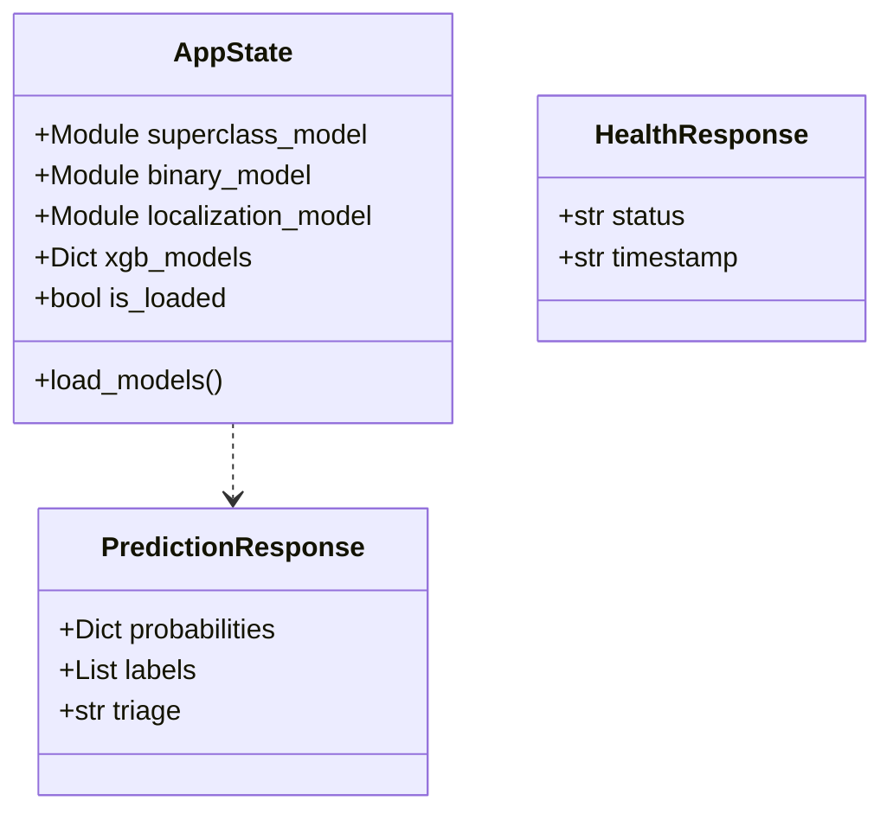
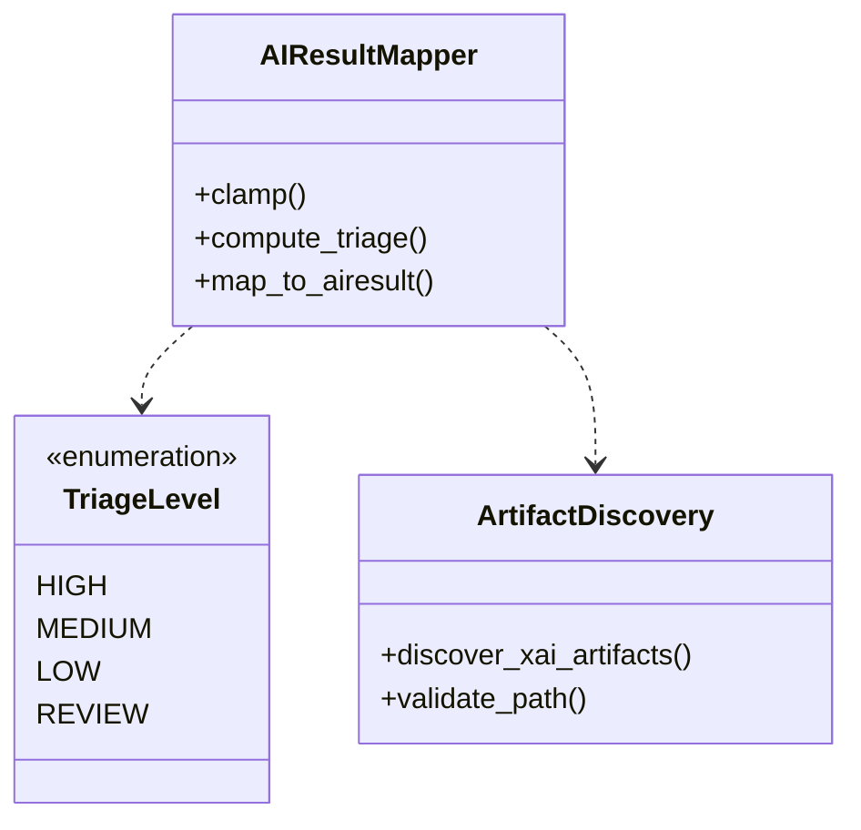
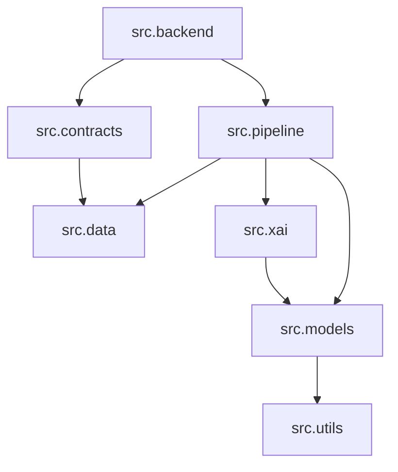
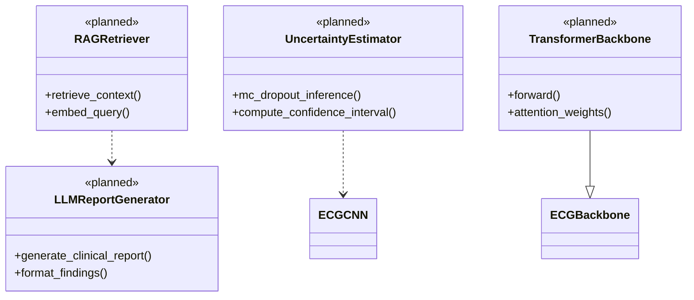

# CardioGuard-AI
# Sınıf Diyagramı

---

**Proje Adı:** CardioGuard-AI  
**Doküman Tipi:** Sınıf Diyagramı (Class Diagram)  
**Versiyon:** 1.0.0  
**Tarih:** 21 Ocak 2026  
**Hazırlayan:** CardioGuard-AI Geliştirme Ekibi

---

## 1. Model Paketi (src.models)

**Notasyon Açıklaması:**
- `*--` Kompozisyon (Composition)
- `o--` Agregasyon (Aggregation)  
- `--|>` Kalıtım (Generalization)
- `..>` Bağımlılık (Dependency)

---

## 2. Veri Paketi (src.data)

---

## 3. Pipeline Paketi (src.pipeline)

---

## 4. XAI Paketi (src.xai)

---

## 5. Backend Paketi (src.backend)

---

## 6. Kontrat Paketi (src.contracts)

---

## 7. Paket Bağımlılıkları

---

## 8. Planlanan Sınıflar (v2.0)

---

## 9. UML Notasyonu Referansı

| Sembol | Anlam | Açıklama |
|--------|-------|----------|
| `--|>` | Kalıtım | Alt sınıf üst sınıftan türer |
| `*--` | Kompozisyon | Parça bütüne bağımlı yaşar |
| `o--` | Agregasyon | Parça bütünden bağımsız yaşayabilir |
| `-->` | Birliktelik | Sınıflar arası referans |
| `..>` | Bağımlılık | Geçici kullanım ilişkisi |
| `..` | Gerçekleştirme | Arayüz implementasyonu |

---

## Onay Sayfası

| Rol | Ad Soyad | Tarih | İmza |
|-----|----------|-------|------|
| Yazılım Mimarı | | | |
| Teknik Lider | | | |

---

**Doküman Sonu**
