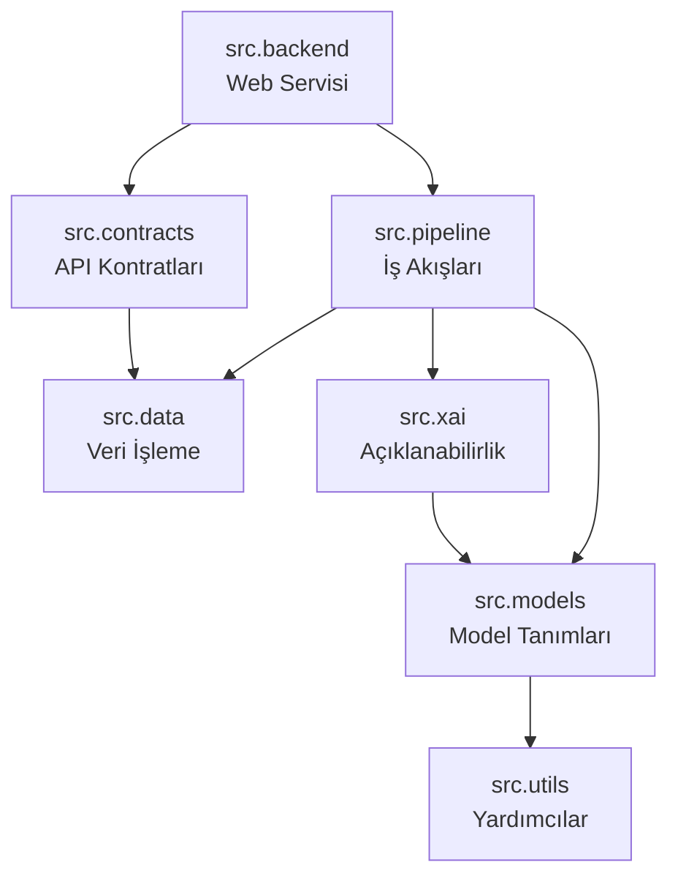
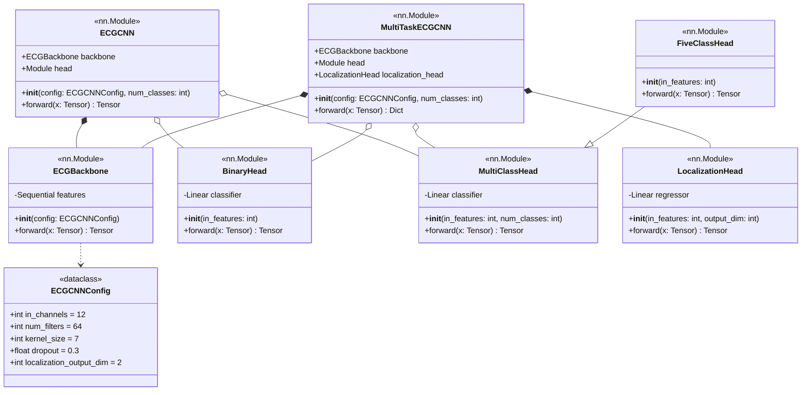
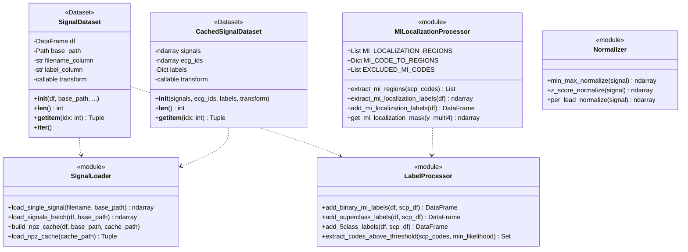
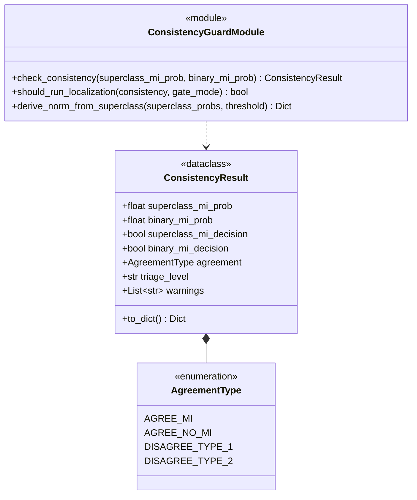
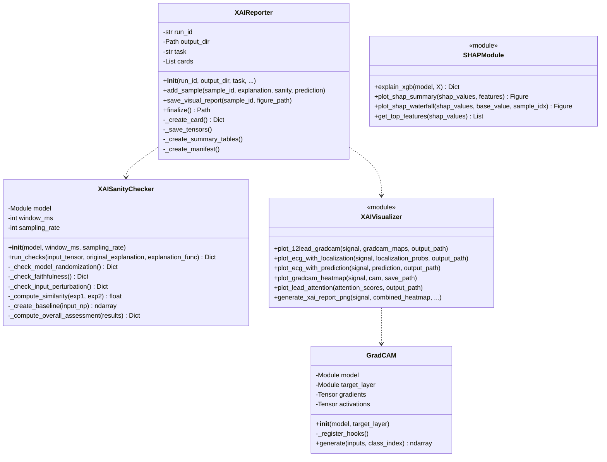
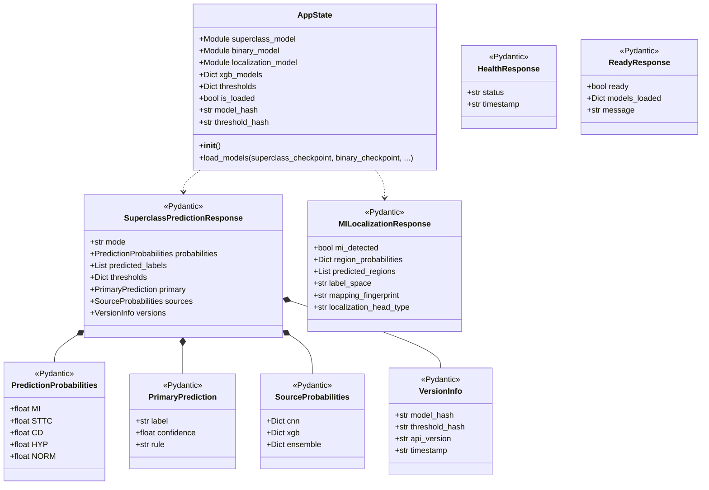
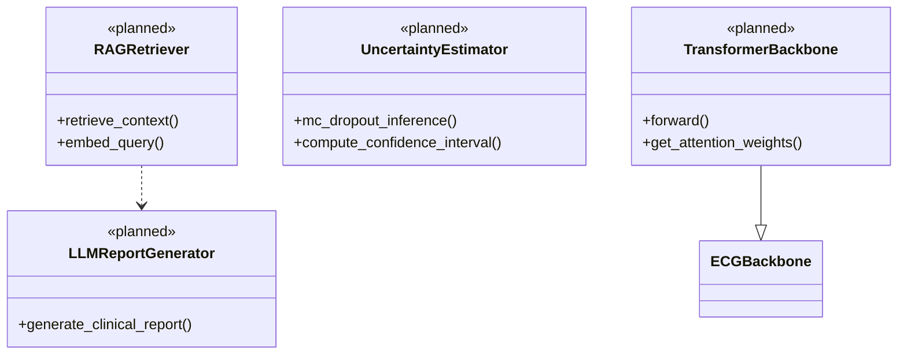

# CardioGuard-AI
# Sınıf Diyagramı

---

**Proje Adı:** CardioGuard-AI  
**Doküman Tipi:** Sınıf Diyagramı (Class Diagram)  
**Versiyon:** 2.0.0  
**Tarih:** 21 Ocak 2026  
**Hazırlayan:** CardioGuard-AI Geliştirme Ekibi

---

## 1. Genel Bakış

CardioGuard-AI, modüler bir mimari üzerine inşa edilmiştir. Sistem, birbirine bağımlı ancak ayrı sorumluluklar taşıyan yedi ana paketten oluşmaktadır. Bu doküman, her paketin sınıf yapısını UML standartlarına uygun şekilde tanımlamaktadır.

### 1.1 Paket Bağımlılıkları

---

## 2. Model Paketi (src.models)

Model paketi, yapay zeka modellerinin temel yapı taşlarını içerir. PyTorch `nn.Module` sınıfından türetilen model bileşenleri modüler ve yeniden kullanılabilir şekilde tasarlanmıştır.

### 2.1 Sınıf Diyagramı

### 2.2 Model Varyantları

| Model | Head Tipi | Çıktı | Kullanım Amacı |
|-------|-----------|-------|----------------|
| Binary MI | BinaryHead | 1 | MI vs Normal sınıflandırma |
| Superclass | MultiClassHead | 4 | MI, STTC, CD, HYP çoklu-etiket |
| Lokalizasyon | FiveClassHead | 5 | AMI, ASMI, ALMI, IMI, LMI bölge tespiti |
| Multi-Task | LocalizationHead | 2 | Zamansal regresyon çıktısı |

### 2.3 ECGBackbone Mimarisi

ECGBackbone, 12 derivasyonlu EKG sinyallerinden (12 × 1000) 64 boyutlu gömme vektörü çıkaran evrişimsel sinir ağıdır.

| Katman | Tip | Parametreler |
|--------|-----|--------------|
| 1 | Conv1d | 12→64, kernel=7, padding=3 |
| 2 | BatchNorm1d | 64 |
| 3 | ReLU | inplace=False |
| 4 | Dropout | p=0.3 |
| 5 | Conv1d | 64→64, kernel=7, padding=3 |
| 6 | BatchNorm1d | 64 |
| 7 | ReLU | inplace=False |
| 8 | Dropout | p=0.3 |
| 9 | AdaptiveAvgPool1d | output=1 |

### 2.4 Yardımcı Fonksiyonlar

| Fonksiyon | Açıklama |
|-----------|----------|
| `build_classification_head()` | BinaryHead veya MultiClassHead oluşturur |
| `build_localization_head()` | LocalizationHead oluşturur |
| `build_sequential_cnn()` | Sequential(backbone, head) yapısı oluşturur |
| `build_multitask_cnn()` | MultiTaskECGCNN instance oluşturur |

---

## 3. Veri Paketi (src.data)

Veri paketi, EKG sinyallerinin yüklenmesi, işlenmesi ve etiketlenmesi süreçlerini yönetir. PyTorch Dataset arayüzüne uygun sınıflar içerir.

### 3.1 Sınıf Diyagramı

### 3.2 Etiketleme Stratejileri

| Strateji | Açıklama | Kullanım |
|----------|----------|----------|
| Binary | MI=1, NORM=0, excluded=-1 | Binary MI modeli |
| Superclass | 4 sınıf multi-hot [MI, STTC, CD, HYP] | Superclass modeli |
| Lokalizasyon | 5 bölge multi-hot [AMI, ASMI, ALMI, IMI, LMI] | MI lokalizasyon modeli |

### 3.3 MI Lokalizasyon Bölgeleri

| Bölge Kodu | Açıklama | İlişkili PTB-XL Kodları |
|------------|----------|-------------------------|
| AMI | Anterior MI | AMI |
| ASMI | Anteroseptal MI | ASMI, INJAS |
| ALMI | Anterolateral MI | ALMI, INJAL |
| IMI | Inferior MI | IMI, IPMI, INJIN |
| LMI | Lateral MI | LMI, INJLA |

---

## 4. Pipeline Paketi (src.pipeline)

Pipeline paketi, tahmin ve eğitim iş akışlarını yöneten sınıfları içerir. Consistency Guard mekanizması burada tanımlanmıştır.

### 4.1 Tutarlılık Kontrolü Sınıfları

### 4.2 Uyum Tipleri

| Tip | Super MI | Binary MI | Triaj | Aksiyon |
|-----|----------|-----------|-------|---------|
| AGREE_MI | + | + | HIGH | Lokalizasyon çalıştır |
| AGREE_NO_MI | - | - | LOW | Normal raporla |
| DISAGREE_TYPE_1 | + | - | REVIEW | Lokalizasyon çalıştır, low confidence |
| DISAGREE_TYPE_2 | - | + | REVIEW | Manuel inceleme gerekli |

### 4.3 Gate Mode Stratejileri

| Mod | Açıklama |
|-----|----------|
| `strict` | Her iki model de MI tespit etmeli |
| `recall_first` | Sadece superclass MI yeterli |

---

## 5. XAI Paketi (src.xai)

Açıklanabilir yapay zeka paketi, model kararlarının görselleştirilmesini ve doğrulanmasını sağlar.

### 5.1 Sınıf Diyagramı

### 5.2 Sanity Check Testleri

| Test | Açıklama | Başarı Kriteri |
|------|----------|----------------|
| Model Randomization | Rastgele ağırlıklarla açıklama değişmeli | Spearman korelasyon < 0.5 |
| Faithfulness Deletion | Önemli bölgeler maskelendiğinde skor düşmeli | Score drop > 0.1 |
| Faithfulness Insertion | Önemli bölgeler eklendiğinde skor artmalı | Score rise > 0.1 |
| Input Perturbation | Küçük gürültüyle açıklama stabil kalmalı | Similarity > 0.7 |

### 5.3 Açıklama Yöntemleri

| Yöntem | Model | Çıktı | Görselleştirme |
|--------|-------|-------|----------------|
| Grad-CAM | CNN | Isı haritası (1000,) | Sinyal üzeri overlay |
| SmoothGrad-CAM | CNN | Ortalanmış ısı haritası | Daha stabil overlay |
| SHAP TreeExplainer | XGBoost | Özellik önemi | Çubuk grafik / Waterfall |

---

## 6. Backend Paketi (src.backend)

Backend paketi, FastAPI tabanlı REST API servisini içermektedir.

### 6.1 Sınıf Diyagramı

### 6.2 API Endpoints

| Endpoint | Metod | Response Sınıfı | Açıklama |
|----------|-------|-----------------|----------|
| /predict/superclass | POST | SuperclassPredictionResponse | Çoklu-etiket patoloji tahmini |
| /predict/mi-localization | POST | MILocalizationResponse | MI bölge lokalizasyonu |
| /health | GET | HealthResponse | Servis sağlık kontrolü |
| /ready | GET | ReadyResponse | Model yüklenme durumu |

---

## 7. Contracts Paketi (src.contracts)

API kontratları ve veri dönüşüm fonksiyonlarını içerir.

### 7.1 Sabitler

| Sabit | Değer | Açıklama |
|-------|-------|----------|
| AIRESULT_VERSION | "1.0" | Kontrat versiyonu |
| PATHOLOGY_CLASSES | ["MI", "STTC", "CD", "HYP"] | Patoloji sınıfları |
| MI_LOCALIZATION_LABELS | ["AMI", "ASMI", "ALMI", "IMI", "LMI"] | Lokalizasyon etiketleri |
| LEADS | ["I", "II", ..., "V6"] | 12 derivasyon isimleri |

### 7.2 Fonksiyonlar

| Fonksiyon | Açıklama |
|-----------|----------|
| `map_predict_output_to_airesult()` | Raw tahmin → AIResult v1.0 dönüşümü |
| `compute_triage()` | Triaj seviyesi hesaplama |
| `discover_xai_artifacts()` | XAI çıktı dosyalarını bulma |

---

## 8. Planlanan Sınıflar (v2.0)

---

## 9. UML Notasyonu

| Sembol | Anlam | Açıklama |
|--------|-------|----------|
| `*--` | Kompozisyon | Parça bütüne bağımlı yaşar |
| `o--` | Agregasyon | Parça bağımsız yaşayabilir |
| `--|>` | Kalıtım | Alt sınıf üst sınıftan türer |
| `..>` | Bağımlılık | Geçici kullanım ilişkisi |
| `<<stereotype>>` | Stereotip | Sınıf türü (dataclass, module, vb.) |

---

## Onay Sayfası

| Rol | Ad Soyad | Tarih | İmza |
|-----|----------|-------|------|
| Yazılım Mimarı | | | |
| Teknik Lider | | | |

---

**Doküman Sonu**
