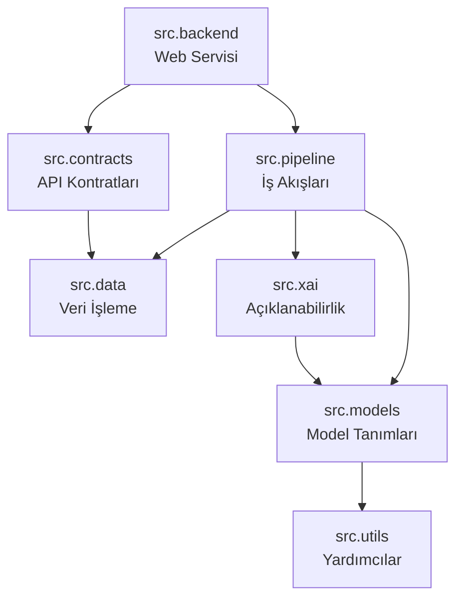
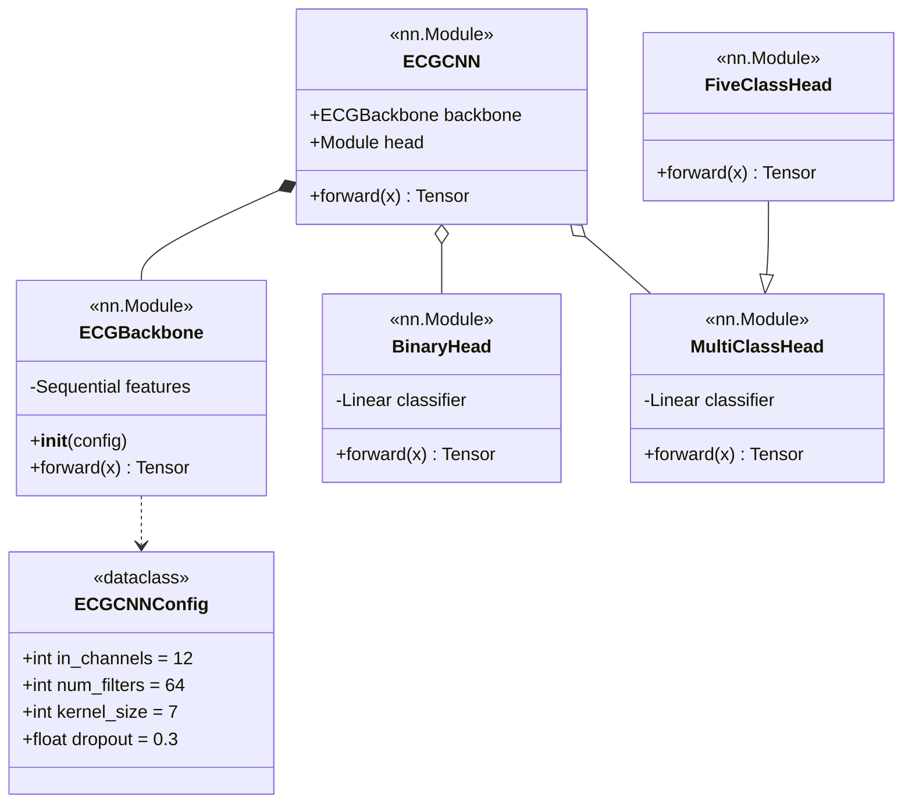
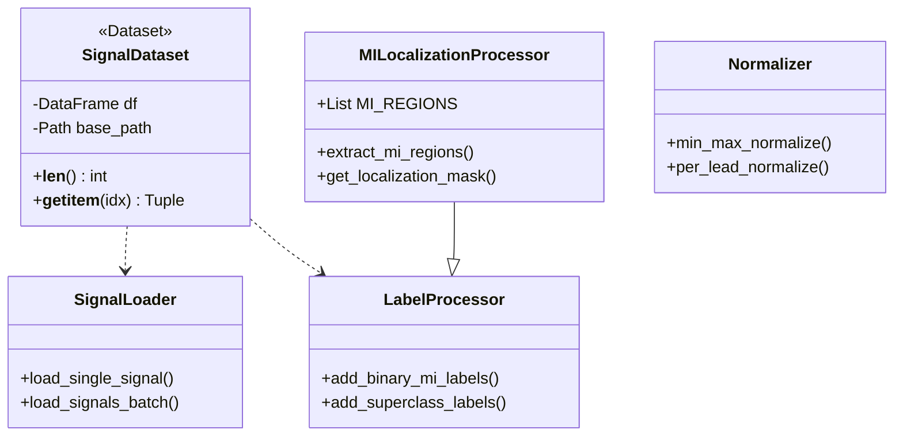
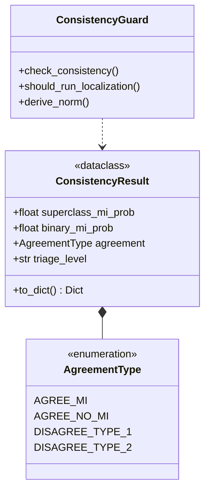
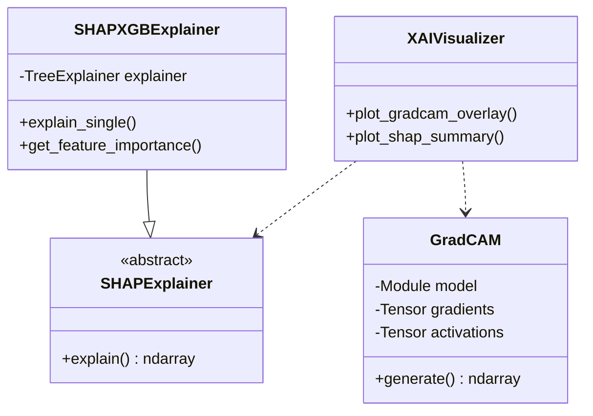
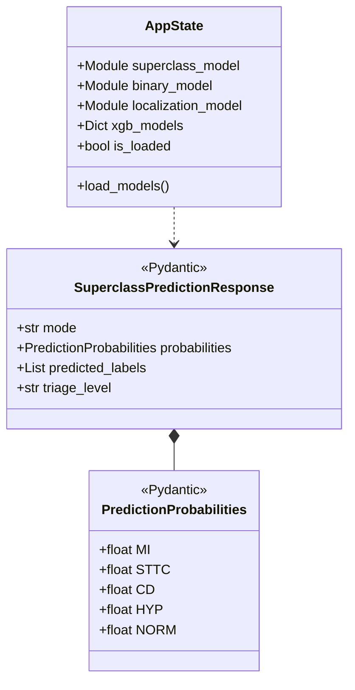
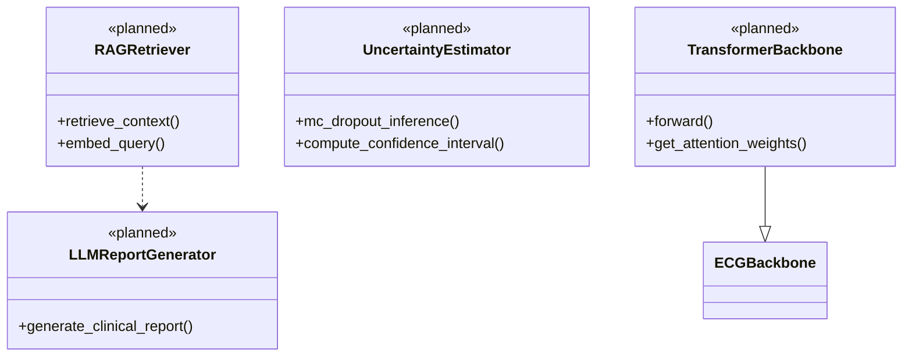

# CardioGuard-AI
# Sınıf Diyagramı

---

**Proje Adı:** CardioGuard-AI  
**Doküman Tipi:** Sınıf Diyagramı (Class Diagram)  
**Versiyon:** 1.0.0  
**Tarih:** 21 Ocak 2026  
**Hazırlayan:** CardioGuard-AI Geliştirme Ekibi

---

## 1. Genel Bakış

CardioGuard-AI, modüler bir mimari üzerine inşa edilmiştir. Sistem, birbirine bağımlı ancak ayrı sorumluluklar taşıyan yedi ana paketten oluşmaktadır. Bu doküman, her paketin sınıf yapısını UML standartlarına uygun şekilde tanımlamaktadır.

### 1.1 Paket Bağımlılıkları

---

## 2. Model Paketi (src.models)

Model paketi, EKG sinyallerini analiz eden derin öğrenme modellerini içermektedir. Merkezi bileşen olan ECGBackbone, tüm modeller tarafından paylaşılan özellik çıkarıcı olarak görev yapmaktadır.

### 2.1 Sınıf Diyagramı

### 2.2 Model Varyantları

| Model | Head Tipi | Çıktı | Kullanım Amacı |
|-------|-----------|-------|----------------|
| Binary MI | BinaryHead | 1 | MI vs Normal sınıflandırma |
| Superclass | MultiClassHead | 4 | MI, STTC, CD, HYP çoklu-etiket |
| Lokalizasyon | FiveClassHead | 5 | 5 anatomik bölge tespiti |

### 2.3 ECGBackbone Mimarisi

ECGBackbone, 12 derivasyonlu EKG sinyallerinden 64 boyutlu gömme vektörü çıkaran evrişimsel sinir ağıdır.

| Katman | Tip | Parametreler |
|--------|-----|--------------|
| 1 | Conv1d | 12→64, kernel=7 |
| 2 | BatchNorm1d | 64 |
| 3 | ReLU | - |
| 4 | Dropout | p=0.3 |
| 5 | Conv1d | 64→64, kernel=7 |
| 6 | BatchNorm1d | 64 |
| 7 | ReLU | - |
| 8 | Dropout | p=0.3 |
| 9 | AdaptiveAvgPool1d | output=1 |

---

## 3. Veri Paketi (src.data)

Veri paketi, PTB-XL veri setinin yüklenmesi, etiketlenmesi ve ön işlenmesinden sorumludur.

### 3.1 Sınıf Diyagramı

### 3.2 Etiketleme Stratejileri

| Strateji | Açıklama | Kullanım |
|----------|----------|----------|
| Binary | MI=1, NORM=0 | Binary MI modeli |
| Superclass | 4 sınıf multi-hot | Superclass modeli |
| Lokalizasyon | 5 bölge multi-hot | MI lokalizasyon modeli |

---

## 4. Pipeline Paketi (src.pipeline)

Pipeline paketi, model eğitimi ve çıkarım iş akışlarını yönetmektedir.

### 4.1 Tutarlılık Kontrolü Sınıfları

### 4.2 Uyum Tipleri

| Tip | Super MI | Binary MI | Triaj | Aksiyon |
|-----|----------|-----------|-------|---------|
| AGREE_MI | + | + | Yüksek | Lokalizasyon çalıştır |
| AGREE_NO_MI | - | - | Düşük | Normal raporla |
| DISAGREE_TYPE_1 | + | - | İnceleme | Lokalizasyon çalıştır |
| DISAGREE_TYPE_2 | - | + | İnceleme | Manuel inceleme |

---

## 5. XAI Paketi (src.xai)

Açıklanabilir yapay zeka paketi, model kararlarının görselleştirilmesini sağlar.

### 5.1 Sınıf Diyagramı

### 5.2 Açıklama Yöntemleri

| Yöntem | Model | Çıktı | Görselleştirme |
|--------|-------|-------|----------------|
| Grad-CAM | CNN | Isı haritası | Sinyal üzeri overlay |
| SHAP | XGBoost | Özellik önemi | Çubuk grafik |

---

## 6. Backend Paketi (src.backend)

Backend paketi, FastAPI tabanlı REST API servisini içermektedir.

### 6.1 Sınıf Diyagramı

### 6.2 API Endpoints

| Endpoint | Metod | Response Sınıfı |
|----------|-------|-----------------|
| /predict/superclass | POST | SuperclassPredictionResponse |
| /predict/mi-localization | POST | MILocalizationResponse |
| /health | GET | HealthResponse |
| /ready | GET | ReadyResponse |

---

## 7. Planlanan Sınıflar (v2.0)

---

## 8. UML Notasyonu

| Sembol | Anlam | Açıklama |
|--------|-------|----------|
| `*--` | Kompozisyon | Parça bütüne bağımlı yaşar |
| `o--` | Agregasyon | Parça bağımsız yaşayabilir |
| `--|>` | Kalıtım | Alt sınıf üst sınıftan türer |
| `..>` | Bağımlılık | Geçici kullanım ilişkisi |

---

## Onay Sayfası

| Rol | Ad Soyad | Tarih | İmza |
|-----|----------|-------|------|
| Yazılım Mimarı | | | |
| Teknik Lider | | | |

---

**Doküman Sonu**
