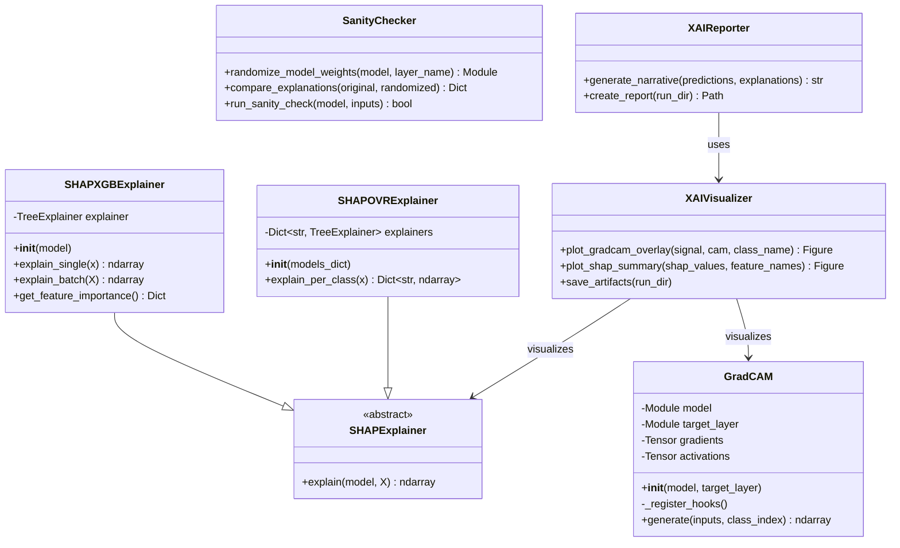

# CardioGuard-AI: Class Diyagramı
## (Sınıf Diyagramı)

---

## 📋 Doküman Bilgileri

| Özellik | Değer |
|---------|-------|
| **Proje Adı** | CardioGuard-AI |
| **Doküman Tipi** | Class Diyagramı |
| **Versiyon** | 1.0.0 |
| **Tarih** | 2026-01-21 |

---

## 1. Genel Bakış

CardioGuard-AI sistemi aşağıdaki ana paketlerden oluşur:

```mermaid
graph TB
    subgraph Packages["📦 Paketler"]
        MODELS["src.models<br/>🧠 Model Tanımları"]
        DATA["src.data<br/>📊 Veri İşleme"]
        PIPELINE["src.pipeline<br/>🔄 Pipeline'lar"]
        XAI["src.xai<br/>💡 Açıklanabilirlik"]
        CONTRACTS["src.contracts<br/>📄 API Kontratları"]
        BACKEND["src.backend<br/>🌐 Web Servisi"]
        UTILS["src.utils<br/>🔧 Yardımcılar"]
    end
    
    BACKEND --> MODELS
    BACKEND --> PIPELINE
    BACKEND --> CONTRACTS
    PIPELINE --> MODELS
    PIPELINE --> DATA
    PIPELINE --> XAI
    XAI --> MODELS
    CONTRACTS --> DATA
    
    style MODELS fill:#e3f2fd
    style DATA fill:#fff3e0
    style PIPELINE fill:#e8f5e9
    style XAI fill:#f3e5f5
    style CONTRACTS fill:#fce4ec
    style BACKEND fill:#e0f2f1
    style UTILS fill:#f5f5f5
```

---

## 2. Model Paketi (src.models)

### 2.1 Tam Class Diyagramı

### 2.2 Model Varyantları

| Model | Çıktı Boyutu | Head Tipi | Kullanım |
|-------|--------------|-----------|----------|
| **Binary MI** | 1 | BinaryHead | MI vs NORM sınıflandırması |
| **Superclass** | 4 | MultiClassHead | [MI, STTC, CD, HYP] çoklu-etiket |
| **Localization** | 5 | FiveClassHead | [AMI, ASMI, ALMI, IMI, LMI] bölge tespiti |

---

## 3. Data Paketi (src.data)

### 3.1 Class Diyagramı

### 3.2 Veri Akışı

```mermaid
graph LR
    subgraph Raw["Ham Veri"]
        PTBXL["PTB-XL<br/>21,837 kayıt"]
    end
    
    subgraph Loading["Yükleme"]
        LOADER["SignalLoader"]
        META["Metadata<br/>DataFrame"]
    end
    
    subgraph Processing["İşleme"]
        LABEL["LabelProcessor"]
        MILOC["MILocalizationProcessor"]
        NORM["Normalizer"]
    end
    
    subgraph Output["Çıktı"]
        DS["SignalDataset<br/>veya<br/>CachedSignalDataset"]
    end
    
    PTBXL --> LOADER --> META
    META --> LABEL --> MILOC --> DS
    LOADER --> NORM --> DS
    
    style PTBXL fill:#e3f2fd
    style DS fill:#e8f5e9
```

---

## 4. Pipeline Paketi (src.pipeline)

### 4.1 Inference Pipeline

### 4.2 Training Pipeline

---

## 5. XAI Paketi (src.xai)

### 5.1 Class Diyagramı

### 5.2 Açıklama Akışı

```mermaid
graph TB
    subgraph Input
        SIGNAL["EKG Sinyali"]
        PREDS["Tahminler"]
    end
    
    subgraph Generators["Açıklama Üreticileri"]
        GCAM["GradCAM"]
        SHAP["SHAP Explainer"]
    end
    
    subgraph Validators["Doğrulayıcılar"]
        SANITY["SanityChecker"]
    end
    
    subgraph Output["Çıktılar"]
        VIZ["Görselleştirmeler<br/>(PNG)"]
        TEXT["Narratives<br/>(MD)"]
    end
    
    SIGNAL --> GCAM & SHAP
    PREDS --> GCAM & SHAP
    GCAM --> SANITY --> VIZ
    SHAP --> VIZ
    VIZ --> TEXT
    
    style GCAM fill:#ffecb3
    style SHAP fill:#ffecb3
    style SANITY fill:#ffcdd2
```

---

## 6. Contracts Paketi (src.contracts)

### 6.1 Class Diyagramı

---

## 7. Backend Paketi (src.backend)

### 7.1 Class Diyagramı

```mermaid
classDiagram
    direction TB
    
    class FastAPIApp {
        <<FastAPI>>
        +str title = "CardioGuard-AI"
        +str version = "1.0.0"
        +CORSMiddleware cors
    }
    
    class AppState {
        +Module superclass_model
        +Module binary_model
        +Module localization_model
        +Dict xgb_models
        +Dict calibrators
        +StandardScaler scaler
        +Dict thresholds
        +bool is_loaded
        +__init__()
        +load_models(checkpoint_paths, xgb_dir, thresholds_path)
    }
    
    class PredictionProbabilities {
        <<Pydantic BaseModel>>
        +float MI
        +float STTC
        +float CD
        +float HYP
        +float NORM
    }
    
    class PrimaryPrediction {
        <<Pydantic BaseModel>>
        +str label
        +float confidence
        +str rule = "MI-first-then-priority"
    }
    
    class SourceProbabilities {
        <<Pydantic BaseModel>>
        +Dict~str, float~ cnn
        +Dict~str, float~ xgb
        +Dict~str, float~ ensemble
    }
    
    class VersionInfo {
        <<Pydantic BaseModel>>
        +str model_hash
        +str threshold_hash
        +str api_version = "1.0.0"
        +str timestamp
    }
    
    class SuperclassPredictionResponse {
        <<Pydantic BaseModel>>
        +str mode = "multilabel-superclass"
        +PredictionProbabilities probabilities
        +List~str~ predicted_labels
        +Dict~str, float~ thresholds
        +PrimaryPrediction primary
        +SourceProbabilities sources
        +VersionInfo versions
    }
    
    class MILocalizationResponse {
        <<Pydantic BaseModel>>
        +bool mi_detected
        +Dict~str, float~ region_probabilities
        +List~str~ detected_regions
        +str label_space
        +str mapping_fingerprint
        +str localization_head_type
    }
    
    class HealthResponse {
        <<Pydantic BaseModel>>
        +str status
        +str timestamp
    }
    
    class ReadyResponse {
        <<Pydantic BaseModel>>
        +bool ready
        +Dict~str, bool~ models_loaded
        +str message
    }
    
    %% İlişkiler
    FastAPIApp --> AppState : contains
    SuperclassPredictionResponse --> PredictionProbabilities
    SuperclassPredictionResponse --> PrimaryPrediction
    SuperclassPredictionResponse --> SourceProbabilities
    SuperclassPredictionResponse --> VersionInfo
```

### 7.2 API Endpoint'leri

---

## 8. Utils Paketi (src.utils)

### 8.1 Class Diyagramı

---

## 9. Bağımlılık Grafiği

---

## 10. Tasarım Prensipleri

### 10.1 SOLID Prensipleri

| Prensip | Uygulama |
|---------|----------|
| **Single Responsibility** | Her sınıf tek bir sorumluluğa sahip (ör. GradCAM sadece heatmap üretir) |
| **Open/Closed** | Head sınıfları genişletilebilir (FiveClassHead extends MultiClassHead) |
| **Liskov Substitution** | Tüm Head sınıfları nn.Module'den türetilmiş ve değiştirilebilir |
| **Interface Segregation** | Küçük, odaklı arayüzler (SHAPExplainer abstract class) |
| **Dependency Inversion** | Üst seviye modüller soyutlamalara bağımlı |

### 10.2 Tasarım Desenleri

| Desen | Kullanım Yeri |
|-------|---------------|
| **Factory** | `build_classification_head()`, `build_sequential_cnn()` |
| **Strategy** | Farklı Head tipleri (BinaryHead, MultiClassHead) |
| **Singleton** | AppState (global state) |
| **Observer** | GradCAM hook mekanizması |
| **Facade** | AIResultMapper (karmaşık mapping işlemini basitleştirir) |

---

> **Not:** Bu class diyagramı CardioGuard-AI v1.0.0 mimarisini yansıtmaktadır. Gelecek versiyonlarda Transformer-based modeller ve RAG entegrasyonu için yeni sınıflar eklenecektir.
