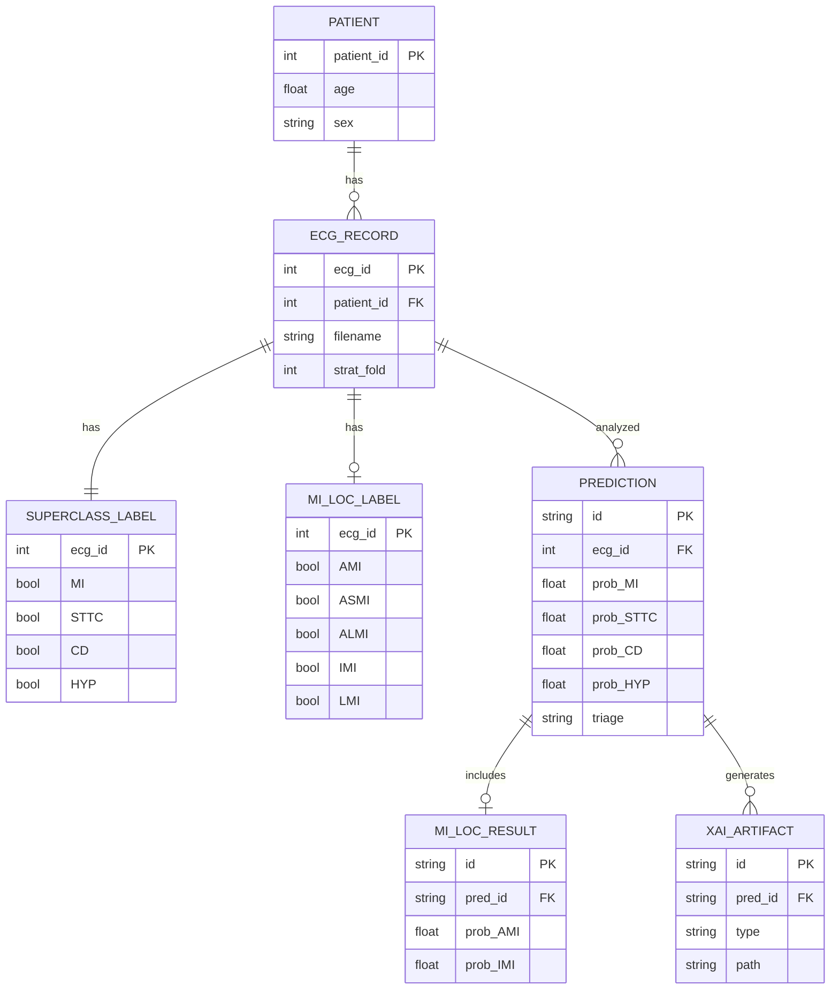

# CardioGuard-AI
# Varlık-İlişki Diyagramı (ERD)

---

**Proje Adı:** CardioGuard-AI  
**Doküman Tipi:** Varlık-İlişki Diyagramı  
**Versiyon:** 1.0.0  
**Tarih:** 21 Ocak 2026  
**Hazırlayan:** CardioGuard-AI Geliştirme Ekibi

---

## 1. Ana ERD Diyagramı

---

## 2. Varlık Özeti

| Varlık | Açıklama | Kayıt Sayısı |
|--------|----------|--------------|
| PATIENT | Hasta bilgileri | 18,885 |
| ECG_RECORD | EKG kayıtları | 21,837 |
| SUPERCLASS_LABEL | 4-sınıf etiketler | 21,837 |
| MI_LOC_LABEL | MI bölge etiketleri | ~5,486 |
| PREDICTION | Tahmin sonuçları | Dinamik |
| MI_LOC_RESULT | Lokalizasyon sonuçları | Dinamik |
| XAI_ARTIFACT | Açıklama dosyaları | Dinamik |

---

## 3. Kardinalite İlişkileri

| İlişki | Tip | Açıklama |
|--------|-----|----------|
| PATIENT → ECG_RECORD | 1:N | Bir hasta birden fazla EKG'ye sahip olabilir |
| ECG_RECORD → SUPERCLASS_LABEL | 1:1 | Her EKG'nin bir süpersınıf etiketi vardır |
| ECG_RECORD → MI_LOC_LABEL | 1:0..1 | MI varsa lokalizasyon etiketi vardır |
| ECG_RECORD → PREDICTION | 1:N | Bir EKG birden fazla kez analiz edilebilir |
| PREDICTION → MI_LOC_RESULT | 1:0..1 | MI tespit edilirse lokalizasyon sonucu vardır |
| PREDICTION → XAI_ARTIFACT | 1:N | Bir tahmin birden fazla XAI çıktısı üretebilir |

---

## 4. Anahtar Alanlar

### 4.1 Birincil Anahtarlar (PK)

| Varlık | Alan | Tip |
|--------|------|-----|
| PATIENT | patient_id | INT |
| ECG_RECORD | ecg_id | INT |
| PREDICTION | id | UUID |

### 4.2 Yabancı Anahtarlar (FK)

| Varlık | Alan | Referans |
|--------|------|----------|
| ECG_RECORD | patient_id | PATIENT.patient_id |
| PREDICTION | ecg_id | ECG_RECORD.ecg_id |
| MI_LOC_RESULT | pred_id | PREDICTION.id |

---

## 5. Etiket Dağılımı

| Sınıf | Sayı | Oran |
|-------|------|------|
| MI | 5,486 | %25.1 |
| STTC | 5,250 | %24.0 |
| CD | 4,907 | %22.5 |
| HYP | 2,655 | %12.2 |
| NORM | 9,528 | %43.6 |

---

## 6. Veri Bölümlemesi

| Bölüm | Katmanlar | Kayıt | Kullanım |
|-------|-----------|-------|----------|
| Eğitim | 1-8 | 17,469 | Model eğitimi |
| Doğrulama | 9 | 2,189 | Hiperparametre ayarı |
| Test | 10 | 2,179 | Final değerlendirme |

---

## 7. Planlanan Varlıklar (v2.0)

| Varlık | Açıklama |
|--------|----------|
| RAG_CONTEXT | Klinik kılavuz bağlamları |
| UNCERTAINTY_SCORE | Monte Carlo belirsizlik değerleri |
| LLM_REPORT | Otomatik üretilen raporlar |

---

## Onay Sayfası

| Rol | Ad Soyad | Tarih | İmza |
|-----|----------|-------|------|
| Veritabanı Mimarı | | | |
| Teknik Lider | | | |

---

**Doküman Sonu**
