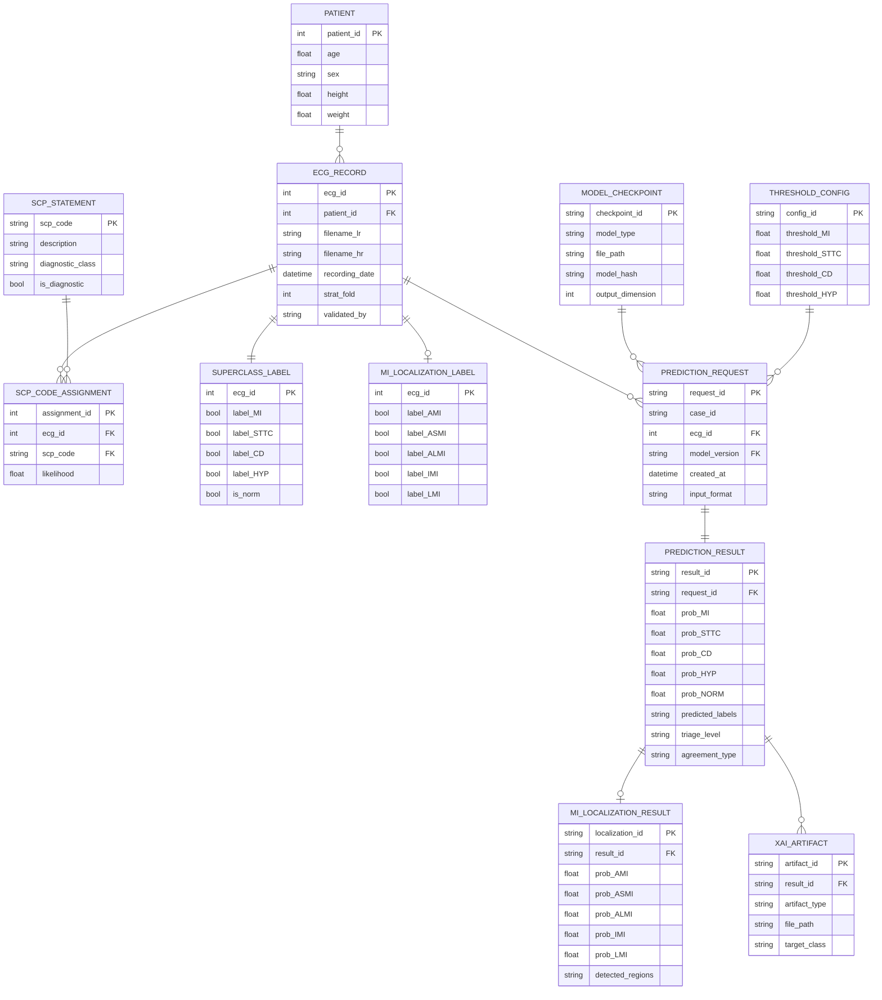

# CardioGuard-AI
# Varlık-İlişki Diyagramı (ERD)

---

**Proje Adı:** CardioGuard-AI  
**Doküman Tipi:** Varlık-İlişki Diyagramı (Entity-Relationship Diagram)  
**Versiyon:** 1.0.0  
**Tarih:** 21 Ocak 2026  
**Hazırlayan:** CardioGuard-AI Geliştirme Ekibi

---

## İçindekiler

1. [Ana ERD Diyagramı](#1-ana-erd-diyagramı)
2. [Varlık Detayları](#2-varlık-detayları)
3. [İlişki Detayları](#3-ilişki-detayları)
4. [Veri İstatistikleri](#4-veri-istatistikleri)
5. [Planlanan Varlıklar](#5-planlanan-varlıklar)

---

## 1. Ana ERD Diyagramı

---

## 2. Varlık Detayları

### 2.1 Kaynak Veri Varlıkları

| Varlık | Açıklama | Birincil Anahtar |
|--------|----------|------------------|
| PATIENT | Hasta demografik bilgileri | patient_id |
| ECG_RECORD | EKG kayıt dosyaları ve metadata | ecg_id |
| SCP_STATEMENT | Standart SCP kod tanımları | scp_code |
| SCP_CODE_ASSIGNMENT | EKG-SCP kod eşlemeleri | assignment_id |

### 2.2 Etiket Varlıkları

| Varlık | Açıklama | Alan Sayısı |
|--------|----------|-------------|
| SUPERCLASS_LABEL | 4 patoloji sınıfı etiketleri | MI, STTC, CD, HYP, NORM |
| MI_LOCALIZATION_LABEL | 5 MI bölge etiketleri | AMI, ASMI, ALMI, IMI, LMI |

### 2.3 Tahmin Varlıkları

| Varlık | Açıklama | Oluşturulma |
|--------|----------|-------------|
| PREDICTION_REQUEST | Tahmin isteği kaydı | Her API çağrısında |
| PREDICTION_RESULT | Tahmin sonuçları | İstek başına bir |
| MI_LOCALIZATION_RESULT | MI bölge sonuçları | MI tespit edilirse |
| XAI_ARTIFACT | Açıklama dosyaları | XAI etkinse |

### 2.4 Konfigürasyon Varlıkları

| Varlık | Açıklama | Güncelleme |
|--------|----------|------------|
| MODEL_CHECKPOINT | Model dosya bilgileri | Her eğitimde |
| THRESHOLD_CONFIG | Sınıflandırma eşikleri | Optimizasyonda |

---

## 3. İlişki Detayları

### 3.1 Kardinalite Tablosu

| Kaynak | Hedef | Kardinalite | Açıklama |
|--------|-------|-------------|----------|
| PATIENT | ECG_RECORD | 1:N | Bir hasta birden fazla EKG'ye sahip olabilir |
| ECG_RECORD | SCP_CODE_ASSIGNMENT | 1:N | Bir EKG birden fazla SCP koduna sahip olabilir |
| ECG_RECORD | SUPERCLASS_LABEL | 1:1 | Her EKG için bir süpersınıf etiketi |
| ECG_RECORD | MI_LOCALIZATION_LABEL | 1:0..1 | MI varsa lokalizasyon etiketi |
| ECG_RECORD | PREDICTION_REQUEST | 1:N | Bir EKG birden fazla kez analiz edilebilir |
| PREDICTION_REQUEST | PREDICTION_RESULT | 1:1 | Her istek bir sonuç üretir |
| PREDICTION_RESULT | MI_LOCALIZATION_RESULT | 1:0..1 | MI tespit edilirse |
| PREDICTION_RESULT | XAI_ARTIFACT | 1:N | Birden fazla XAI çıktısı |

### 3.2 Yabancı Anahtar Kısıtları

| Tablo | Alan | Referans | Silme Kuralı |
|-------|------|----------|--------------|
| ECG_RECORD | patient_id | PATIENT.patient_id | RESTRICT |
| SCP_CODE_ASSIGNMENT | ecg_id | ECG_RECORD.ecg_id | CASCADE |
| PREDICTION_REQUEST | ecg_id | ECG_RECORD.ecg_id | SET NULL |
| PREDICTION_RESULT | request_id | PREDICTION_REQUEST.request_id | CASCADE |
| XAI_ARTIFACT | result_id | PREDICTION_RESULT.result_id | CASCADE |

---

## 4. Veri İstatistikleri

### 4.1 Kayıt Sayıları

| Varlık | Kayıt Sayısı | Kaynak |
|--------|--------------|--------|
| PATIENT | 18,885 | PTB-XL |
| ECG_RECORD | 21,837 | PTB-XL |
| SUPERCLASS_LABEL | 21,837 | Türetilmiş |
| MI_LOCALIZATION_LABEL | ~5,486 | MI kayıtları |

### 4.2 Etiket Dağılımı

| Sınıf | Kayıt Sayısı | Oran |
|-------|--------------|------|
| MI | 5,486 | %25.1 |
| STTC | 5,250 | %24.0 |
| CD | 4,907 | %22.5 |
| HYP | 2,655 | %12.2 |
| NORM | 9,528 | %43.6 |

### 4.3 Veri Bölümlemesi

| Bölüm | Katmanlar | Kayıt Sayısı | Kullanım |
|-------|-----------|--------------|----------|
| Eğitim | 1-8 | 17,469 | Model eğitimi |
| Doğrulama | 9 | 2,189 | Hiperparametre ayarı |
| Test | 10 | 2,179 | Final değerlendirme |

---

## 5. Planlanan Varlıklar (v2.0)

| Varlık | Açıklama | İlişki |
|--------|----------|--------|
| RAG_CONTEXT | Klinik kılavuz bağlamları | PREDICTION_RESULT ile 1:N |
| UNCERTAINTY_SCORE | Monte Carlo belirsizlik değerleri | PREDICTION_RESULT ile 1:1 |
| LLM_REPORT | Otomatik üretilen klinik raporlar | PREDICTION_RESULT ile 1:1 |
| CLINICAL_GUIDELINE | Kılavuz referansları | RAG_CONTEXT ile N:M |

---

## Onay Sayfası

| Rol | Ad Soyad | Tarih | İmza |
|-----|----------|-------|------|
| Veritabanı Mimarı | | | |
| Teknik Lider | | | |
| Kalite Güvence Mühendisi | | | |

---

**Doküman Sonu**

*Bu ERD, CardioGuard-AI v1.0.0 veri modelini temsil eder. Kavramsal düzeyde olup, üretim ortamında PostgreSQL veya MongoDB kullanılması önerilir.*
