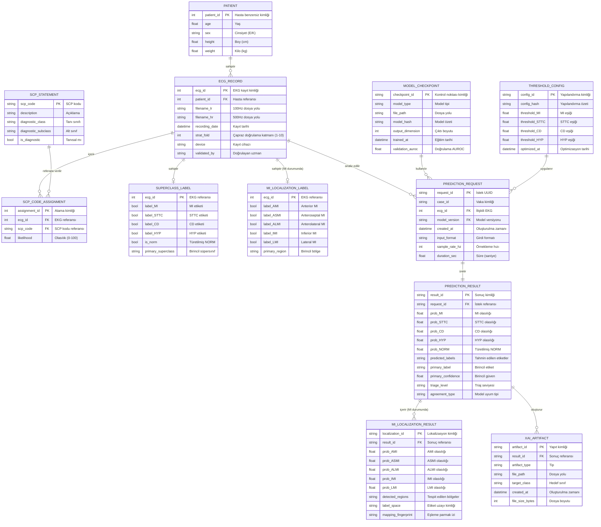
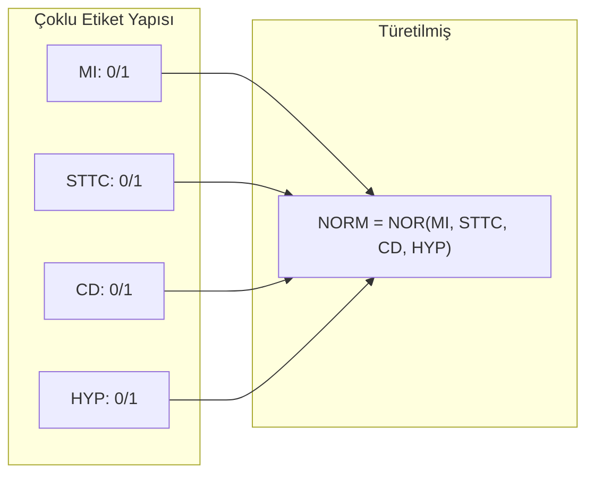
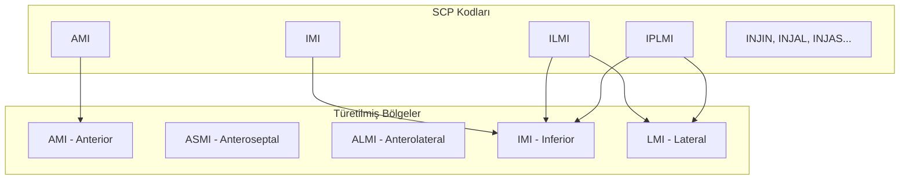
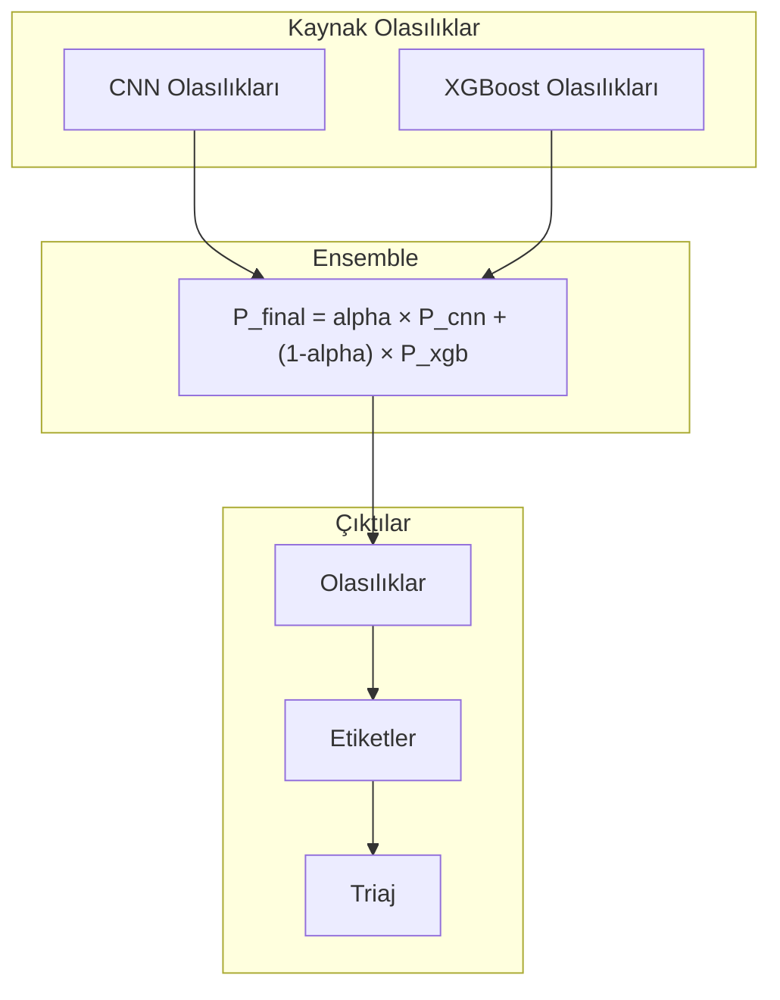
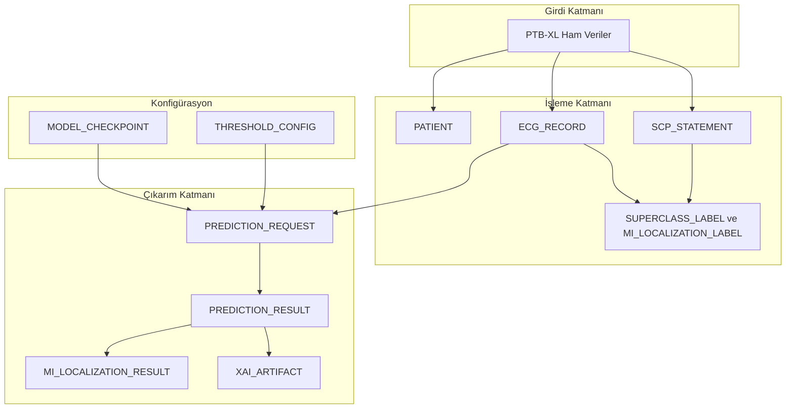

# CardioGuard-AI
# Varlık-İlişki Diyagramı (ERD)

---

**Proje Adı:** CardioGuard-AI  
**Doküman Tipi:** Varlık-İlişki Diyagramı (Entity-Relationship Diagram)  
**Versiyon:** 1.0.0  
**Tarih:** 21 Ocak 2026  
**Hazırlayan:** CardioGuard-AI Geliştirme Ekibi

---

## İçindekiler

1. [Genel Bakış](#1-genel-bakış)
2. [ERD Diyagramı](#2-erd-diyagramı)
3. [Varlık Detayları](#3-varlık-detayları)
4. [İlişki Detayları](#4-ilişki-detayları)
5. [Veri Bütünlüğü Kuralları](#5-veri-bütünlüğü-kuralları)
6. [Veri Akışı](#6-veri-akışı)
7. [Örnek Veri](#7-örnek-veri)

---

## 1. Genel Bakış

CardioGuard-AI sistemi, PTB-XL veri setini kullanarak EKG sinyallerini işler ve tahmin sonuçları üretir. Bu doküman, sistemdeki tüm veri varlıklarını ve ilişkilerini tanımlamaktadır.

### 1.1 Varlık Kategorileri

| Kategori | Varlıklar | Açıklama |
|----------|-----------|----------|
| Kaynak Veri | PATIENT, ECG_RECORD, SCP_STATEMENT | PTB-XL veritabanından gelen ham veriler |
| Etiketler | SUPERCLASS_LABEL, MI_LOCALIZATION_LABEL | İşlenmiş etiket verileri |
| Tahmin | PREDICTION_REQUEST, PREDICTION_RESULT | Tahmin işlem verileri |
| Çıktı | MI_LOCALIZATION_RESULT, XAI_ARTIFACT | Tahmin çıktıları |
| Konfigürasyon | MODEL_CHECKPOINT, THRESHOLD_CONFIG | Sistem yapılandırma verileri |

---

## 2. ERD Diyagramı

---

## 3. Varlık Detayları

### 3.1 PATIENT (Hasta)

| Alan | Tip | Açıklama | Kısıtlar |
|------|-----|----------|----------|
| patient_id | INT | Birincil anahtar | PK, NOT NULL, AUTO_INCREMENT |
| age | FLOAT | Yaş (yıl) | CHECK (age >= 0 AND age <= 120) |
| sex | VARCHAR(1) | Cinsiyet | CHECK (sex IN ('E', 'K')) |
| height | FLOAT | Boy (cm) | NULL değeri alabilir |
| weight | FLOAT | Kilo (kg) | NULL değeri alabilir |

**İstatistikler (PTB-XL Veritabanı):**

| Metrik | Değer |
|--------|-------|
| Toplam Hasta | 18,885 |
| Yaş Aralığı | 18-89 |
| Erkek Oranı | %52 |
| Kadın Oranı | %48 |

---

### 3.2 ECG_RECORD (EKG Kaydı)

| Alan | Tip | Açıklama | Kısıtlar |
|------|-----|----------|----------|
| ecg_id | INT | Birincil anahtar | PK, NOT NULL |
| patient_id | INT | Hasta referansı | FK, PATIENT tablosuna referans |
| filename_lr | VARCHAR(255) | 100Hz dosya yolu | NOT NULL |
| filename_hr | VARCHAR(255) | 500Hz dosya yolu | NOT NULL |
| strat_fold | INT | Çapraz doğrulama katmanı | CHECK (strat_fold BETWEEN 1 AND 10) |

**Veri Bölümlemesi:**

| Bölüm | Katmanlar | Kayıt Sayısı | Oran |
|-------|-----------|--------------|------|
| Eğitim | 1-8 | 17,469 | %80 |
| Doğrulama | 9 | 2,189 | %10 |
| Test | 10 | 2,179 | %10 |

---

### 3.3 SCP_STATEMENT (SCP İfadesi)

PTB-XL veri setindeki standart SCP kodları:

| Kategori | Kodlar | Açıklama |
|----------|--------|----------|
| NORM | NORM | Normal EKG |
| MI | AMI, IMI, ASMI, ALMI, LMI, ILMI, IPLMI, IPMI | Miyokard Enfarktüsü |
| STTC | NDT, NST_, ISCA, ISCI, ISC_, STD_, STE_ | ST/T Değişikliği |
| CD | CLBBB, CRBBB, IRBBB, 1AVB, 2AVB, 3AVB | İletim Bozukluğu |
| HYP | LVH, RVH, SEHYP, LAO/LAE, RAO/RAE | Hipertrofi |

---

### 3.4 SUPERCLASS_LABEL (Süpersınıf Etiketi)

**Çoklu Etiket Yapısı:**

**Etiket Dağılımı:**

| Sınıf | Kayıt Sayısı | Oran |
|-------|--------------|------|
| MI | 5,486 | %25.1 |
| STTC | 5,250 | %24.0 |
| CD | 4,907 | %22.5 |
| HYP | 2,655 | %12.2 |
| NORM | 9,528 | %43.6 |

*Not: Toplamlar %100'ü aşar çünkü çoklu etiket yapısı kullanılmaktadır.*

---

### 3.5 MI_LOCALIZATION_LABEL (MI Lokalizasyon Etiketi)

**SCP Kodundan Bölge Eşlemesi:**

**Eşleme Kuralları:**

| Kaynak Kod | Hedef Bölgeler | Açıklama |
|------------|----------------|----------|
| AMI | AMI | Anterior miyokard enfarktüsü |
| ASMI | ASMI | Anteroseptal miyokard enfarktüsü |
| ALMI | ALMI | Anterolateral miyokard enfarktüsü |
| IMI | IMI | Inferior miyokard enfarktüsü |
| LMI | LMI | Lateral miyokard enfarktüsü |
| ILMI | IMI, LMI | Inferolateral - iki bölgeye eşlenir |
| IPLMI | IMI, LMI | Inferoposterolateral - iki bölgeye eşlenir |
| IPMI | IMI | Inferoposterior - inferior bölgeye eşlenir |

---

### 3.6 PREDICTION_RESULT (Tahmin Sonucu)

**Ensemble Kombinasyonu:**

---

## 4. İlişki Detayları

### 4.1 Kardinalite Tablosu

| İlişki | Tip | Açıklama |
|--------|-----|----------|
| PATIENT — ECG_RECORD | 1:N | Bir hasta birden fazla EKG kaydına sahip olabilir |
| ECG_RECORD — SCP_CODE_ASSIGNMENT | 1:N | Bir EKG birden fazla SCP koduna sahip olabilir |
| ECG_RECORD — SUPERCLASS_LABEL | 1:1 | Her EKG için bir süpersınıf etiketi bulunur |
| ECG_RECORD — MI_LOCALIZATION_LABEL | 1:0..1 | MI tespit edilirse lokalizasyon etiketi bulunur |
| ECG_RECORD — PREDICTION_REQUEST | 1:N | Bir EKG birden fazla kez analiz edilebilir |
| PREDICTION_REQUEST — PREDICTION_RESULT | 1:1 | Her istek bir sonuç üretir |
| PREDICTION_RESULT — MI_LOCALIZATION_RESULT | 1:0..1 | MI tespit edilirse lokalizasyon sonucu bulunur |
| PREDICTION_RESULT — XAI_ARTIFACT | 1:N | Bir sonuç birden fazla XAI yapıtı üretebilir |

---

## 5. Veri Bütünlüğü Kuralları

### 5.1 Yabancı Anahtar Kısıtları

| Kaynak Tablo | Hedef Tablo | Silme Kuralı | Güncelleme Kuralı |
|--------------|-------------|--------------|-------------------|
| ECG_RECORD | PATIENT | RESTRICT | CASCADE |
| PREDICTION_RESULT | PREDICTION_REQUEST | CASCADE | CASCADE |
| XAI_ARTIFACT | PREDICTION_RESULT | CASCADE | CASCADE |

### 5.2 Kontrol Kısıtları

| Tablo | Kısıt | Açıklama |
|-------|-------|----------|
| PREDICTION_RESULT | prob_MI BETWEEN 0 AND 1 | Olasılık değer aralığı |
| PREDICTION_RESULT | triage_level IN ('HIGH', 'MEDIUM', 'LOW', 'REVIEW') | Geçerli triaj seviyeleri |
| THRESHOLD_CONFIG | threshold_MI BETWEEN 0 AND 1 | Eşik değer aralığı |

---

## 6. Veri Akışı

---

## 7. Örnek Veri

### 7.1 Örnek EKG Kaydı

| Alan | Değer |
|------|-------|
| ecg_id | 1 |
| patient_id | 15709 |
| filename_lr | records100/00000/00001_lr |
| filename_hr | records500/00000/00001_hr |
| strat_fold | 3 |
| scp_codes | AMI: 80.0, IMI: 100.0 |

### 7.2 Örnek Tahmin Sonucu

| Alan | Değer |
|------|-------|
| result_id | res_abc123 |
| request_id | req_xyz789 |
| prob_MI | 0.85 |
| prob_STTC | 0.12 |
| prob_CD | 0.08 |
| prob_HYP | 0.05 |
| prob_NORM | 0.15 |
| predicted_labels | [MI] |
| primary_label | MI |
| primary_confidence | 0.85 |
| triage_level | HIGH |
| agreement_type | AGREE_MI |

---

## Onay Sayfası

| Rol | Ad Soyad | Tarih | İmza |
|-----|----------|-------|------|
| Veritabanı Mimarı | | | |
| Teknik Lider | | | |
| Kalite Güvence Mühendisi | | | |

---

**Doküman Sonu**

*Bu ERD, CardioGuard-AI v1.0.0 veri modelini temsil eder. Veritabanı şeması, dosya tabanlı depolama kullanıldığından kavramsal düzeydedir. Üretim ortamında PostgreSQL veya MongoDB kullanılması önerilir.*
