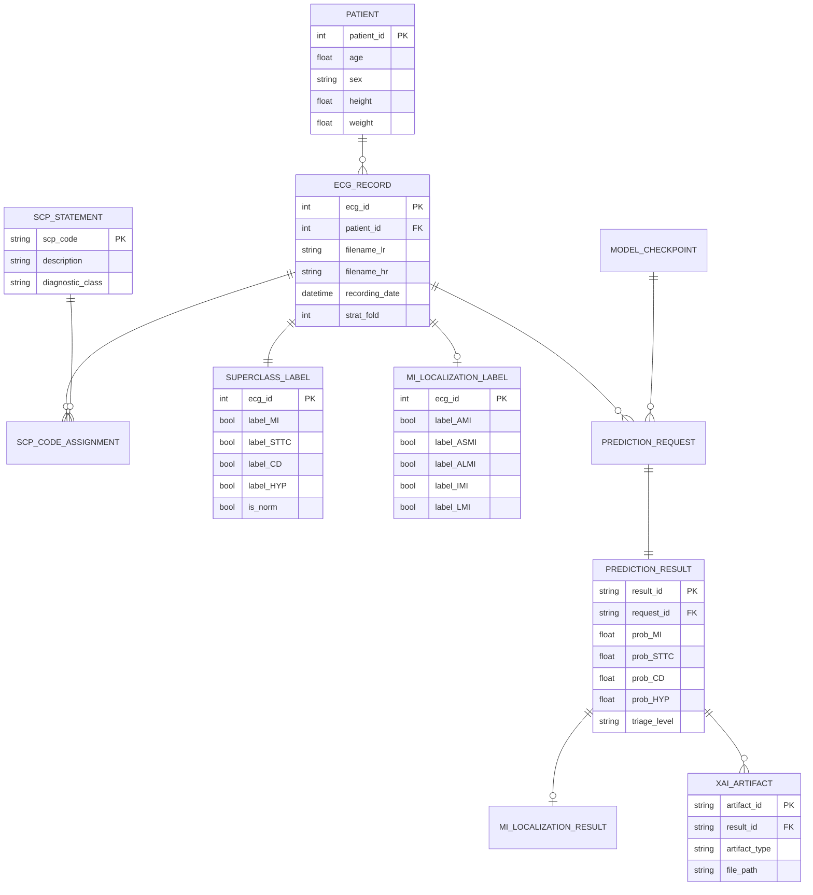

# CardioGuard-AI
# Varlık-İlişki Diyagramı (ERD)

---

**Proje Adı:** CardioGuard-AI  
**Doküman Tipi:** Varlık-İlişki Diyagramı  
**Versiyon:** 1.0.0  
**Tarih:** 21 Ocak 2026  
**Hazırlayan:** CardioGuard-AI Geliştirme Ekibi

---

## 1. Genel Bakış

Bu doküman, CardioGuard-AI sisteminin veri modelini tanımlamaktadır. Sistem, PTB-XL veritabanından gelen kaynak verileri, türetilmiş etiketleri, tahmin sonuçlarını ve konfigürasyon bilgilerini yönetmektedir.

### 1.1 Varlık Kategorileri

| Kategori | Varlıklar | Açıklama |
|----------|-----------|----------|
| **Kaynak Veri** | PATIENT, ECG_RECORD, SCP_STATEMENT | PTB-XL veritabanından gelen ham veriler |
| **Etiketler** | SUPERCLASS_LABEL, MI_LOCALIZATION_LABEL | Model eğitimi için türetilmiş etiketler |
| **Tahmin** | PREDICTION_REQUEST, PREDICTION_RESULT | API üzerinden yapılan tahmin işlemleri |
| **Çıktı** | MI_LOCALIZATION_RESULT, XAI_ARTIFACT | Tahmin çıktıları ve açıklamalar |
| **Konfigürasyon** | MODEL_CHECKPOINT, THRESHOLD_CONFIG | Sistem yapılandırma verileri |

---

## 2. Ana ERD Diyagramı

---

## 3. Varlık Detayları

### 3.1 PATIENT (Hasta)

PTB-XL veritabanındaki hasta demografik bilgilerini içerir.

| Alan | Tip | Açıklama | Kısıtlar |
|------|-----|----------|----------|
| patient_id | INT | Birincil anahtar | PK, NOT NULL |
| age | FLOAT | Yaş (yıl) | 0-120 aralığı |
| sex | VARCHAR(1) | Cinsiyet | 'E' veya 'K' |
| height | FLOAT | Boy (cm) | Nullable |
| weight | FLOAT | Kilo (kg) | Nullable |

**İstatistikler:**
- Toplam hasta: 18,885
- Yaş aralığı: 18-89
- Cinsiyet dağılımı: %52 Erkek, %48 Kadın

---

### 3.2 ECG_RECORD (EKG Kaydı)

12 derivasyonlu EKG kayıtlarının metadata bilgilerini içerir.

| Alan | Tip | Açıklama |
|------|-----|----------|
| ecg_id | INT | Birincil anahtar |
| patient_id | INT | Hasta referansı (FK) |
| filename_lr | VARCHAR(255) | 100Hz dosya yolu |
| filename_hr | VARCHAR(255) | 500Hz dosya yolu |
| recording_date | DATETIME | Kayıt tarihi |
| strat_fold | INT | Çapraz doğrulama katmanı (1-10) |

**İstatistikler:**
- Toplam kayıt: 21,837
- Örnekleme hızları: 100Hz ve 500Hz
- Kayıt süresi: 10 saniye

---

### 3.3 SUPERCLASS_LABEL (Süpersınıf Etiketi)

Dört ana patoloji sınıfı için çoklu-etiket yapısı.

| Alan | Tip | Açıklama |
|------|-----|----------|
| ecg_id | INT | Birincil anahtar ve FK |
| label_MI | BOOL | Miyokard Enfarktüsü |
| label_STTC | BOOL | ST/T Değişikliği |
| label_CD | BOOL | İletim Bozukluğu |
| label_HYP | BOOL | Hipertrofi |
| is_norm | BOOL | Türetilmiş NORM |

**Etiket Dağılımı:**

| Sınıf | Kayıt Sayısı | Oran |
|-------|--------------|------|
| MI | 5,486 | %25.1 |
| STTC | 5,250 | %24.0 |
| CD | 4,907 | %22.5 |
| HYP | 2,655 | %12.2 |
| NORM | 9,528 | %43.6 |

---

### 3.4 MI_LOCALIZATION_LABEL (MI Lokalizasyon Etiketi)

MI tespit edilen kayıtlar için anatomik bölge etiketleri.

| Alan | Tip | Açıklama |
|------|-----|----------|
| ecg_id | INT | Birincil anahtar ve FK |
| label_AMI | BOOL | Anterior MI |
| label_ASMI | BOOL | Anteroseptal MI |
| label_ALMI | BOOL | Anterolateral MI |
| label_IMI | BOOL | Inferior MI |
| label_LMI | BOOL | Lateral MI |

**SCP Kod Eşlemesi:**

| Kaynak Kod | Hedef Bölgeler |
|------------|----------------|
| AMI | AMI |
| ASMI | ASMI |
| ALMI | ALMI |
| IMI | IMI |
| LMI | LMI |
| ILMI | IMI, LMI |
| IPLMI | IMI, LMI |

---

### 3.5 PREDICTION_RESULT (Tahmin Sonucu)

API üzerinden yapılan tahmin sonuçları.

| Alan | Tip | Açıklama |
|------|-----|----------|
| result_id | UUID | Birincil anahtar |
| request_id | UUID | İstek referansı (FK) |
| prob_MI | FLOAT | MI olasılığı (0-1) |
| prob_STTC | FLOAT | STTC olasılığı (0-1) |
| prob_CD | FLOAT | CD olasılığı (0-1) |
| prob_HYP | FLOAT | HYP olasılığı (0-1) |
| prob_NORM | FLOAT | Türetilmiş NORM (0-1) |
| predicted_labels | JSON | Tahmin edilen etiketler |
| triage_level | ENUM | YÜKSEK/ORTA/DÜŞÜK/İNCELEME |
| agreement_type | ENUM | Tutarlılık tipi |

---

## 4. İlişki Detayları

### 4.1 Kardinalite Tablosu

| Kaynak | Hedef | Kardinalite | Açıklama |
|--------|-------|-------------|----------|
| PATIENT | ECG_RECORD | 1:N | Bir hasta birden fazla EKG'ye sahip olabilir |
| ECG_RECORD | SUPERCLASS_LABEL | 1:1 | Her EKG için bir süpersınıf etiketi |
| ECG_RECORD | MI_LOCALIZATION_LABEL | 1:0..1 | MI varsa lokalizasyon etiketi |
| ECG_RECORD | PREDICTION_REQUEST | 1:N | Bir EKG birden fazla kez analiz edilebilir |
| PREDICTION_REQUEST | PREDICTION_RESULT | 1:1 | Her istek bir sonuç üretir |
| PREDICTION_RESULT | MI_LOCALIZATION_RESULT | 1:0..1 | MI tespit edilirse |
| PREDICTION_RESULT | XAI_ARTIFACT | 1:N | Birden fazla XAI çıktısı |

### 4.2 Yabancı Anahtar Kısıtları

| Tablo | Alan | Referans | Silme |
|-------|------|----------|-------|
| ECG_RECORD | patient_id | PATIENT.patient_id | RESTRICT |
| PREDICTION_RESULT | request_id | PREDICTION_REQUEST.request_id | CASCADE |
| XAI_ARTIFACT | result_id | PREDICTION_RESULT.result_id | CASCADE |

---

## 5. Veri Bölümlemesi

PTB-XL veri seti, 10 katlı çapraz doğrulama için önceden bölümlenmiştir.

| Bölüm | Katmanlar | Kayıt Sayısı | Kullanım |
|-------|-----------|--------------|----------|
| Eğitim | 1-8 | 17,469 | Model eğitimi |
| Doğrulama | 9 | 2,189 | Hiperparametre ayarı |
| Test | 10 | 2,179 | Final değerlendirme |

---

## 6. Planlanan Varlıklar (v2.0)

| Varlık | Açıklama | İlişki |
|--------|----------|--------|
| RAG_CONTEXT | Klinik kılavuz bağlamları | PREDICTION_RESULT ile 1:N |
| UNCERTAINTY_SCORE | Monte Carlo belirsizlik değerleri | PREDICTION_RESULT ile 1:1 |
| LLM_REPORT | Otomatik klinik raporlar | PREDICTION_RESULT ile 1:1 |

---

## Onay Sayfası

| Rol | Ad Soyad | Tarih | İmza |
|-----|----------|-------|------|
| Veritabanı Mimarı | | | |
| Teknik Lider | | | |

---

**Doküman Sonu**
