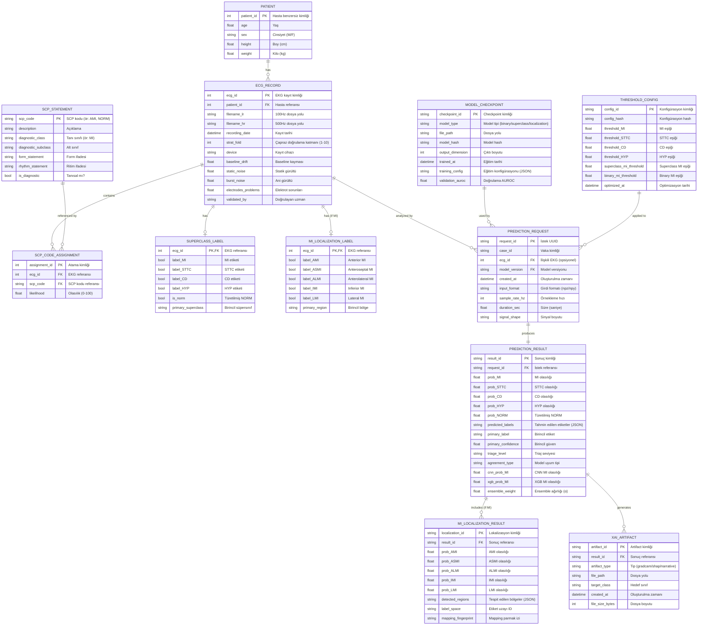
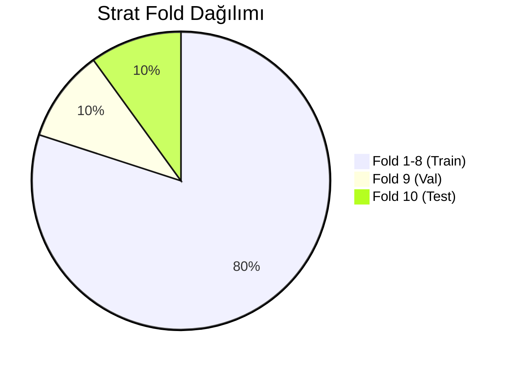
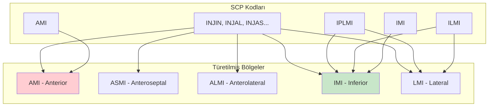
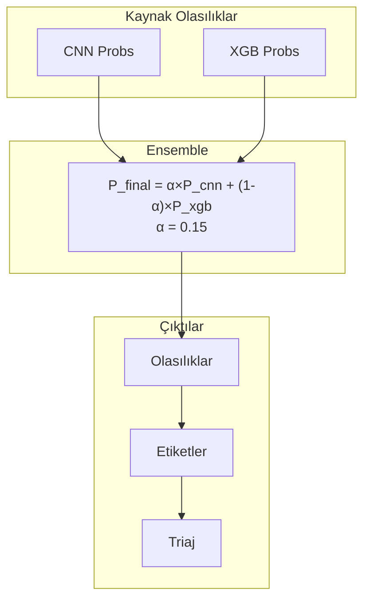
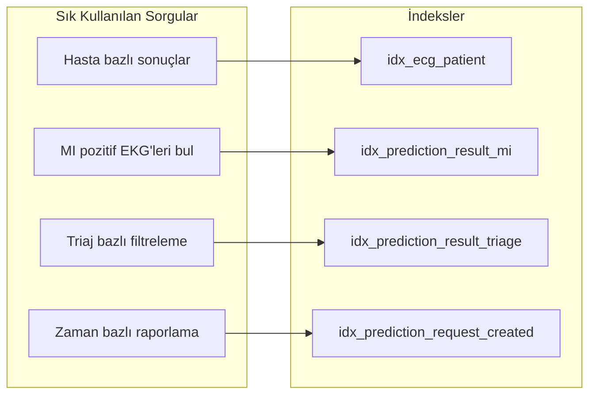
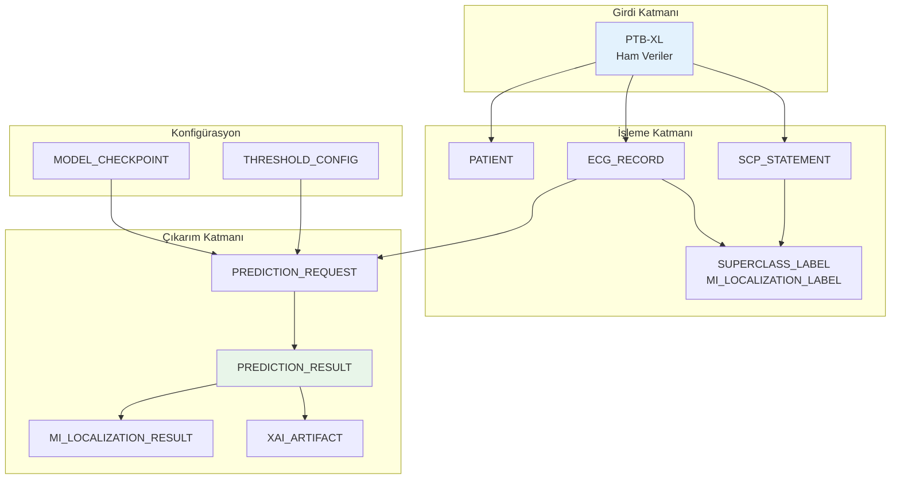

# CardioGuard-AI: ERD (Varlık-İlişki Diyagramı)
## (Entity-Relationship Diagram)

---

## 📋 Doküman Bilgileri

| Özellik | Değer |
|---------|-------|
| **Proje Adı** | CardioGuard-AI |
| **Doküman Tipi** | ERD (Varlık-İlişki Diyagramı) |
| **Versiyon** | 1.0.0 |
| **Tarih** | 2026-01-21 |

---

## 1. Genel Bakış

CardioGuard-AI sistemi, PTB-XL veri setini kullanarak EKG sinyallerini işler ve tahmin sonuçları üretir. Bu ERD, sistemdeki tüm veri varlıklarını ve ilişkilerini gösterir.

---

## 2. Tam ERD Diyagramı



---

## 3. Varlık Detayları

### 3.1 PATIENT (Hasta)

| Alan | Tip | Açıklama | Kısıtlar |
|------|-----|----------|----------|
| `patient_id` | INT | Birincil anahtar | PK, NOT NULL, AUTO_INCREMENT |
| `age` | FLOAT | Yaş (yıl) | CHECK (age >= 0 AND age <= 120) |
| `sex` | VARCHAR(1) | Cinsiyet | CHECK (sex IN ('M', 'F')) |
| `height` | FLOAT | Boy (cm) | NULLABLE |
| `weight` | FLOAT | Kilo (kg) | NULLABLE |

**İstatistikler (PTB-XL):**
- Toplam: 18,885 benzersiz hasta
- Yaş aralığı: 18-89
- Cinsiyet dağılımı: ~52% Erkek, ~48% Kadın

---

### 3.2 ECG_RECORD (EKG Kaydı)

| Alan | Tip | Açıklama | Kısıtlar |
|------|-----|----------|----------|
| `ecg_id` | INT | Birincil anahtar | PK, NOT NULL |
| `patient_id` | INT | Hasta referansı | FK -> PATIENT |
| `filename_lr` | VARCHAR(255) | 100Hz dosya yolu | NOT NULL |
| `filename_hr` | VARCHAR(255) | 500Hz dosya yolu | NOT NULL |
| `strat_fold` | INT | Çapraz doğrulama katmanı | CHECK (strat_fold BETWEEN 1 AND 10) |

**Veri Bölümlemesi:**


---

### 3.3 SCP_STATEMENT (SCP İfadesi)

PTB-XL veri setindeki standart SCP kodları:

| Kategori | Kodlar | Açıklama |
|----------|--------|----------|
| **NORM** | NORM | Normal EKG |
| **MI** | AMI, IMI, ASMI, ALMI, LMI, ILMI, IPLMI, IPMI | Miyokard Enfarktüsü |
| **STTC** | NDT, NST_, ISCA, ISCI, ISC_, STD_, STE_ | ST/T Değişikliği |
| **CD** | CLBBB, CRBBB, IRBBB, 1AVB, 2AVB, 3AVB | İletim Bozukluğu |
| **HYP** | LVH, RVH, SEHYP, LAO/LAE, RAO/RAE | Hipertrofi |

---

### 3.4 SUPERCLASS_LABEL (Süpersınıf Etiketi)


**Etiket Dağılımı:**
| Sınıf | Sayı | Oran |
|-------|------|------|
| MI | 5,486 | 25.1% |
| STTC | 5,250 | 24.0% |
| CD | 4,907 | 22.5% |
| HYP | 2,655 | 12.2% |
| NORM | 9,528 | 43.6% |

> **Not:** Toplamlar %100'ü aşar çünkü çoklu-etiket yapısı kullanılmaktadır.

---

### 3.5 MI_LOCALIZATION_LABEL (MI Lokalizasyon Etiketi)



**Mapping Kuralları:**
```
MI_CODE_TO_REGIONS = {
    "AMI": ["AMI"],
    "ASMI": ["ASMI"],
    "ALMI": ["ALMI"],
    "IMI": ["IMI"],
    "LMI": ["LMI"],
    "ILMI": ["IMI", "LMI"],      # Inferolateral -> 2 bölge
    "IPLMI": ["IMI", "LMI"],     # Inferoposterolateral -> 2 bölge
    "IPMI": ["IMI"],             # Inferoposterior -> Inferior
}
```

---

### 3.6 PREDICTION_RESULT (Tahmin Sonucu)



---

## 4. İlişki Detayları

### 4.1 Kardinalite Tablosu

| İlişki | Tip | Açıklama |
|--------|-----|----------|
| PATIENT → ECG_RECORD | 1:N | Bir hasta birden fazla EKG kaydına sahip olabilir |
| ECG_RECORD → SCP_CODE_ASSIGNMENT | 1:N | Bir EKG birden fazla SCP koduna sahip olabilir |
| ECG_RECORD → SUPERCLASS_LABEL | 1:1 | Her EKG'nin bir süpersınıf etiketi var |
| ECG_RECORD → MI_LOCALIZATION_LABEL | 1:0..1 | MI tespit edilirse lokalizasyon etiketi var |
| ECG_RECORD → PREDICTION_REQUEST | 1:N | Bir EKG birden fazla kez analiz edilebilir |
| PREDICTION_REQUEST → PREDICTION_RESULT | 1:1 | Her istek bir sonuç üretir |
| PREDICTION_RESULT → MI_LOCALIZATION_RESULT | 1:0..1 | MI tespit edilirse lokalizasyon sonucu var |
| PREDICTION_RESULT → XAI_ARTIFACT | 1:N | Bir sonuç birden fazla XAI artifact'ı üretebilir |

---

## 5. İndeksler ve Performans

### 5.1 Önerilen İndeksler

```sql
-- Hasta aramaları için
CREATE INDEX idx_patient_age ON PATIENT(age);
CREATE INDEX idx_patient_sex ON PATIENT(sex);

-- EKG kayıt aramaları için
CREATE INDEX idx_ecg_patient ON ECG_RECORD(patient_id);
CREATE INDEX idx_ecg_fold ON ECG_RECORD(strat_fold);

-- SCP kod aramaları için
CREATE INDEX idx_scp_assignment_ecg ON SCP_CODE_ASSIGNMENT(ecg_id);
CREATE INDEX idx_scp_assignment_code ON SCP_CODE_ASSIGNMENT(scp_code);

-- Tahmin aramaları için
CREATE INDEX idx_prediction_request_created ON PREDICTION_REQUEST(created_at);
CREATE INDEX idx_prediction_result_triage ON PREDICTION_RESULT(triage_level);
CREATE INDEX idx_prediction_result_mi ON PREDICTION_RESULT(prob_MI);
```

### 5.2 Sorgu Optimizasyonu



---

## 6. Veri Bütünlüğü Kuralları

### 6.1 Foreign Key Kısıtları

```sql
-- EKG -> Hasta ilişkisi
ALTER TABLE ECG_RECORD
ADD CONSTRAINT fk_ecg_patient
FOREIGN KEY (patient_id) REFERENCES PATIENT(patient_id)
ON DELETE RESTRICT ON UPDATE CASCADE;

-- Tahmin Sonucu -> İstek ilişkisi
ALTER TABLE PREDICTION_RESULT
ADD CONSTRAINT fk_result_request
FOREIGN KEY (request_id) REFERENCES PREDICTION_REQUEST(request_id)
ON DELETE CASCADE ON UPDATE CASCADE;
```

### 6.2 Check Kısıtları

```sql
-- Olasılık değerleri 0-1 arasında olmalı
ALTER TABLE PREDICTION_RESULT
ADD CONSTRAINT chk_prob_range
CHECK (prob_MI BETWEEN 0 AND 1
   AND prob_STTC BETWEEN 0 AND 1
   AND prob_CD BETWEEN 0 AND 1
   AND prob_HYP BETWEEN 0 AND 1);

-- Triaj seviyeleri geçerli olmalı
ALTER TABLE PREDICTION_RESULT
ADD CONSTRAINT chk_triage_level
CHECK (triage_level IN ('HIGH', 'MEDIUM', 'LOW', 'REVIEW'));

-- Eşik değerleri 0-1 arasında olmalı
ALTER TABLE THRESHOLD_CONFIG
ADD CONSTRAINT chk_threshold_range
CHECK (threshold_MI BETWEEN 0 AND 1
   AND threshold_STTC BETWEEN 0 AND 1);
```

---

## 7. Veri Akışı



---

## 8. Örnek Veri

### 8.1 Örnek EKG Kaydı

```json
{
  "ecg_id": 1,
  "patient_id": 15709,
  "filename_lr": "records100/00000/00001_lr",
  "filename_hr": "records500/00000/00001_hr",
  "strat_fold": 3,
  "scp_codes": {
    "AMI": 80.0,
    "IMI": 100.0
  }
}
```

### 8.2 Örnek Tahmin Sonucu

```json
{
  "result_id": "res_abc123",
  "request_id": "req_xyz789",
  "prob_MI": 0.85,
  "prob_STTC": 0.12,
  "prob_CD": 0.08,
  "prob_HYP": 0.05,
  "prob_NORM": 0.15,
  "predicted_labels": ["MI"],
  "primary_label": "MI",
  "primary_confidence": 0.85,
  "triage_level": "HIGH",
  "agreement_type": "AGREE_MI"
}
```

---

> **Not:** Bu ERD, CardioGuard-AI v1.0.0 veri modelini temsil eder. Veritabanı şeması, file-based storage kullanıldığından kavramsal düzeydedir. Üretim ortamında PostgreSQL veya MongoDB kullanılması önerilir.
