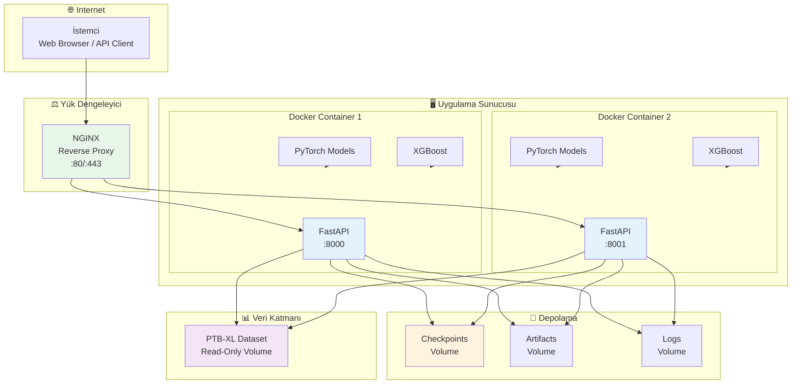
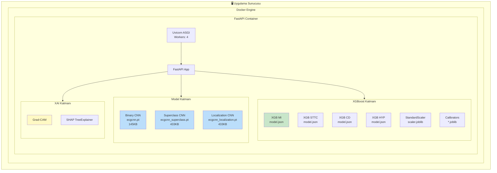
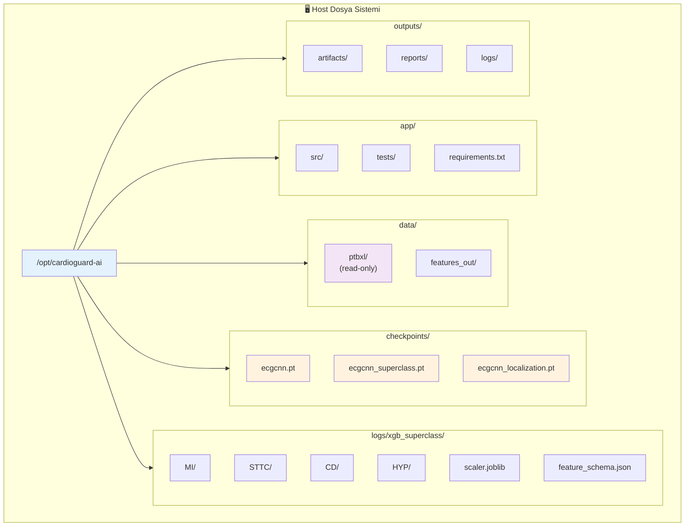
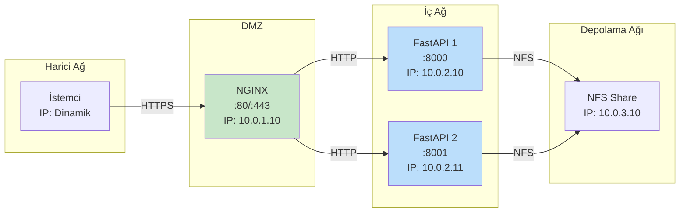
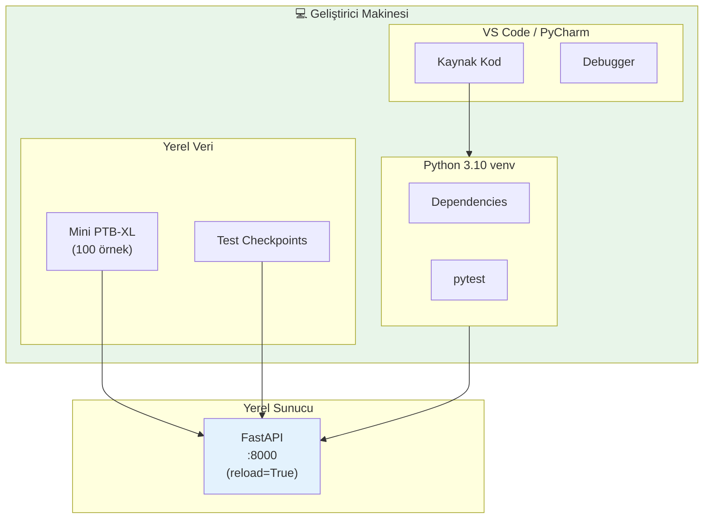
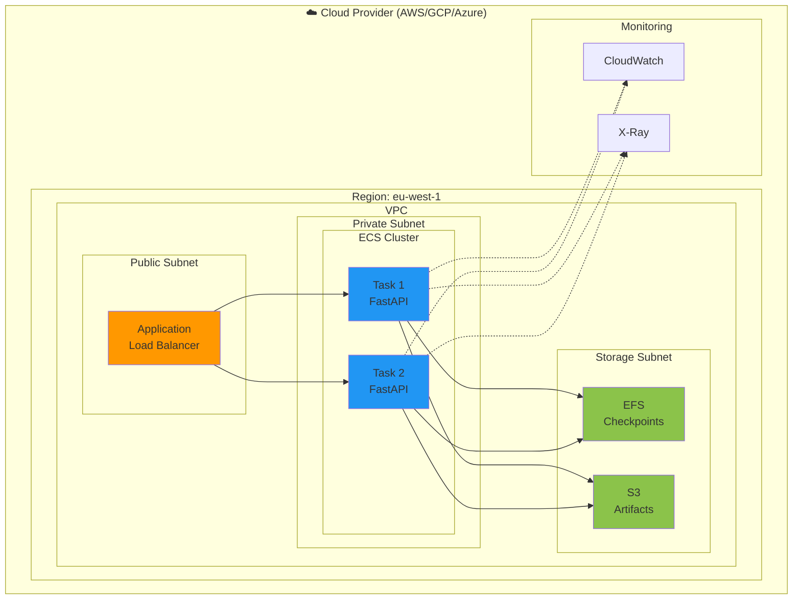
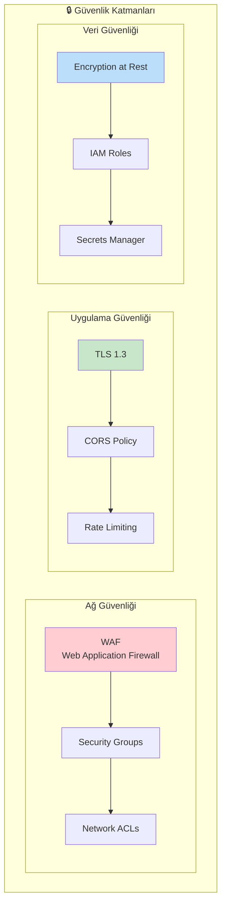
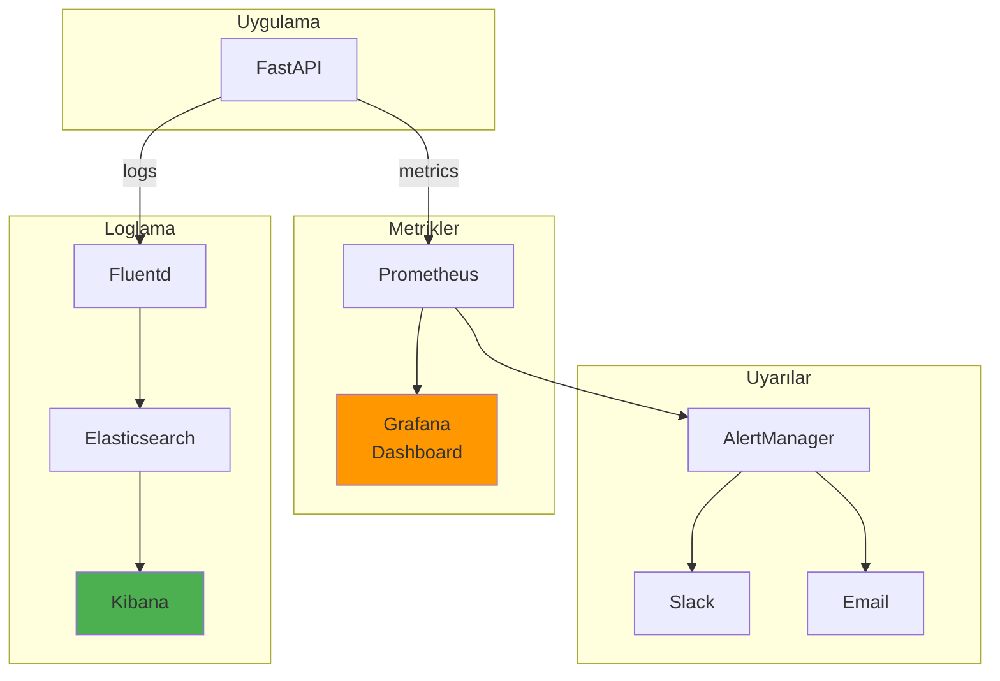
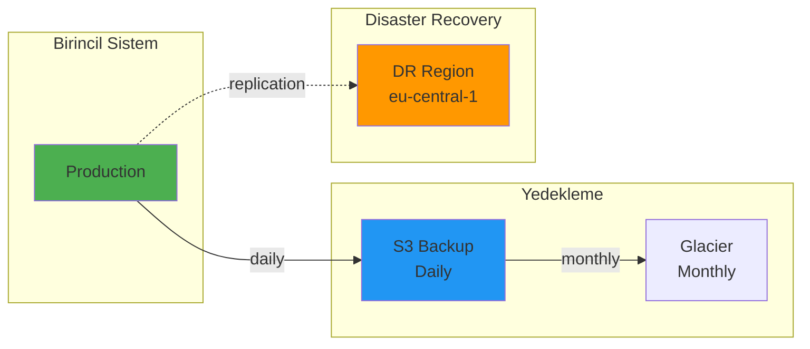

# CardioGuard-AI: Deployment Diyagramı
## (Dağıtım Mimarisi)

---

## 📋 Doküman Bilgileri

| Özellik | Değer |
|---------|-------|
| **Proje Adı** | CardioGuard-AI |
| **Doküman Tipi** | Deployment Diyagramı |
| **Versiyon** | 1.0.0 |
| **Tarih** | 2026-01-21 |

---

## 1. Genel Mimari



---

## 2. Bileşen Detayları

### 2.1 Uygulama Sunucusu



### 2.2 Sunucu Gereksinimleri

| Bileşen | Minimum | Önerilen |
|---------|---------|----------|
| **CPU** | 4 core | 8 core |
| **RAM** | 8 GB | 16 GB |
| **Disk** | 50 GB SSD | 100 GB NVMe |
| **GPU** | - (CPU-only) | NVIDIA T4 (opsiyonel) |
| **Ağ** | 100 Mbps | 1 Gbps |

---

## 3. Dosya Sistemi Yapısı



### 3.1 Volume Mapping (Docker)

```yaml
volumes:
  - ./checkpoints:/app/checkpoints:ro
  - ./logs/xgb_superclass:/app/logs/xgb_superclass:ro
  - ./artifacts:/app/artifacts:rw
  - ./data/ptbxl:/app/data/ptbxl:ro
  - ./outputs/reports:/app/reports:rw
  - ./outputs/logs:/app/logs:rw
```

---

## 4. Ağ Mimarisi



### 4.1 Port Allocation

| Servis | Port | Protokol | Erişim |
|--------|------|----------|--------|
| NGINX (HTTP) | 80 | TCP | Public |
| NGINX (HTTPS) | 443 | TCP | Public |
| FastAPI (Primary) | 8000 | TCP | Internal |
| FastAPI (Secondary) | 8001 | TCP | Internal |
| Prometheus Metrics | 9090 | TCP | Internal |
| Health Check | 8000/health | HTTP | Internal |

---

## 5. Docker Deployment

### 5.1 Dockerfile

```dockerfile
# Base image
FROM python:3.10-slim

# Set working directory
WORKDIR /app

# Install system dependencies
RUN apt-get update && apt-get install -y \
    libgomp1 \
    && rm -rf /var/lib/apt/lists/*

# Copy requirements
COPY requirements.txt .
RUN pip install --no-cache-dir -r requirements.txt

# Copy application code
COPY src/ ./src/
COPY checkpoints/ ./checkpoints/
COPY logs/xgb_superclass/ ./logs/xgb_superclass/
COPY artifacts/ ./artifacts/

# Environment variables
ENV PYTHONPATH=/app
ENV PYTORCH_ENABLE_MPS_FALLBACK=1

# Health check
HEALTHCHECK --interval=30s --timeout=10s --start-period=5s --retries=3 \
    CMD curl -f http://localhost:8000/health || exit 1

# Expose port
EXPOSE 8000

# Start command
CMD ["uvicorn", "src.backend.main:app", "--host", "0.0.0.0", "--port", "8000", "--workers", "4"]
```

### 5.2 Docker Compose

```yaml
version: '3.8'

services:
  cardioguard-api:
    build: .
    image: cardioguard-ai:latest
    container_name: cardioguard-api
    ports:
      - "8000:8000"
    volumes:
      - ./checkpoints:/app/checkpoints:ro
      - ./logs/xgb_superclass:/app/logs/xgb_superclass:ro
      - ./artifacts:/app/artifacts:rw
      - ./reports:/app/reports:rw
    environment:
      - PYTHONPATH=/app
      - LOG_LEVEL=INFO
    healthcheck:
      test: ["CMD", "curl", "-f", "http://localhost:8000/health"]
      interval: 30s
      timeout: 10s
      retries: 3
    restart: unless-stopped
    deploy:
      resources:
        limits:
          cpus: '4'
          memory: 8G
        reservations:
          cpus: '2'
          memory: 4G

  nginx:
    image: nginx:alpine
    container_name: cardioguard-nginx
    ports:
      - "80:80"
      - "443:443"
    volumes:
      - ./nginx.conf:/etc/nginx/nginx.conf:ro
      - ./ssl:/etc/nginx/ssl:ro
    depends_on:
      - cardioguard-api
    restart: unless-stopped

volumes:
  checkpoints:
  artifacts:
  reports:
```

---

## 6. Geliştirme Ortamı



### 6.1 Geliştirme Komutları

```powershell
# Sanal ortam oluşturma
python -m venv .venv
.\.venv\Scripts\Activate.ps1

# Bağımlılıkları yükleme
pip install -r requirements.txt

# Geliştirme sunucusu başlatma
python -m uvicorn src.backend.main:app --reload --port 8000

# Testleri çalıştırma
python -m pytest tests/ -v

# Kod kalitesi kontrolü
python -m flake8 src/
python -m mypy src/
```

---

## 7. Üretim Ortamı



### 7.1 Üretim Konfigürasyonu

| Bileşen | Servis | Boyut |
|---------|--------|-------|
| **Compute** | ECS Fargate | 4 vCPU, 8GB RAM |
| **Load Balancer** | ALB | - |
| **Storage** | EFS | 50 GB |
| **Object Storage** | S3 | 100 GB |
| **Logging** | CloudWatch | 30 gün retention |
| **Monitoring** | X-Ray | - |

---

## 8. CI/CD Pipeline

```mermaid
graph LR
    subgraph Source["Kaynak Kontrol"]
        GIT["GitHub Repository"]
    end
    
    subgraph CI["Continuous Integration"]
        LINT["Lint & Format"]
        TEST["Unit Tests"]
        BUILD["Docker Build"]
        SCAN["Security Scan"]
    end
    
    subgraph Registry["Container Registry"]
        ECR["ECR / Docker Hub"]
    end
    
    subgraph CD["Continuous Deployment"]
        STAGING["Staging Deploy"]
        PROD["Production Deploy"]
    end
    
    GIT -->|push| LINT --> TEST --> BUILD --> SCAN --> ECR
    ECR -->|auto| STAGING
    STAGING -->|manual approval| PROD
    
    style GIT fill:#24292e,color:#fff
    style TEST fill:#4caf50
    style BUILD fill:#2196f3
    style STAGING fill:#ff9800
    style PROD fill:#f44336
```



### 8.1 GitHub Actions Workflow

```yaml
name: CI/CD Pipeline

on:
  push:
    branches: [main, develop]
  pull_request:
    branches: [main]

jobs:
  test:
    runs-on: ubuntu-latest
    steps:
      - uses: actions/checkout@v3
      - name: Set up Python
        uses: actions/setup-python@v4
        with:
          python-version: '3.10'
      - name: Install dependencies
        run: pip install -r requirements.txt
      - name: Run tests
        run: pytest tests/ -v --cov=src

  build:
    needs: test
    runs-on: ubuntu-latest
    steps:
      - uses: actions/checkout@v3
      - name: Build Docker image
        run: docker build -t cardioguard-ai:${{ github.sha }} .
      - name: Push to ECR
        run: |
          aws ecr get-login-password | docker login --username AWS --password-stdin $ECR_REGISTRY
          docker push $ECR_REGISTRY/cardioguard-ai:${{ github.sha }}

  deploy-staging:
    needs: build
    runs-on: ubuntu-latest
    environment: staging
    steps:
      - name: Deploy to ECS Staging
        run: aws ecs update-service --cluster staging --service cardioguard --force-new-deployment

  deploy-production:
    needs: deploy-staging
    runs-on: ubuntu-latest
    environment: production
    steps:
      - name: Deploy to ECS Production
        run: aws ecs update-service --cluster production --service cardioguard --force-new-deployment
```

---

## 9. Güvenlik Mimarisi



### 9.1 Güvenlik Kontrolleri

| Katman | Kontrol | Uygulama |
|--------|---------|----------|
| **Ağ** | Firewall | WAF + Security Groups |
| **Transport** | Şifreleme | TLS 1.3 |
| **Uygulama** | Kimlik Doğrulama | API Key / JWT (gelecek) |
| **Veri** | Şifreleme | AES-256 at rest |
| **Erişim** | Yetkilendirme | IAM Roles |

---

## 10. İzleme ve Loglama



### 10.1 Önemli Metrikler

| Metrik | Açıklama | Eşik |
|--------|----------|------|
| `request_latency_seconds` | API yanıt süresi | < 500ms |
| `request_count` | Toplam istek sayısı | - |
| `error_rate` | Hata oranı | < 1% |
| `model_load_time_seconds` | Model yükleme süresi | < 5s |
| `prediction_confidence` | Tahmin güveni | - |
| `memory_usage_bytes` | Bellek kullanımı | < 80% |
| `cpu_usage_percent` | CPU kullanımı | < 70% |

---

## 11. Yedekleme ve Kurtarma



### 11.1 Yedekleme Politikası

| Bileşen | Sıklık | Saklama Süresi | Konum |
|---------|--------|----------------|-------|
| Checkpoints | Her değişiklikte | Süresiz | S3 + Glacier |
| Konfigürasyon | Günlük | 90 gün | S3 |
| Loglar | Günlük | 30 gün | CloudWatch |
| XAI Artifacts | Her tahmin | 7 gün | S3 |

---

> **Not:** Bu deployment diyagramı hem yerel geliştirme hem de cloud-based üretim ortamlarını kapsamaktadır. Gerçek deployment, organizasyonun güvenlik gereksinimleri ve bütçesine göre özelleştirilmelidir.
