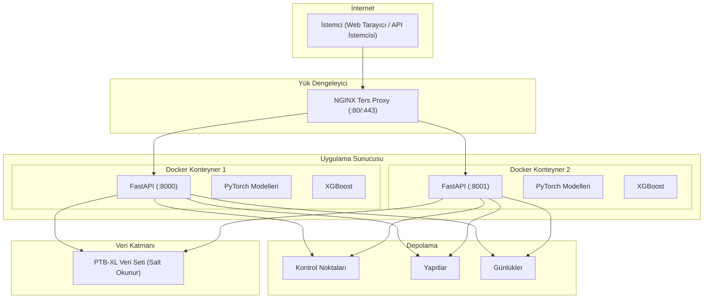
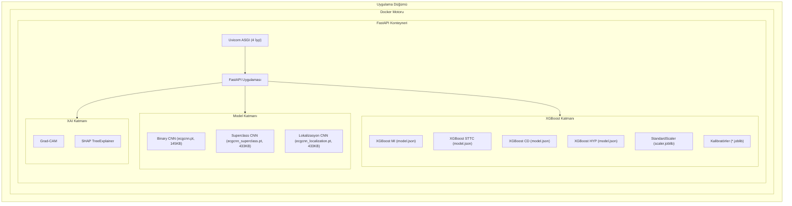
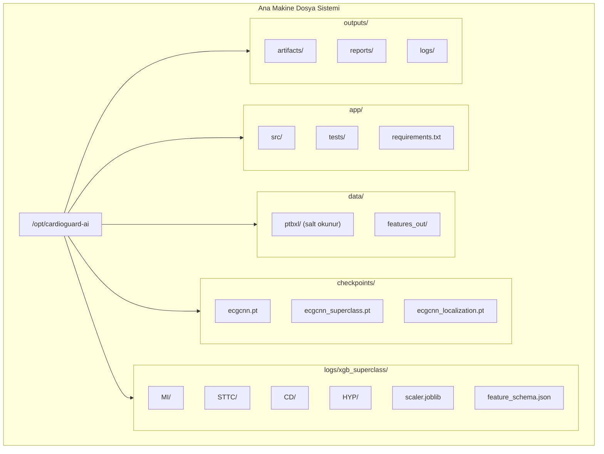
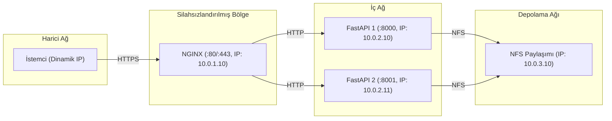
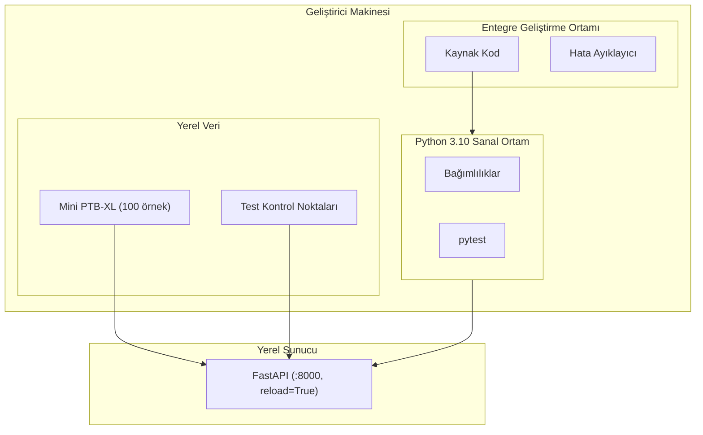
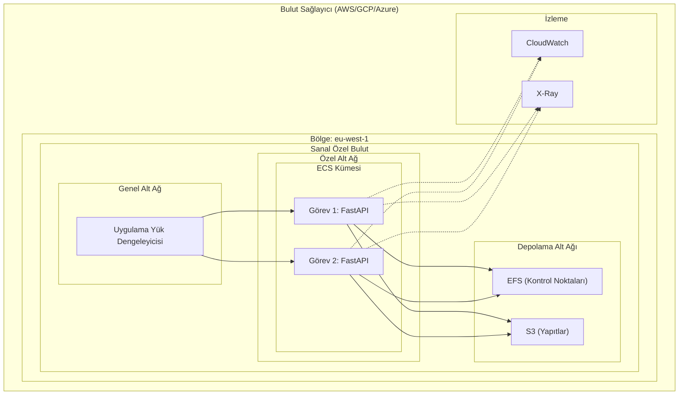
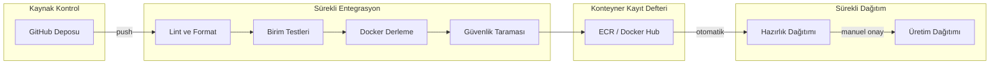
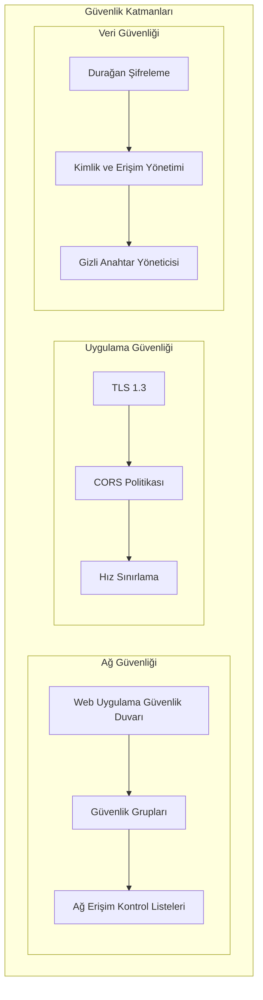
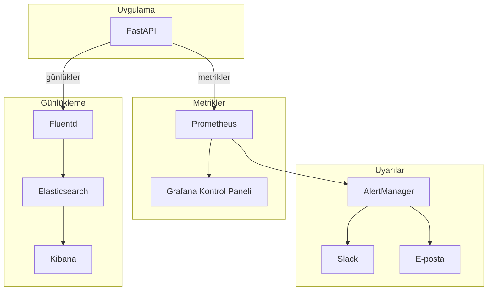

# CardioGuard-AI
# Dağıtım Diyagramı

---

**Proje Adı:** CardioGuard-AI  
**Doküman Tipi:** Dağıtım Diyagramı (Deployment Diagram)  
**Versiyon:** 1.0.0  
**Tarih:** 21 Ocak 2026  
**Hazırlayan:** CardioGuard-AI Geliştirme Ekibi

---

## İçindekiler

1. [Genel Mimari](#1-genel-mimari)
2. [Bileşen Detayları](#2-bileşen-detayları)
3. [Dosya Sistemi Yapısı](#3-dosya-sistemi-yapısı)
4. [Ağ Mimarisi](#4-ağ-mimarisi)
5. [Docker Dağıtımı](#5-docker-dağıtımı)
6. [Geliştirme Ortamı](#6-geliştirme-ortamı)
7. [Üretim Ortamı](#7-üretim-ortamı)
8. [CI/CD Pipeline](#8-cicd-pipeline)
9. [Güvenlik Mimarisi](#9-güvenlik-mimarisi)
10. [İzleme ve Günlükleme](#10-izleme-ve-günlükleme)

---

## 1. Genel Mimari



---

## 2. Bileşen Detayları

### 2.1 Uygulama Sunucusu Bileşenleri



### 2.2 Sunucu Gereksinimleri

| Bileşen | Minimum | Önerilen |
|---------|---------|----------|
| İşlemci (CPU) | 4 çekirdek | 8 çekirdek |
| Bellek (RAM) | 8 GB | 16 GB |
| Disk | 50 GB SSD | 100 GB NVMe |
| Grafik İşlemci (GPU) | Gerekli değil | NVIDIA T4 (opsiyonel) |
| Ağ | 100 Mbps | 1 Gbps |

---

## 3. Dosya Sistemi Yapısı



### 3.1 Birim Eşlemesi (Docker)

| Ana Makine Yolu | Konteyner Yolu | Erişim Modu |
|-----------------|----------------|-------------|
| ./checkpoints | /app/checkpoints | Salt okunur |
| ./logs/xgb_superclass | /app/logs/xgb_superclass | Salt okunur |
| ./artifacts | /app/artifacts | Okuma/Yazma |
| ./data/ptbxl | /app/data/ptbxl | Salt okunur |
| ./outputs/reports | /app/reports | Okuma/Yazma |
| ./outputs/logs | /app/logs | Okuma/Yazma |

---

## 4. Ağ Mimarisi



### 4.1 Port Tahsisi

| Servis | Port | Protokol | Erişim |
|--------|------|----------|--------|
| NGINX (HTTP) | 80 | TCP | Genel |
| NGINX (HTTPS) | 443 | TCP | Genel |
| FastAPI (Birincil) | 8000 | TCP | İç |
| FastAPI (İkincil) | 8001 | TCP | İç |
| Prometheus Metrikleri | 9090 | TCP | İç |
| Sağlık Kontrolü | 8000/health | HTTP | İç |

---

## 5. Docker Dağıtımı

### 5.1 Dockerfile

```dockerfile
# Temel imaj
FROM python:3.10-slim

# Çalışma dizini
WORKDIR /app

# Sistem bağımlılıkları
RUN apt-get update && apt-get install -y \
    libgomp1 \
    && rm -rf /var/lib/apt/lists/*

# Gereksinimler
COPY requirements.txt .
RUN pip install --no-cache-dir -r requirements.txt

# Uygulama kodu
COPY src/ ./src/
COPY checkpoints/ ./checkpoints/
COPY logs/xgb_superclass/ ./logs/xgb_superclass/
COPY artifacts/ ./artifacts/

# Ortam değişkenleri
ENV PYTHONPATH=/app
ENV PYTORCH_ENABLE_MPS_FALLBACK=1

# Sağlık kontrolü
HEALTHCHECK --interval=30s --timeout=10s --start-period=5s --retries=3 \
    CMD curl -f http://localhost:8000/health || exit 1

# Port
EXPOSE 8000

# Başlatma komutu
CMD ["uvicorn", "src.backend.main:app", "--host", "0.0.0.0", "--port", "8000", "--workers", "4"]
```

### 5.2 Docker Compose Yapılandırması

```yaml
version: '3.8'

services:
  cardioguard-api:
    build: .
    image: cardioguard-ai:latest
    container_name: cardioguard-api
    ports:
      - "8000:8000"
    volumes:
      - ./checkpoints:/app/checkpoints:ro
      - ./logs/xgb_superclass:/app/logs/xgb_superclass:ro
      - ./artifacts:/app/artifacts:rw
      - ./reports:/app/reports:rw
    environment:
      - PYTHONPATH=/app
      - LOG_LEVEL=INFO
    healthcheck:
      test: ["CMD", "curl", "-f", "http://localhost:8000/health"]
      interval: 30s
      timeout: 10s
      retries: 3
    restart: unless-stopped
    deploy:
      resources:
        limits:
          cpus: '4'
          memory: 8G
        reservations:
          cpus: '2'
          memory: 4G

  nginx:
    image: nginx:alpine
    container_name: cardioguard-nginx
    ports:
      - "80:80"
      - "443:443"
    volumes:
      - ./nginx.conf:/etc/nginx/nginx.conf:ro
      - ./ssl:/etc/nginx/ssl:ro
    depends_on:
      - cardioguard-api
    restart: unless-stopped
```

---

## 6. Geliştirme Ortamı



### 6.1 Geliştirme Komutları

| Komut | Açıklama |
|-------|----------|
| `python -m venv .venv` | Sanal ortam oluşturma |
| `.\.venv\Scripts\Activate.ps1` | Sanal ortamı etkinleştirme (Windows) |
| `pip install -r requirements.txt` | Bağımlılıkları yükleme |
| `python -m uvicorn src.backend.main:app --reload --port 8000` | Geliştirme sunucusu başlatma |
| `python -m pytest tests/ -v` | Testleri çalıştırma |
| `python -m flake8 src/` | Kod kalitesi kontrolü |

---

## 7. Üretim Ortamı



### 7.1 Üretim Yapılandırması

| Bileşen | Servis | Boyut |
|---------|--------|-------|
| Hesaplama | ECS Fargate | 4 vCPU, 8GB RAM |
| Yük Dengeleyici | ALB | Otomatik ölçeklendirme |
| Dosya Depolama | EFS | 50 GB |
| Nesne Depolama | S3 | 100 GB |
| Günlükleme | CloudWatch | 30 gün saklama |
| İzleme | X-Ray | Dağıtık izleme |

---

## 8. CI/CD Pipeline



### 8.1 Pipeline Aşamaları

| Aşama | Açıklama | Tetikleyici |
|-------|----------|-------------|
| Lint | Kod formatı ve stil kontrolü | Her push |
| Test | Birim ve entegrasyon testleri | Her push |
| Build | Docker imajı derleme | Test başarılı |
| Scan | Güvenlik açığı taraması | Build başarılı |
| Staging | Hazırlık ortamına dağıtım | Tarama başarılı |
| Production | Üretim ortamına dağıtım | Manuel onay |

---

## 9. Güvenlik Mimarisi



### 9.1 Güvenlik Kontrolleri

| Katman | Kontrol | Uygulama |
|--------|---------|----------|
| Ağ | Güvenlik Duvarı | WAF + Güvenlik Grupları |
| İletim | Şifreleme | TLS 1.3 |
| Uygulama | Kimlik Doğrulama | API Anahtarı / JWT (planlanan) |
| Veri | Şifreleme | AES-256 (durağan) |
| Erişim | Yetkilendirme | IAM Rolleri |

---

## 10. İzleme ve Günlükleme



### 10.1 Önemli Metrikler

| Metrik | Açıklama | Eşik |
|--------|----------|------|
| request_latency_seconds | API yanıt süresi | < 500 ms |
| request_count | Toplam istek sayısı | İzleme |
| error_rate | Hata oranı | < %1 |
| model_load_time_seconds | Model yükleme süresi | < 5 s |
| prediction_confidence | Tahmin güven skoru | İzleme |
| memory_usage_bytes | Bellek kullanımı | < %80 |
| cpu_usage_percent | İşlemci kullanımı | < %70 |

---

## Onay Sayfası

| Rol | Ad Soyad | Tarih | İmza |
|-----|----------|-------|------|
| Sistem Mimarı | | | |
| DevOps Mühendisi | | | |
| Güvenlik Mühendisi | | | |

---

**Doküman Sonu**

*Bu dağıtım diyagramı hem yerel geliştirme hem de bulut tabanlı üretim ortamlarını kapsamaktadır. Gerçek dağıtım, organizasyonun güvenlik gereksinimleri ve bütçesine göre özelleştirilmelidir.*
