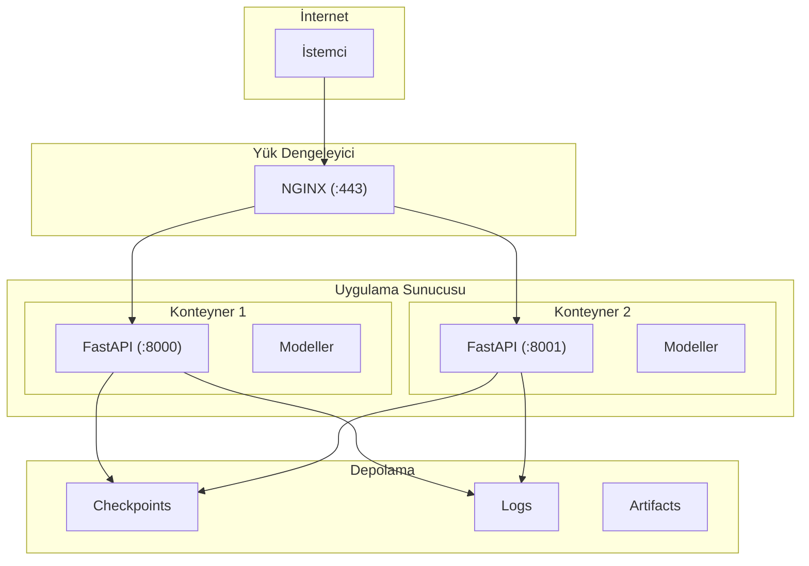
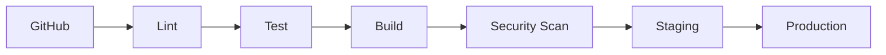

# CardioGuard-AI
# Dağıtım Diyagramı

---

**Proje Adı:** CardioGuard-AI  
**Doküman Tipi:** Dağıtım Diyagramı (Deployment Diagram)  
**Versiyon:** 1.0.0  
**Tarih:** 21 Ocak 2026  
**Hazırlayan:** CardioGuard-AI Geliştirme Ekibi

---

## 1. Genel Mimari

CardioGuard-AI, konteyner tabanlı bir dağıtım mimarisi kullanmaktadır. Sistem, geliştirme ortamından üretime kadar tutarlı bir çalışma ortamı sağlamak için Docker kullanmaktadır.

### 1.1 Mimari Diyagramı



---

## 2. Bileşen Detayları

### 2.1 Uygulama Sunucusu

| Bileşen | Açıklama | Port |
|---------|----------|------|
| FastAPI | ASGI web framework | 8000 |
| Uvicorn | ASGI sunucu | - |
| PyTorch | Derin öğrenme framework | - |
| XGBoost | Gradient boosting | - |

### 2.2 Model Bileşenleri

| Model | Dosya | Boyut |
|-------|-------|-------|
| Binary CNN | ecgcnn.pt | 145 KB |
| Superclass CNN | ecgcnn_superclass.pt | 433 KB |
| Lokalizasyon CNN | ecgcnn_localization.pt | 433 KB |
| XGBoost MI | MI/model.json | ~50 KB |
| XGBoost STTC | STTC/model.json | ~50 KB |
| XGBoost CD | CD/model.json | ~50 KB |
| XGBoost HYP | HYP/model.json | ~50 KB |

### 2.3 Sunucu Gereksinimleri

| Kaynak | Minimum | Önerilen |
|--------|---------|----------|
| CPU | 4 çekirdek | 8 çekirdek |
| RAM | 8 GB | 16 GB |
| Disk | 50 GB SSD | 100 GB NVMe |
| GPU | Gerekli değil | NVIDIA T4 (opsiyonel) |

---

## 3. Docker Yapılandırması

### 3.1 Dockerfile

```dockerfile
FROM python:3.10-slim

WORKDIR /app

RUN apt-get update && apt-get install -y libgomp1 && rm -rf /var/lib/apt/lists/*

COPY requirements.txt .
RUN pip install --no-cache-dir -r requirements.txt

COPY src/ ./src/
COPY checkpoints/ ./checkpoints/
COPY logs/xgb_superclass/ ./logs/xgb_superclass/
COPY artifacts/ ./artifacts/

ENV PYTHONPATH=/app

HEALTHCHECK --interval=30s --timeout=10s --start-period=5s --retries=3 \
    CMD curl -f http://localhost:8000/health || exit 1

EXPOSE 8000

CMD ["uvicorn", "src.backend.main:app", "--host", "0.0.0.0", "--port", "8000", "--workers", "4"]
```

### 3.2 Docker Compose

```yaml
version: '3.8'

services:
  cardioguard-api:
    build: .
    image: cardioguard-ai:latest
    ports:
      - "8000:8000"
    volumes:
      - ./checkpoints:/app/checkpoints:ro
      - ./artifacts:/app/artifacts:rw
    environment:
      - PYTHONPATH=/app
      - LOG_LEVEL=INFO
    healthcheck:
      test: ["CMD", "curl", "-f", "http://localhost:8000/health"]
      interval: 30s
      timeout: 10s
      retries: 3
    deploy:
      resources:
        limits:
          cpus: '4'
          memory: 8G
```

---

## 4. Ağ Mimarisi

### 4.1 Port Tahsisi

| Servis | Port | Protokol | Erişim |
|--------|------|----------|--------|
| NGINX (HTTPS) | 443 | TCP | Genel |
| NGINX (HTTP) | 80 | TCP | Redirect |
| FastAPI | 8000-8001 | TCP | İç |
| Prometheus | 9090 | TCP | İç |

### 4.2 Güvenlik

| Katman | Kontrol | Uygulama |
|--------|---------|----------|
| Ağ | Firewall | AWS Security Groups |
| İletim | Şifreleme | TLS 1.3 |
| Uygulama | CORS | FastAPI middleware |
| API | Rate Limiting | Nginx |

---

## 5. Geliştirme Ortamı

### 5.1 Yerel Kurulum

```bash
# Sanal ortam oluştur
python -m venv .venv
.venv\Scripts\Activate.ps1  # Windows

# Bağımlılıkları yükle
pip install -r requirements.txt

# Geliştirme sunucusu
python -m uvicorn src.backend.main:app --reload --port 8000
```

### 5.2 Test Komutları

| Komut | Açıklama |
|-------|----------|
| `pytest tests/ -v` | Tüm testleri çalıştır |
| `pytest tests/ -k "test_api"` | API testlerini çalıştır |
| `flake8 src/` | Kod kalitesi kontrolü |

---

## 6. CI/CD Pipeline

### 6.1 Pipeline Aşamaları



### 6.2 Aşama Detayları

| Aşama | Araç | Tetikleyici |
|-------|------|-------------|
| Lint | flake8, black | Her push |
| Test | pytest | Her push |
| Build | Docker | Test başarılı |
| Scan | Trivy | Build başarılı |
| Staging | ECS | Otomatik |
| Production | ECS | Manuel onay |

---

## 7. Planlanan Altyapı (v2.0)

### 7.1 Yeni Bileşenler

| Bileşen | Amaç |
|---------|------|
| Vektör Veritabanı | RAG için klinik kılavuz depolama |
| LLM Servisi | Otomatik rapor üretimi |
| GPU Kümesi | Transformer modelleri için |

### 7.2 Ölçeklenebilirlik

| Metrik | Mevcut | Hedef v2.0 |
|--------|--------|------------|
| Anlık istek | 100 req/s | 1000 req/s |
| Konteyner | 2 | 10+ |
| Latency (p99) | 500ms | 200ms |

---

## Onay Sayfası

| Rol | Ad Soyad | Tarih | İmza |
|-----|----------|-------|------|
| DevOps Mühendisi | | | |
| Sistem Mimarı | | | |

---

**Doküman Sonu**
