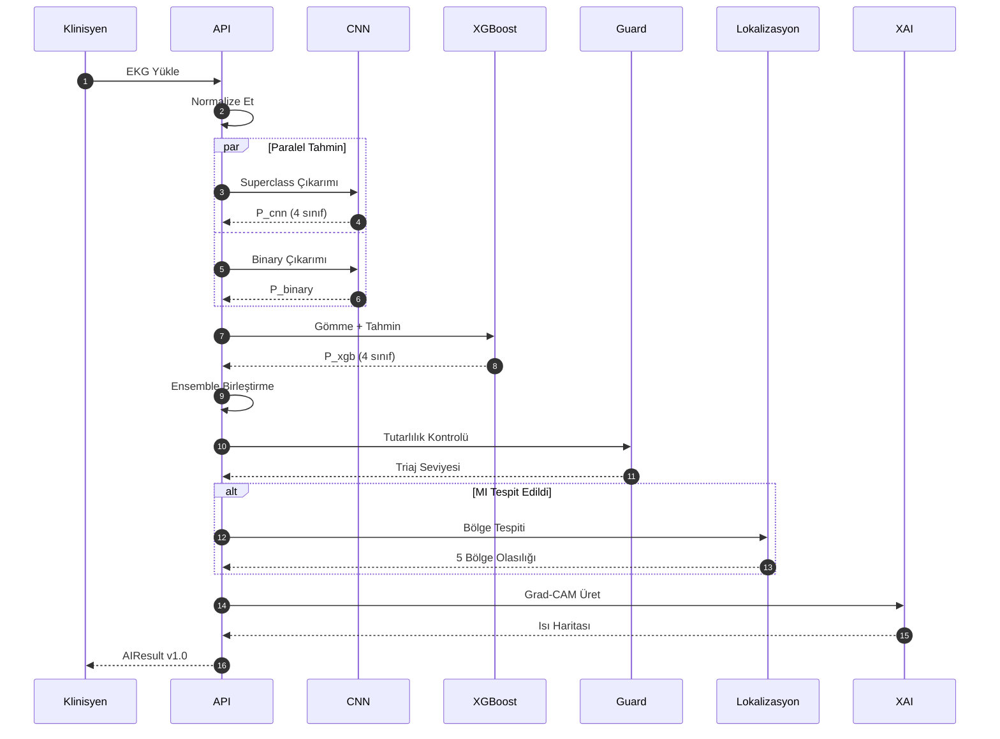
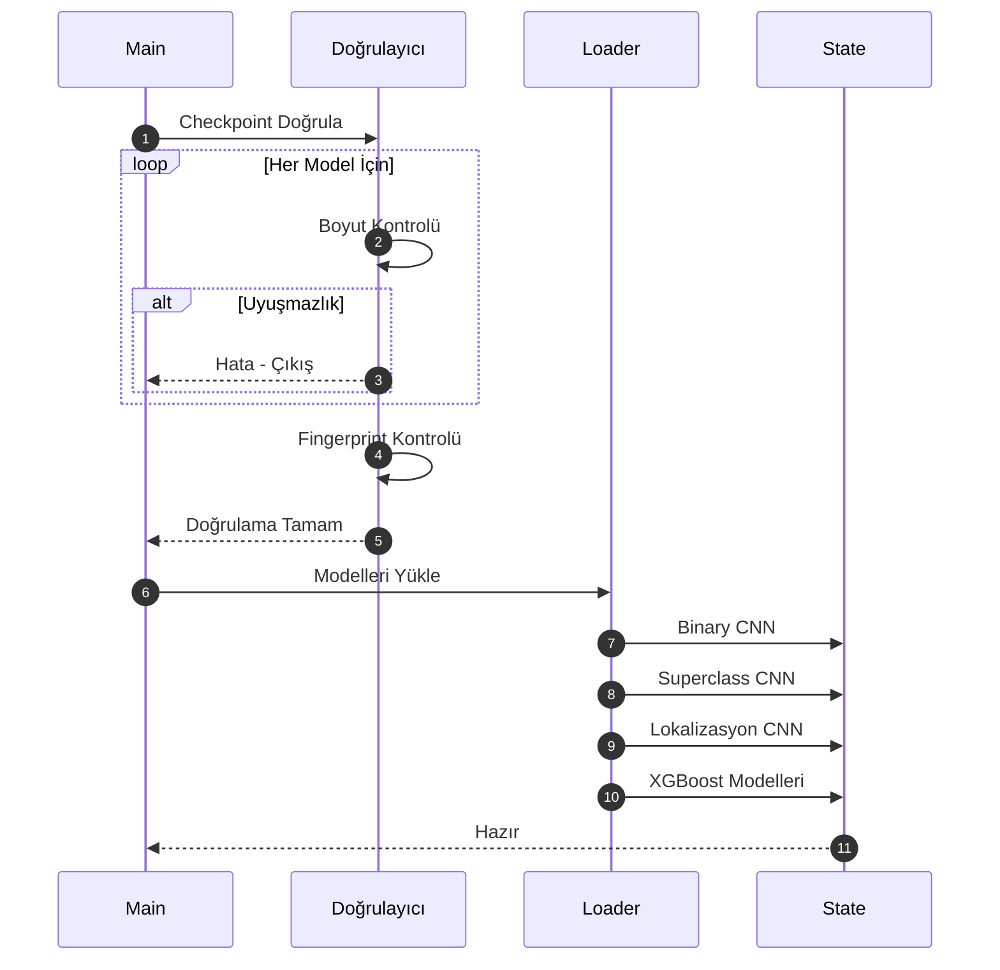
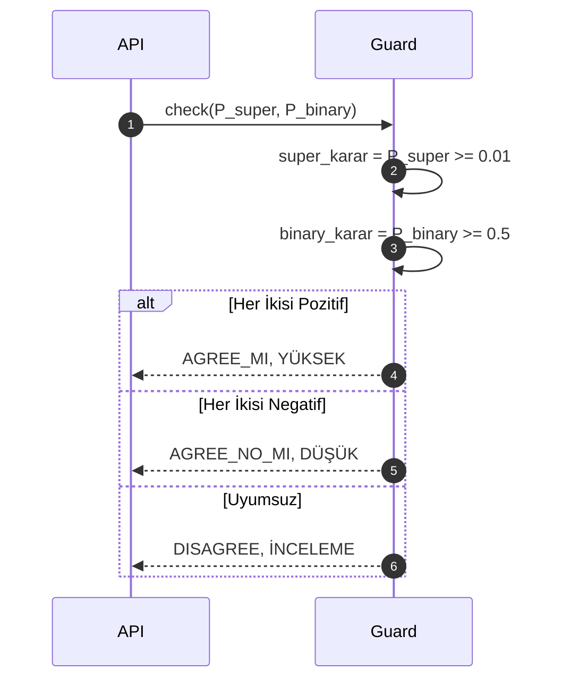
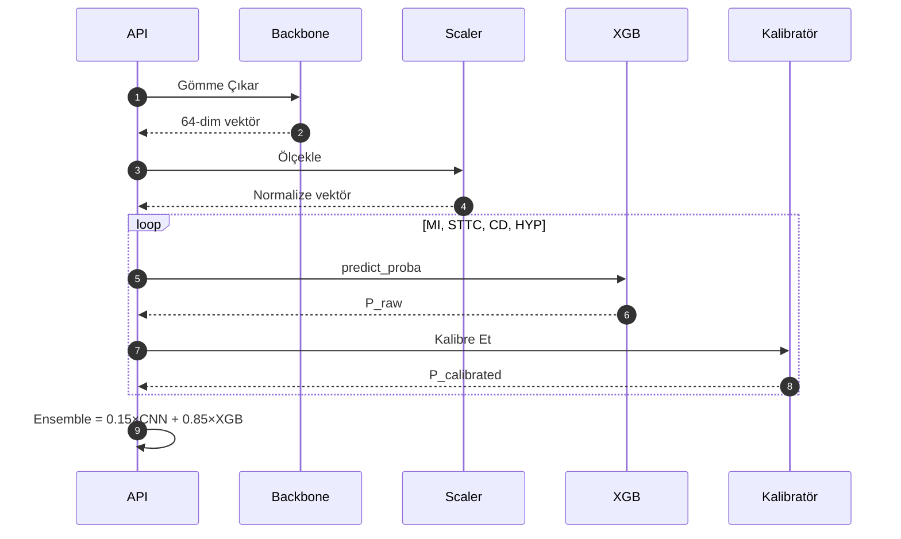
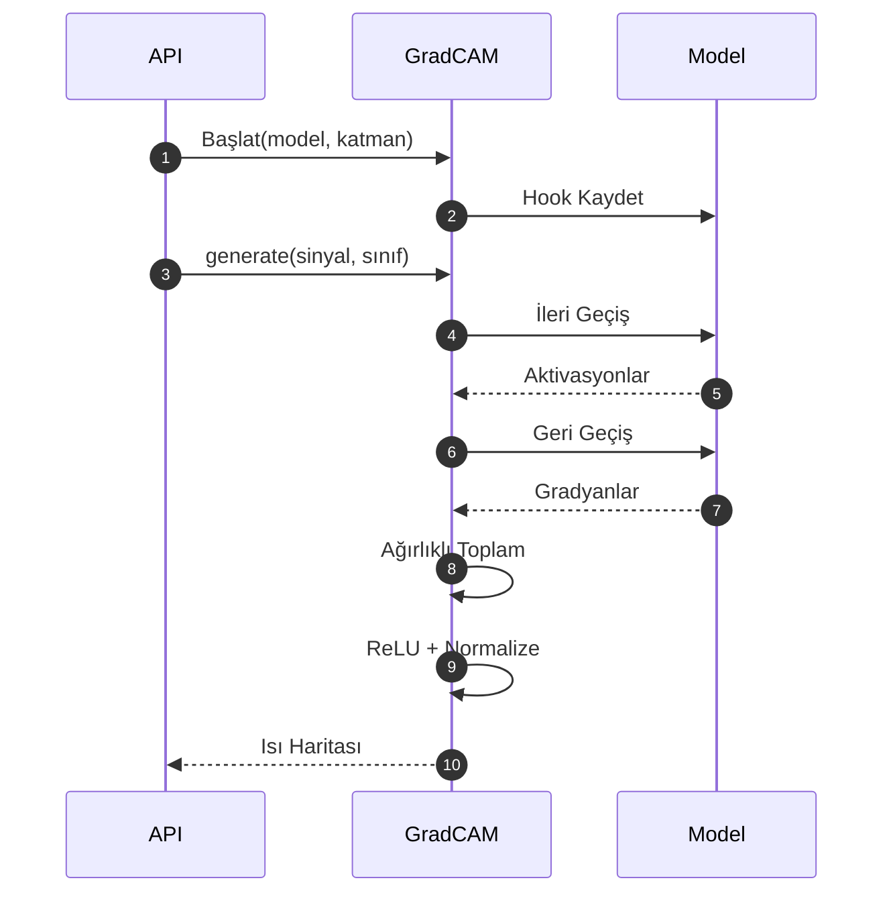
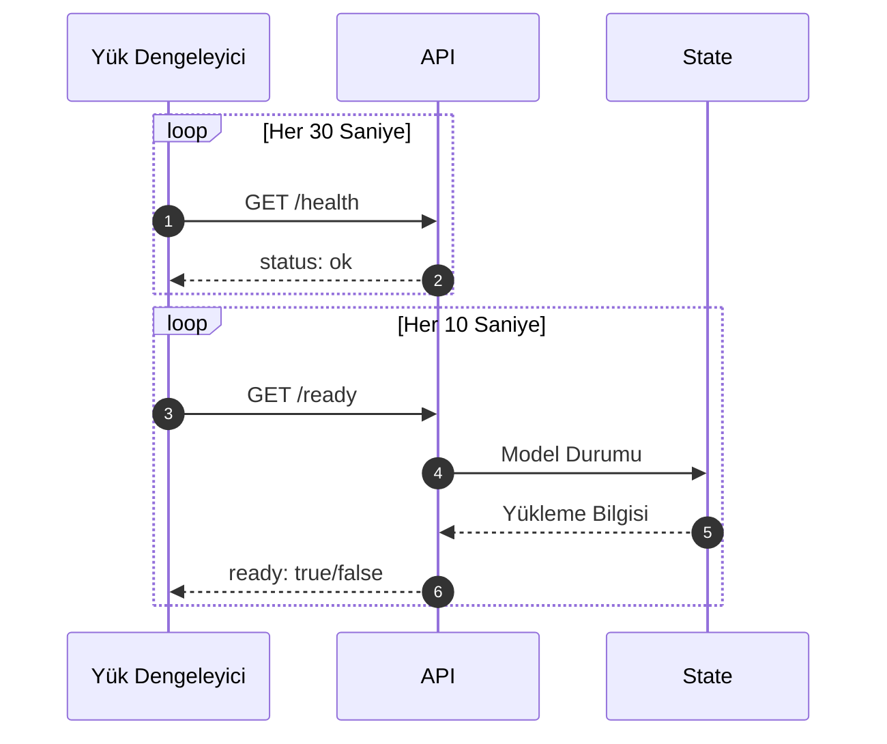
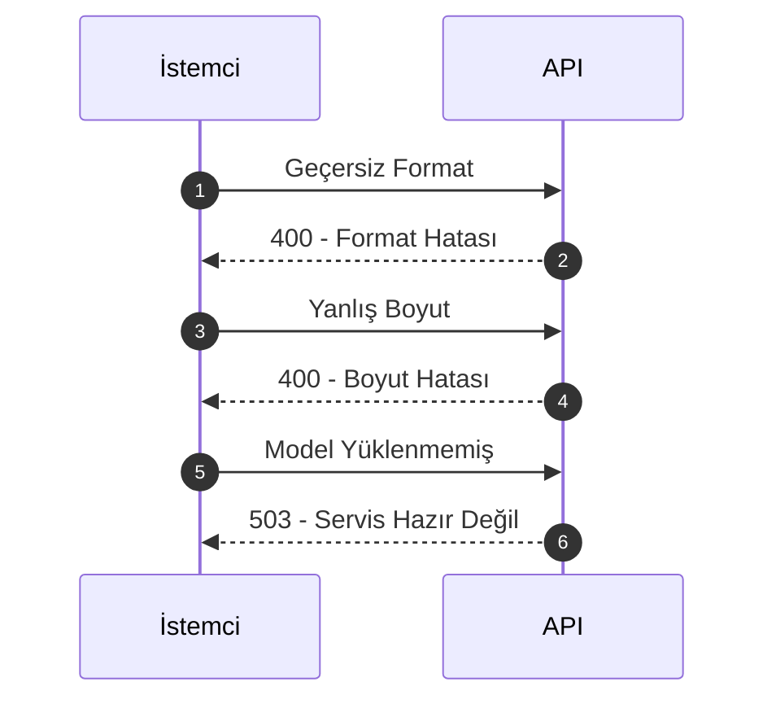
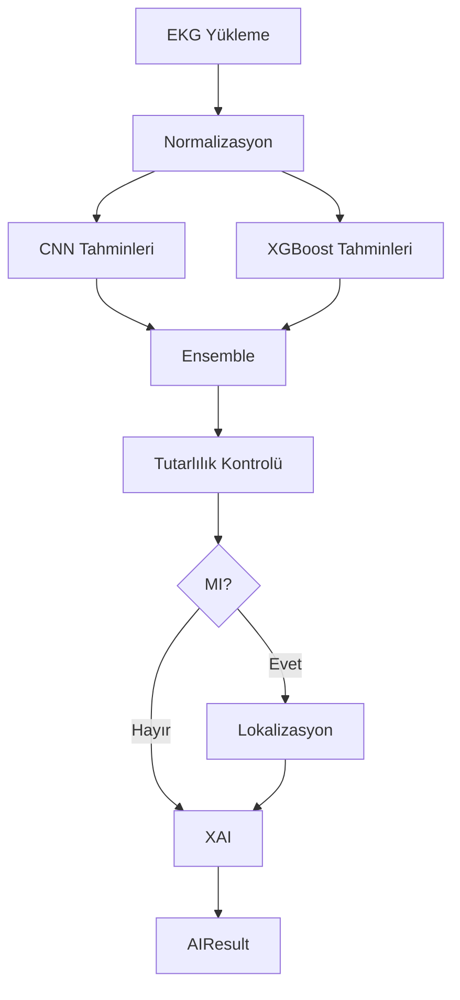
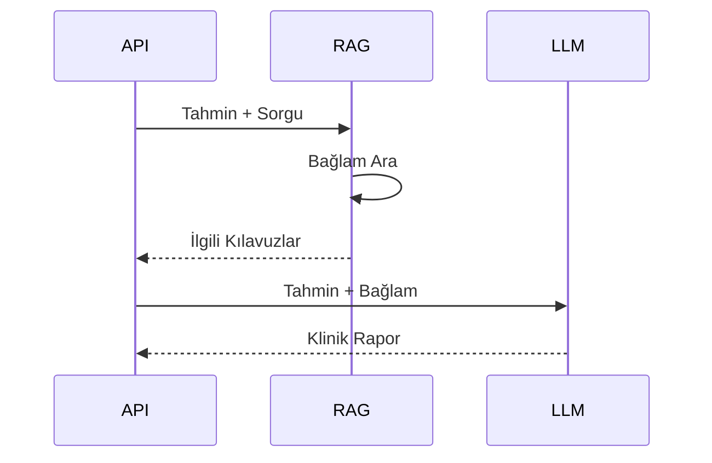
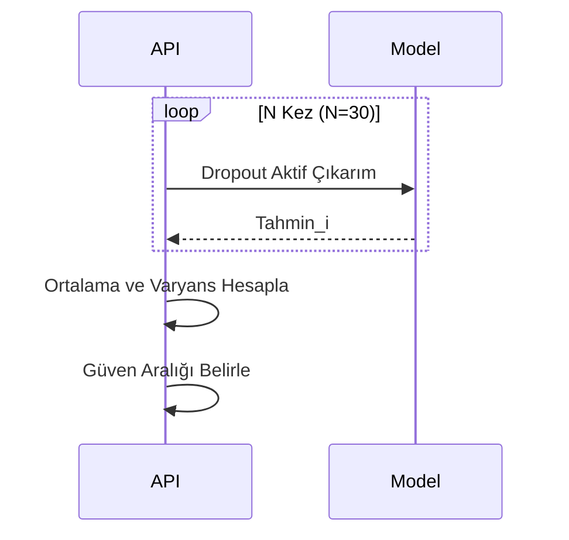

# CardioGuard-AI
# Sıralı Akış Diyagramları

---

**Proje Adı:** CardioGuard-AI  
**Doküman Tipi:** Sıralı Akış Diyagramları (Sequence Diagrams)  
**Versiyon:** 1.0.0  
**Tarih:** 21 Ocak 2026  
**Hazırlayan:** CardioGuard-AI Geliştirme Ekibi

---

## 1. Ana Tahmin Akışı

---

## 2. Sistem Başlatma Akışı

---

## 3. Tutarlılık Kontrolü

---

## 4. XGBoost Hibrit Pipeline

---

## 5. Grad-CAM Üretimi

---

## 6. Sağlık Kontrolü

---

## 7. Hata Senaryoları

---

## 8. Özet Akış

---

## 9. Planlanan Akışlar (v2.0)

### 9.1 RAG Entegrasyonu

### 9.2 Belirsizlik Tahmini

---

## Onay Sayfası

| Rol | Ad Soyad | Tarih | İmza |
|-----|----------|-------|------|
| Yazılım Mimarı | | | |
| Teknik Lider | | | |

---

**Doküman Sonu**
