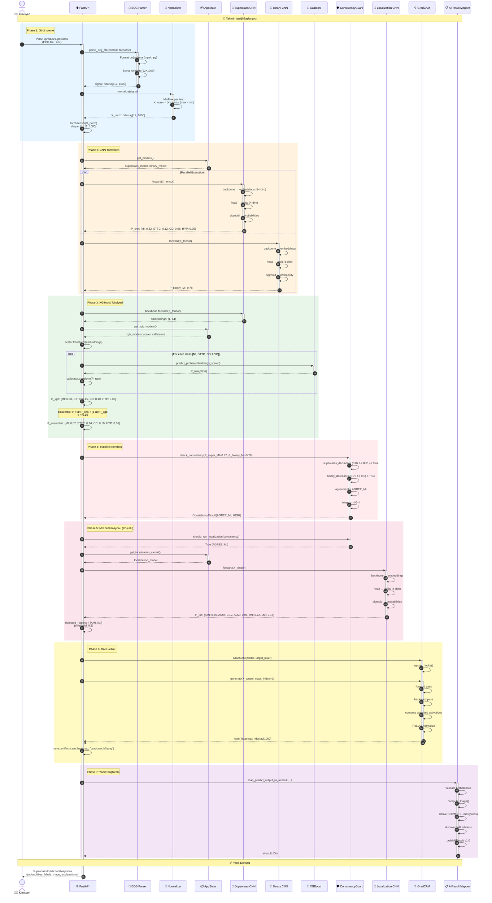
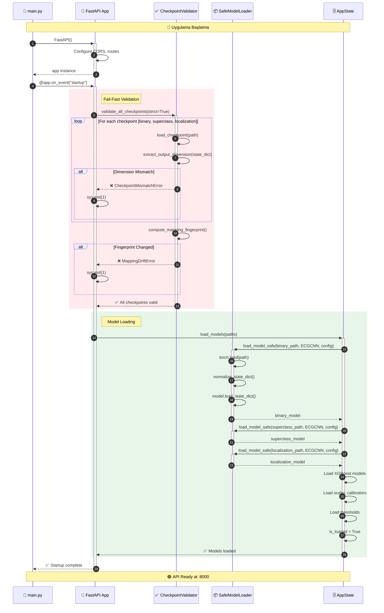
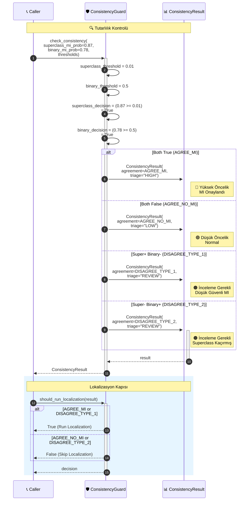
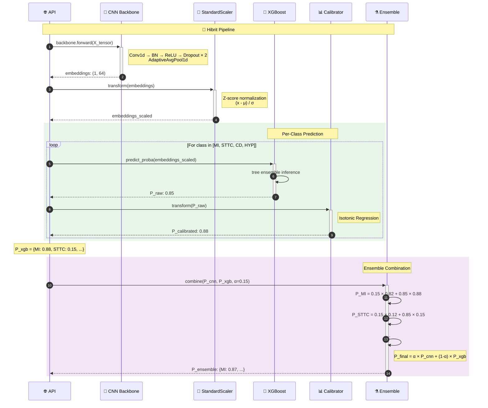
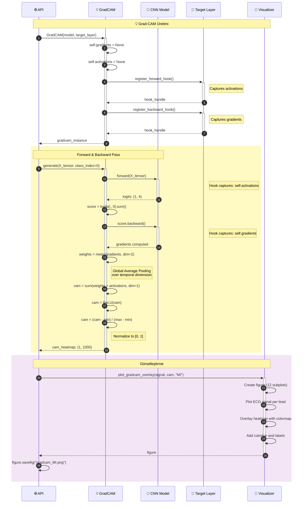
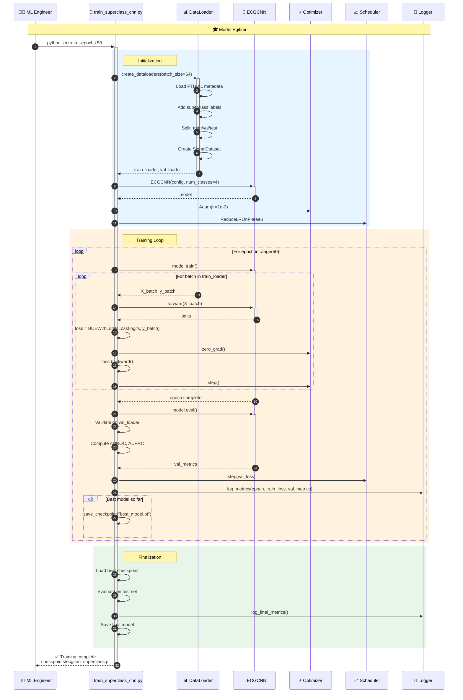
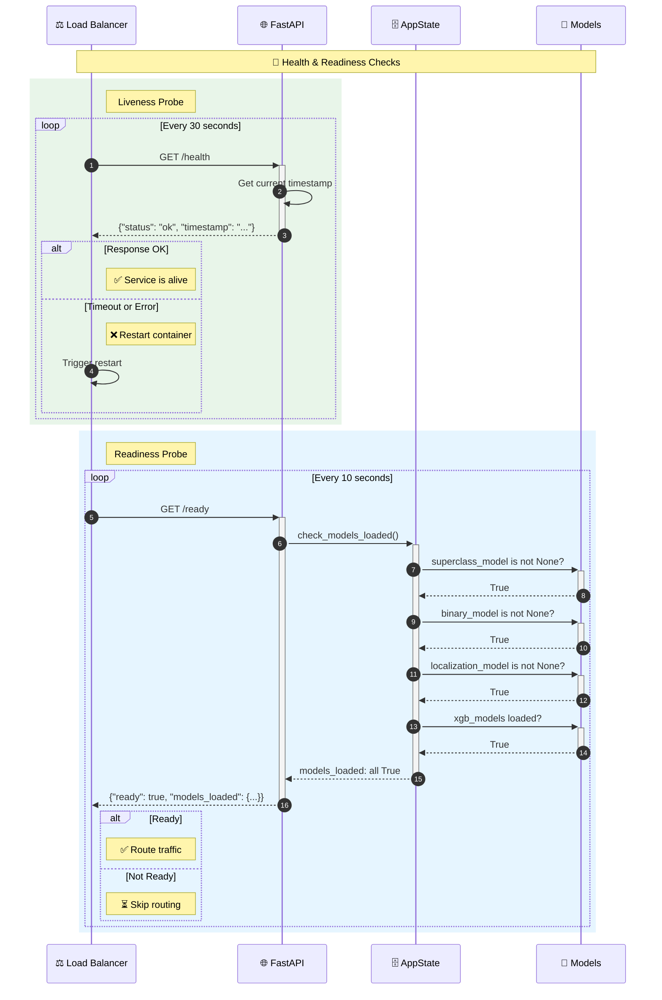
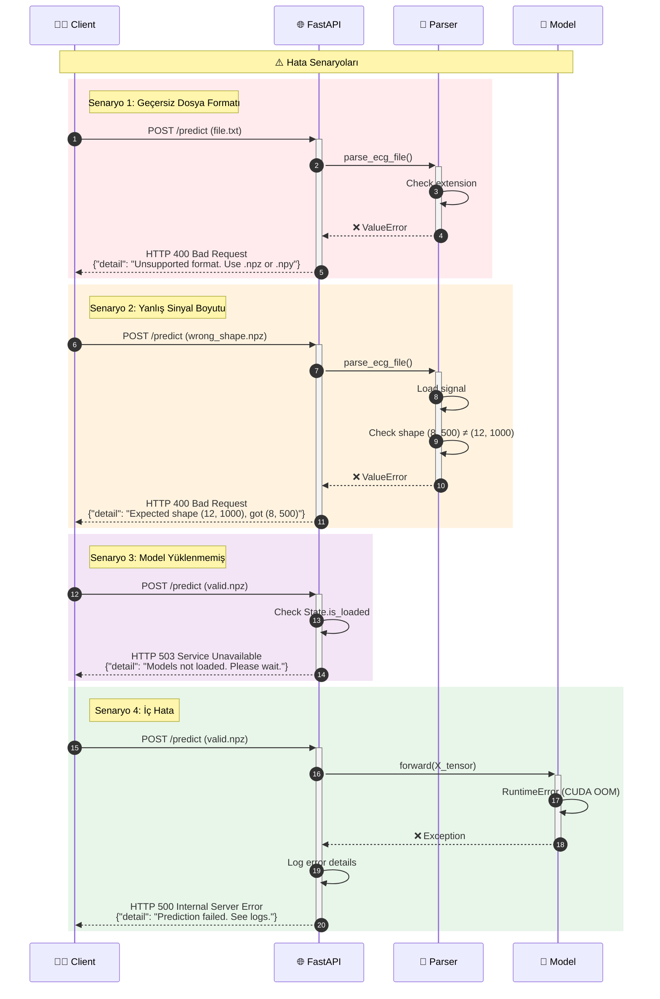
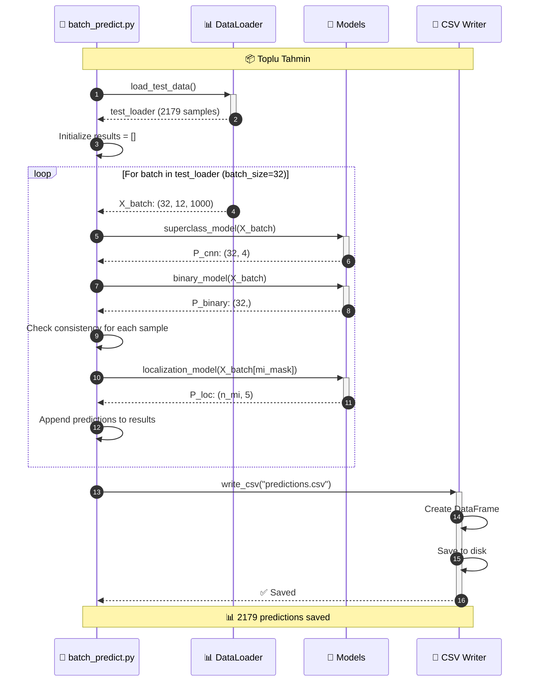
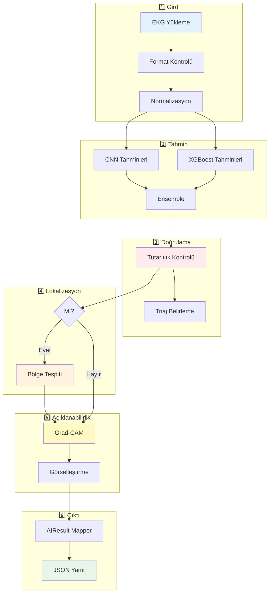

# CardioGuard-AI: Sequence Diyagramı
## (Sıralı Akış Diyagramları)

---

## 📋 Doküman Bilgileri

| Özellik | Değer |
|---------|-------|
| **Proje Adı** | CardioGuard-AI |
| **Doküman Tipi** | Sequence Diyagramı |
| **Versiyon** | 1.0.0 |
| **Tarih** | 2026-01-21 |

---

## 1. Ana Tahmin Akışı (Full Prediction Flow)

Bu diyagram, bir EKG sinyalinin yüklenip analiz edilmesinden sonuç üretilmesine kadar olan tüm akışı gösterir.

---

## 2. Model Yükleme ve Başlatma (Startup Sequence)

---

## 3. Tutarlılık Kontrolü Detayı (Consistency Guard Flow)

---

## 4. XGBoost Hibrit Pipeline (Ensemble Flow)

---

## 5. Grad-CAM Açıklama Üretimi (XAI Flow)

---

## 6. Model Eğitim Akışı (Training Flow)

---

## 7. Health Check ve Readiness (Monitoring Flow)

---

## 8. Hata Senaryoları (Error Handling)

---

## 9. Batch Prediction Akışı (Batch Processing)

---

## 10. Özet Akış Şeması

---

> **Not:** Bu sequence diyagramları CardioGuard-AI v1.0.0 akışlarını gösterir. Tüm diyagramlar Mermaid formatındadır ve GitHub, GitLab veya uyumlu Markdown görüntüleyicilerde render edilebilir.
