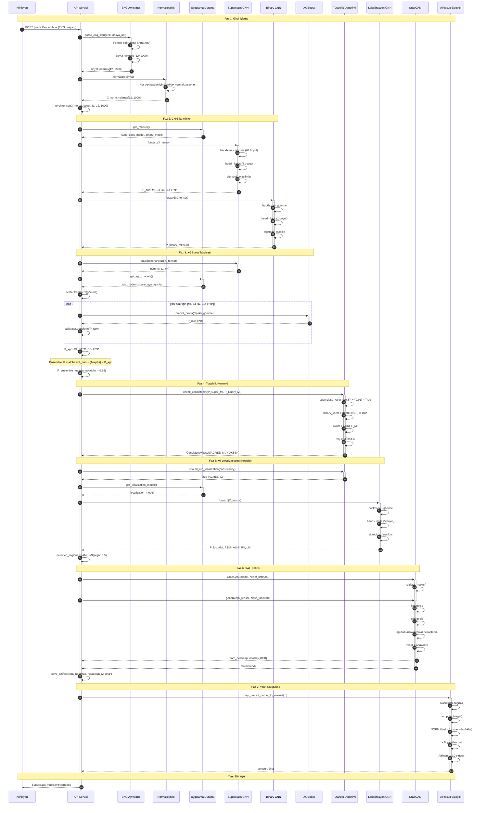
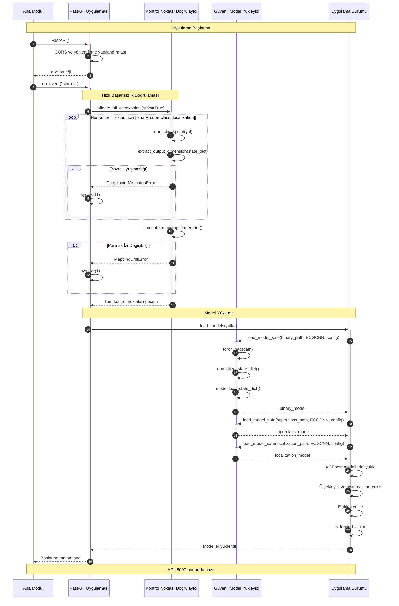
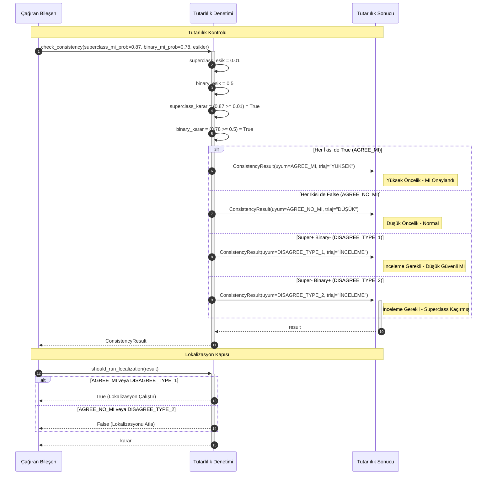
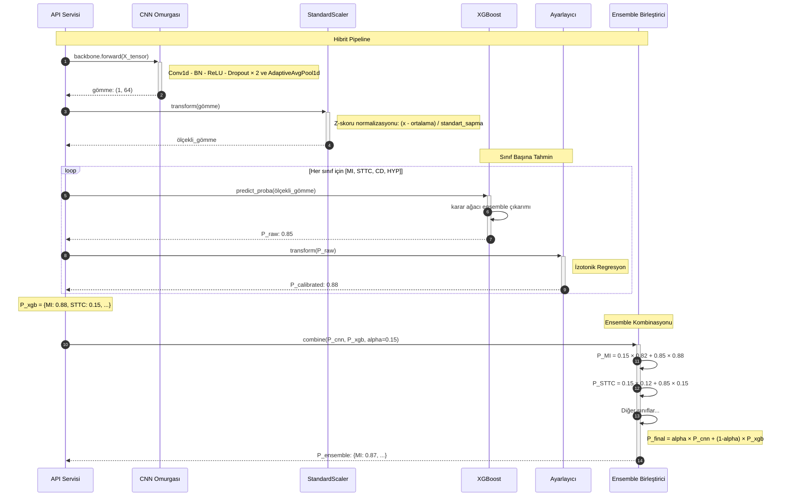
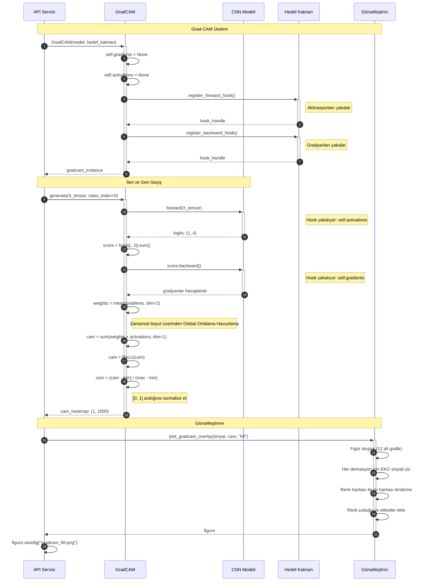
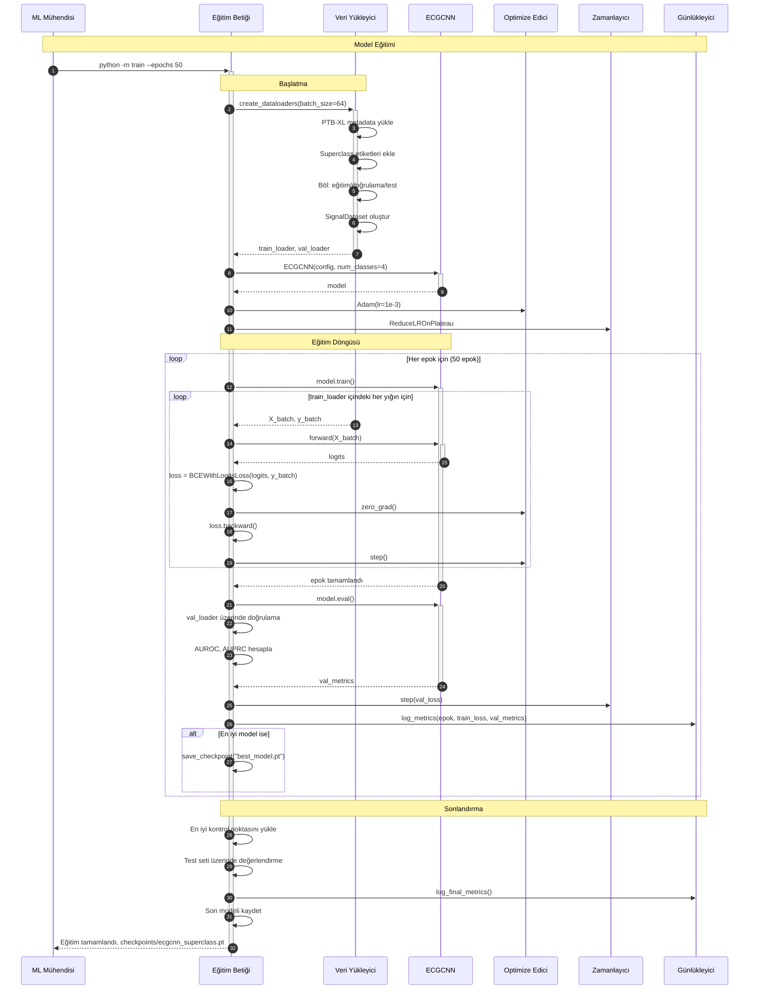
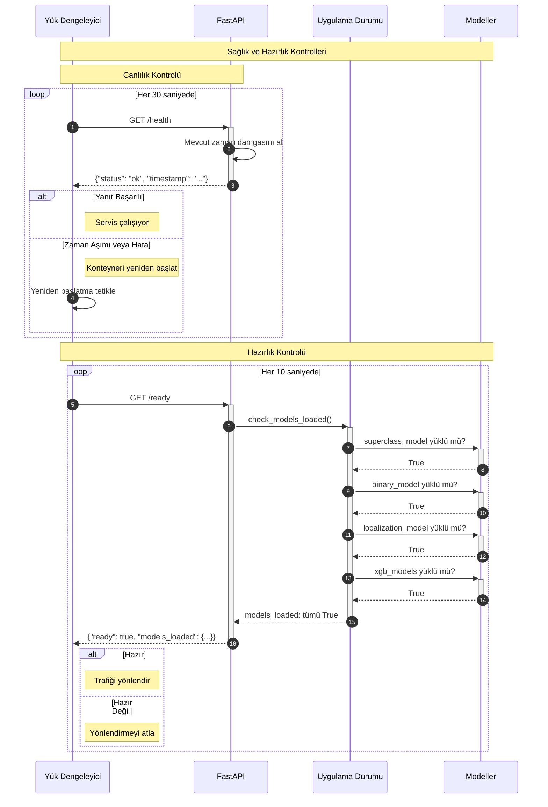
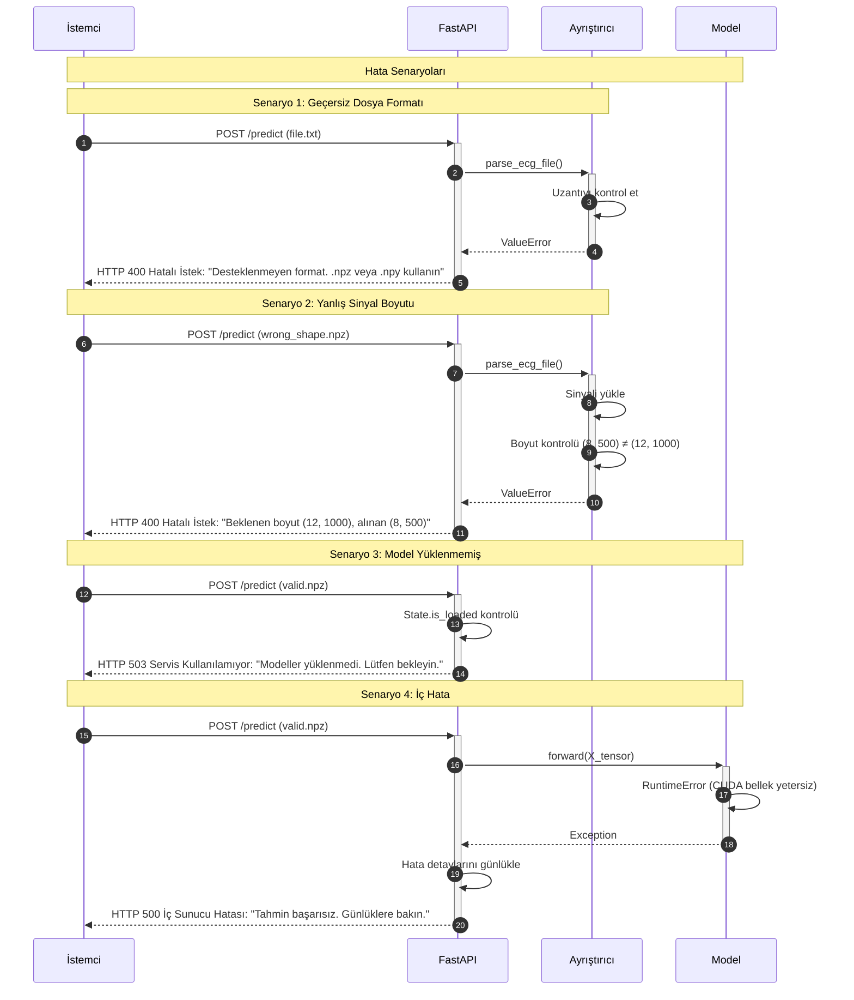
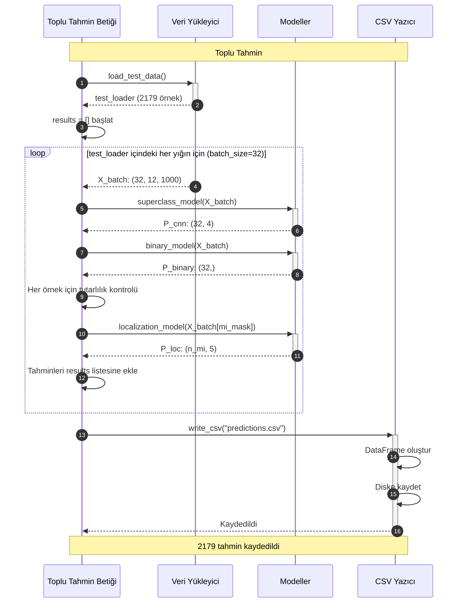
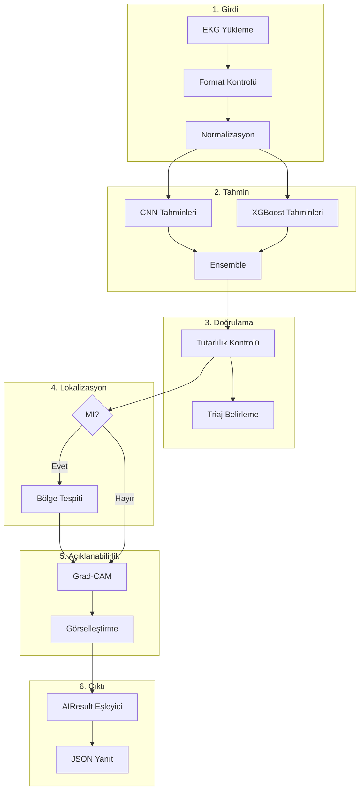

# CardioGuard-AI
# Sıralı Akış Diyagramları

---

**Proje Adı:** CardioGuard-AI  
**Doküman Tipi:** Sıralı Akış Diyagramları (Sequence Diagrams)  
**Versiyon:** 1.0.0  
**Tarih:** 21 Ocak 2026  
**Hazırlayan:** CardioGuard-AI Geliştirme Ekibi

---

## İçindekiler

1. [Ana Tahmin Akışı](#1-ana-tahmin-akışı)
2. [Model Yükleme ve Başlatma](#2-model-yükleme-ve-başlatma)
3. [Tutarlılık Kontrolü Detayı](#3-tutarlılık-kontrolü-detayı)
4. [XGBoost Hibrit Pipeline](#4-xgboost-hibrit-pipeline)
5. [Grad-CAM Açıklama Üretimi](#5-grad-cam-açıklama-üretimi)
6. [Model Eğitim Akışı](#6-model-eğitim-akışı)
7. [Sağlık Kontrolü ve Hazırlık](#7-sağlık-kontrolü-ve-hazırlık)
8. [Hata Senaryoları](#8-hata-senaryoları)
9. [Toplu Tahmin Akışı](#9-toplu-tahmin-akışı)
10. [Özet Akış Şeması](#10-özet-akış-şeması)

---

## 1. Ana Tahmin Akışı

Bu diyagram, bir EKG sinyalinin yüklenip analiz edilmesinden sonuç üretilmesine kadar olan tüm akışı göstermektedir.

---

## 2. Model Yükleme ve Başlatma

---

## 3. Tutarlılık Kontrolü Detayı

---

## 4. XGBoost Hibrit Pipeline

---

## 5. Grad-CAM Açıklama Üretimi

---

## 6. Model Eğitim Akışı

---

## 7. Sağlık Kontrolü ve Hazırlık

---

## 8. Hata Senaryoları

---

## 9. Toplu Tahmin Akışı

---

## 10. Özet Akış Şeması

---

## Onay Sayfası

| Rol | Ad Soyad | Tarih | İmza |
|-----|----------|-------|------|
| Yazılım Mimarı | | | |
| Teknik Lider | | | |
| Kalite Güvence Mühendisi | | | |

---

**Doküman Sonu**

*Bu sıralı akış diyagramları CardioGuard-AI v1.0.0 akışlarını göstermektedir. Tüm diyagramlar Mermaid formatındadır ve GitHub, GitLab veya uyumlu Markdown görüntüleyicilerde işlenebilir.*
