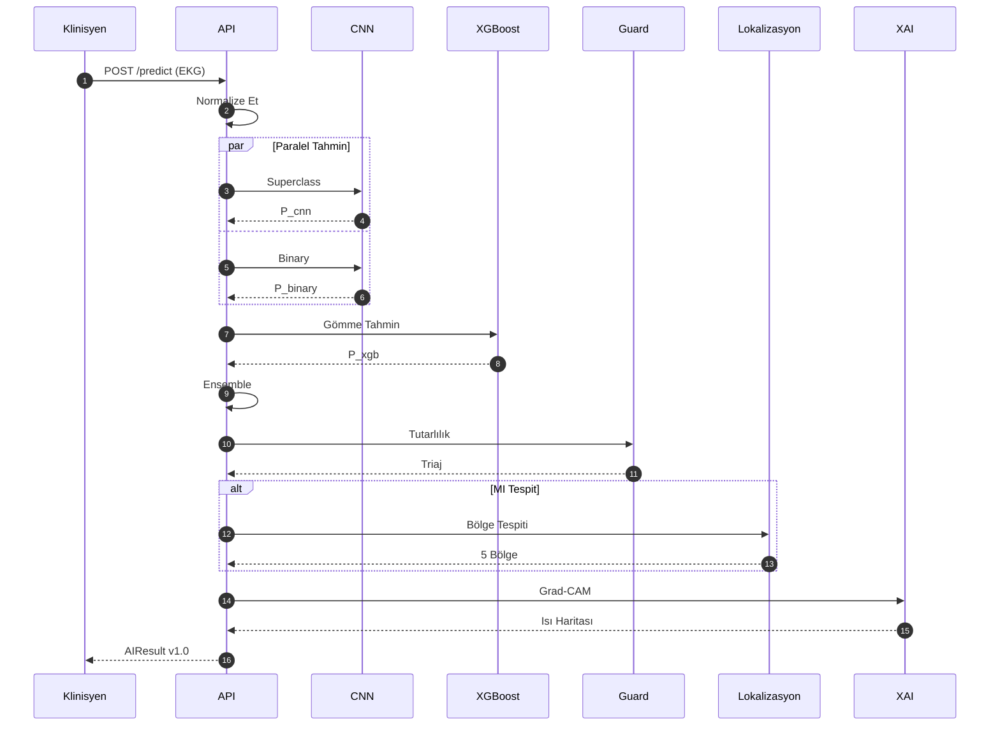
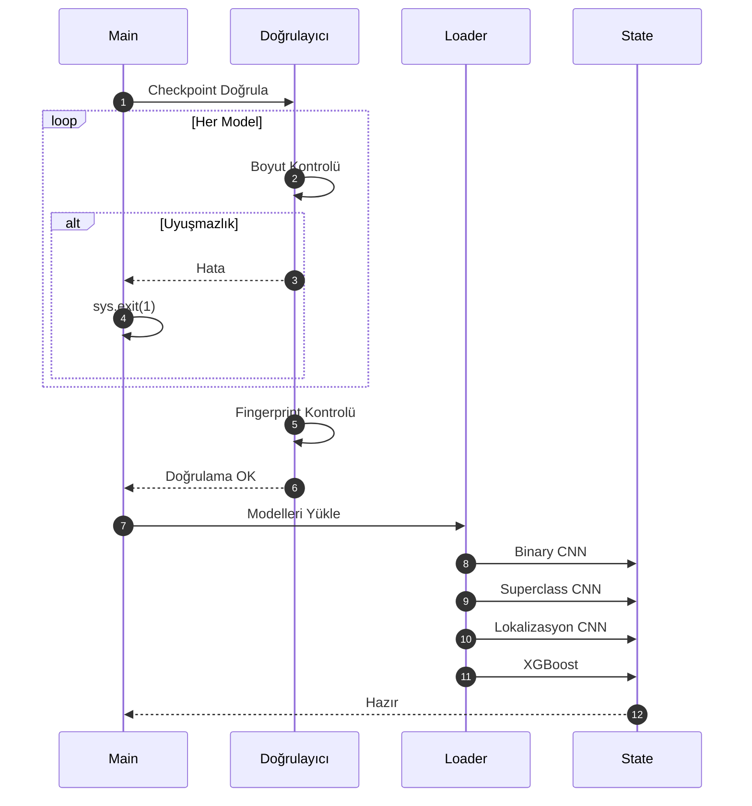
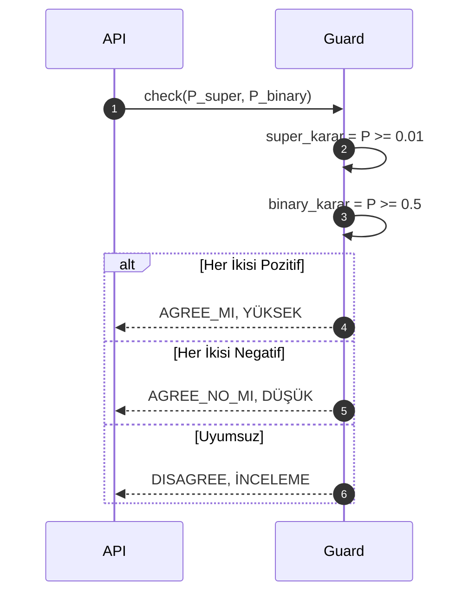
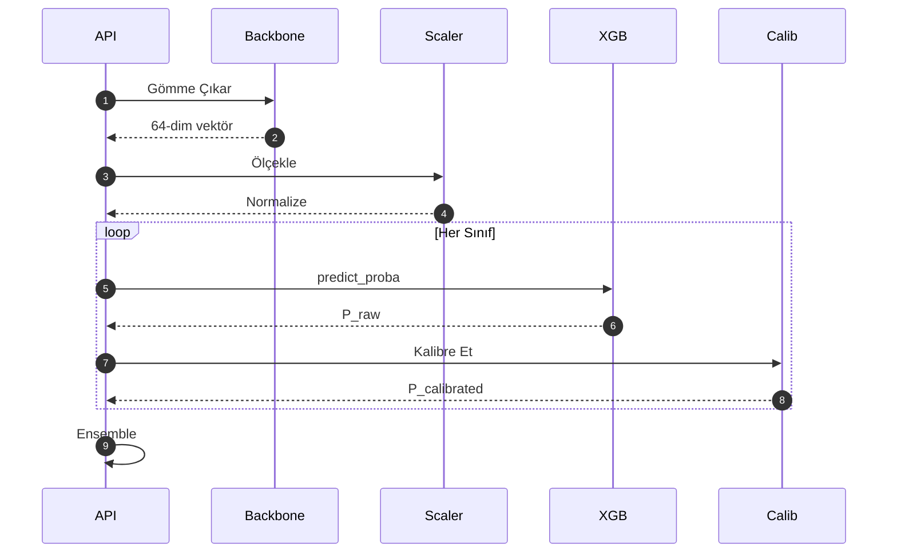
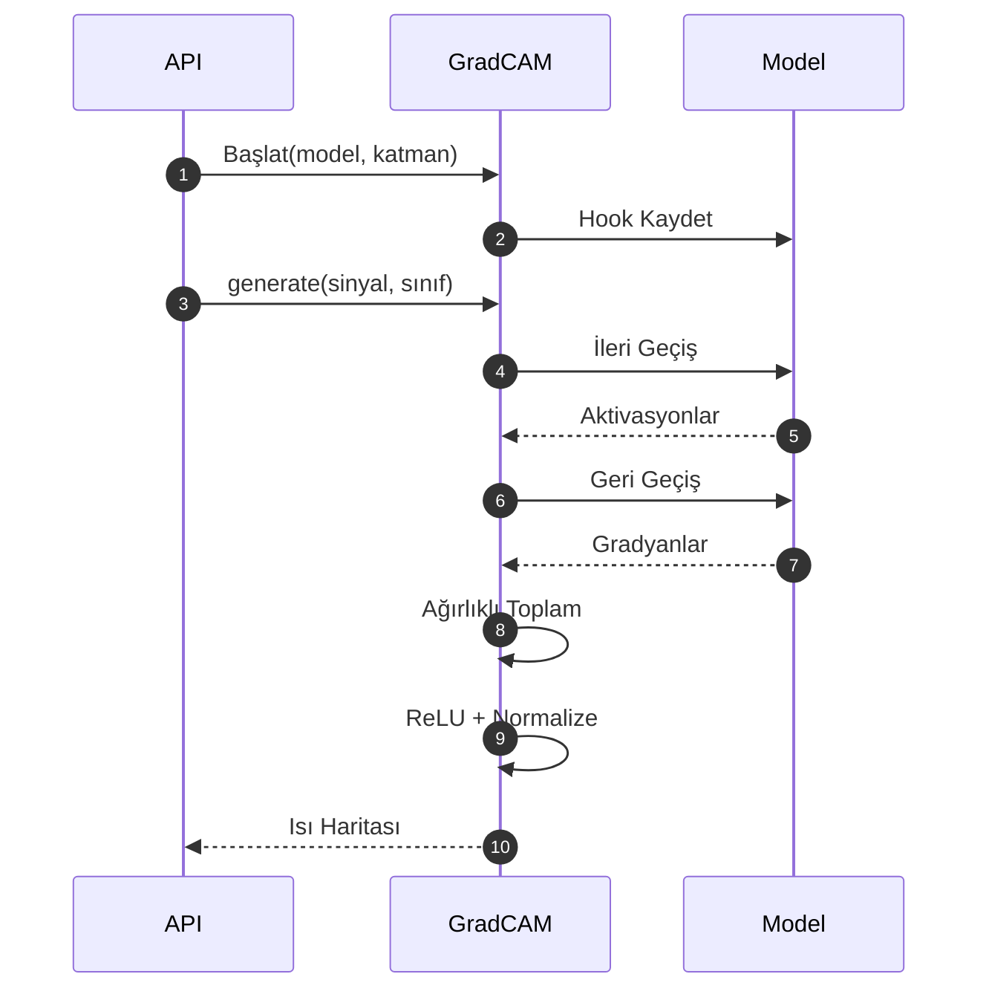
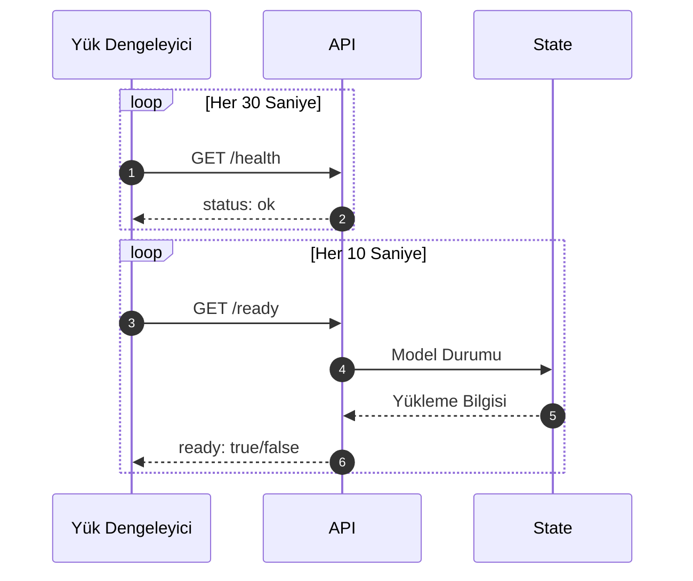
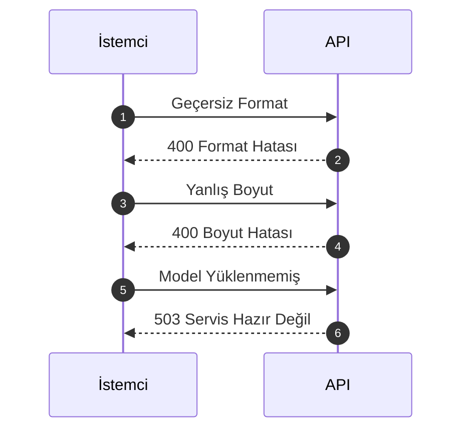
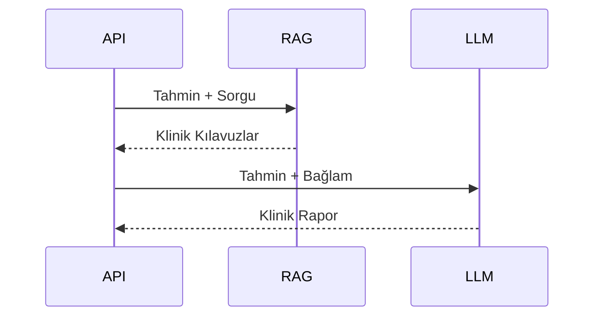
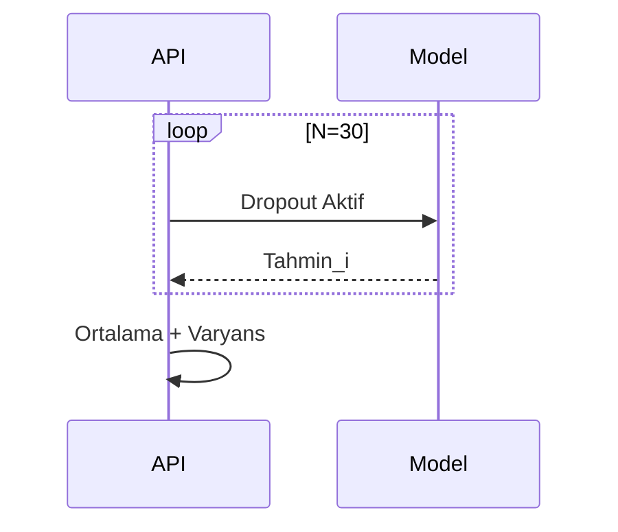

# CardioGuard-AI
# Sıralı Akış Diyagramları

---

**Proje Adı:** CardioGuard-AI  
**Doküman Tipi:** Sıralı Akış Diyagramları  
**Versiyon:** 1.0.0  
**Tarih:** 21 Ocak 2026  
**Hazırlayan:** CardioGuard-AI Geliştirme Ekibi

---

## 1. Ana Tahmin Akışı

Bu diyagram, EKG sinyalinin yüklenmesinden sonuç üretilmesine kadar olan tam akışı göstermektedir.

### 1.1 Akış Diyagramı



### 1.2 Akış Açıklaması

| Faz | Bileşenler | Açıklama |
|-----|------------|----------|
| 1. Girdi | API, Normalizer | Sinyal yükleme ve normalizasyon |
| 2. Tahmin | CNN, XGBoost | Paralel model çıkarımı |
| 3. Birleştirme | Ensemble | CNN ve XGB olasılıklarını birleştirme |
| 4. Kontrol | ConsistencyGuard | Tutarlılık ve triaj belirleme |
| 5. Lokalizasyon | Lokalizasyon CNN | MI bölge tespiti (koşullu) |
| 6. Açıklama | GradCAM | XAI üretimi |
| 7. Yanıt | AIResultMapper | JSON yanıt oluşturma |

---

## 2. Sistem Başlatma Akışı

### 2.1 Akış Diyagramı



### 2.2 Fail-Fast Mekanizması

Sistem başlangıcında uygulanan doğrulama kontrolleri:

| Kontrol | Açıklama | Başarısızlık Durumu |
|---------|----------|---------------------|
| Dosya Varlığı | Checkpoint dosyaları mevcut mu? | FileNotFoundError |
| Boyut Uyumu | Model çıktı boyutu beklenenle eşleşiyor mu? | CheckpointMismatchError |
| Fingerprint | MI eşleme parmak izi değişmiş mi? | MappingDriftError |

---

## 3. Tutarlılık Kontrolü

### 3.1 Akış Diyagramı



### 3.2 Karar Matrisi

| Superclass MI | Binary MI | Sonuç | Triaj |
|---------------|-----------|-------|-------|
| ≥ 0.01 | ≥ 0.5 | AGREE_MI | Yüksek |
| < 0.01 | < 0.5 | AGREE_NO_MI | Düşük |
| ≥ 0.01 | < 0.5 | DISAGREE_TYPE_1 | İnceleme |
| < 0.01 | ≥ 0.5 | DISAGREE_TYPE_2 | İnceleme |

---

## 4. XGBoost Hibrit Pipeline

### 4.1 Akış Diyagramı



### 4.2 Ensemble Formülü

```
P_final = α × P_cnn + (1 - α) × P_xgb
```

Varsayılan: α = 0.15 (XGBoost ağırlıklı)

---

## 5. Grad-CAM Üretimi

### 5.1 Akış Diyagramı



### 5.2 Grad-CAM Hesaplama Adımları

| Adım | İşlem | Çıktı |
|------|-------|-------|
| 1 | İleri geçiş | Aktivasyonlar (A) |
| 2 | Geri geçiş | Gradyanlar (∂y/∂A) |
| 3 | Global ortalama | Ağırlıklar (α) |
| 4 | Ağırlıklı toplam | Σ(α × A) |
| 5 | ReLU | max(0, cam) |
| 6 | Normalize | [0, 1] aralığı |

---

## 6. Sağlık Kontrolü

### 6.1 Akış Diyagramı



### 6.2 Health Check Endpoints

| Endpoint | Amaç | Yanıt |
|----------|------|-------|
| /health | Canlılık kontrolü | {"status": "ok"} |
| /ready | Hazırlık kontrolü | {"ready": true/false} |

---

## 7. Hata Senaryoları

### 7.1 Akış Diyagramı



### 7.2 Hata Kodları

| Kod | Açıklama | Çözüm |
|-----|----------|-------|
| 400 | Geçersiz girdi | Dosya formatını kontrol edin |
| 503 | Servis hazır değil | Modellerin yüklenmesini bekleyin |
| 500 | İç hata | Günlükleri inceleyin |

---

## 8. Planlanan Akışlar (v2.0)

### 8.1 RAG Entegrasyonu



### 8.2 Belirsizlik Tahmini



---

## Onay Sayfası

| Rol | Ad Soyad | Tarih | İmza |
|-----|----------|-------|------|
| Yazılım Mimarı | | | |
| Teknik Lider | | | |

---

**Doküman Sonu**
