# CardioGuard-AI: Sequence Diyagramı
## (Sıralı Akış Diyagramları)

---

## 📋 Doküman Bilgileri

| Özellik | Değer |
|---------|-------|
| **Proje Adı** | CardioGuard-AI |
| **Doküman Tipi** | Sequence Diyagramı |
| **Versiyon** | 1.0.0 |
| **Tarih** | 2026-01-21 |

---

## 1. Ana Tahmin Akışı (Full Prediction Flow)

Bu diyagram, bir EKG sinyalinin yüklenip analiz edilmesinden sonuç üretilmesine kadar olan tüm akışı gösterir.

---

## 2. Model Yükleme ve Başlatma (Startup Sequence)

```mermaid
sequenceDiagram
    autonumber
    
    participant Main as 🚀 main.py
    participant App as 📱 FastAPI App
    participant Validator as ✅ CheckpointValidator
    participant Loader as 📦 SafeModelLoader
    participant State as 🗄️ AppState
    
    Note over Main, State: 🔄 Uygulama Başlatma
    
    Main->>+App: FastAPI()
    App->>App: Configure CORS, routes
    App-->>-Main: app instance
    
    Main->>+App: @app.on_event("startup")
    
    rect rgb(255, 235, 238)
        Note right of App: Fail-Fast Validation
        App->>+Validator: validate_all_checkpoints(strict=True)
        
        loop For each checkpoint [binary, superclass, localization]
            Validator->>Validator: load_checkpoint(path)
            Validator->>Validator: extract_output_dimension(state_dict)
            
            alt Dimension Mismatch
                Validator-->>App: ❌ CheckpointMismatchError
                App->>App: sys.exit(1)
            end
        end
        
        Validator->>Validator: compute_mapping_fingerprint()
        alt Fingerprint Changed
            Validator-->>App: ❌ MappingDriftError
            App->>App: sys.exit(1)
        end
        
        Validator-->>-App: ✅ All checkpoints valid
    end
    
    rect rgb(232, 245, 233)
        Note right of App: Model Loading
        App->>+State: load_models(paths)
        
        State->>+Loader: load_model_safe(binary_path, ECGCNN, config)
        Loader->>Loader: torch.load(path)
        Loader->>Loader: normalize_state_dict()
        Loader->>Loader: model.load_state_dict()
        Loader-->>-State: binary_model
        
        State->>+Loader: load_model_safe(superclass_path, ECGCNN, config)
        Loader-->>-State: superclass_model
        
        State->>+Loader: load_model_safe(localization_path, ECGCNN, config)
        Loader-->>-State: localization_model
        
        State->>State: Load XGBoost models
        State->>State: Load scaler, calibrators
        State->>State: Load thresholds
        
        State->>State: is_loaded = True
        State-->>-App: ✅ Models loaded
    end
    
    App-->>-Main: ✅ Startup complete
    
    Note over Main, State: 🟢 API Ready at :8000
```

---

## 3. Tutarlılık Kontrolü Detayı (Consistency Guard Flow)

```mermaid
sequenceDiagram
    autonumber
    
    participant Caller as 📞 Caller
    participant Guard as 🛡️ ConsistencyGuard
    participant Result as 📊 ConsistencyResult
    
    Note over Caller, Result: 🔍 Tutarlılık Kontrolü
    
    Caller->>+Guard: check_consistency(<br/>superclass_mi_prob=0.87,<br/>binary_mi_prob=0.78,<br/>thresholds)
    
    Guard->>Guard: superclass_threshold = 0.01
    Guard->>Guard: binary_threshold = 0.5
    
    Guard->>Guard: superclass_decision = (0.87 >= 0.01)<br/>= True
    Guard->>Guard: binary_decision = (0.78 >= 0.5)<br/>= True
    
    alt Both True (AGREE_MI)
        Guard->>+Result: ConsistencyResult(<br/>agreement=AGREE_MI,<br/>triage="HIGH")
        Note right of Result: 🔴 Yüksek Öncelik<br/>MI Onaylandı
    else Both False (AGREE_NO_MI)
        Guard->>+Result: ConsistencyResult(<br/>agreement=AGREE_NO_MI,<br/>triage="LOW")
        Note right of Result: 🟢 Düşük Öncelik<br/>Normal
    else Super+ Binary- (DISAGREE_TYPE_1)
        Guard->>+Result: ConsistencyResult(<br/>agreement=DISAGREE_TYPE_1,<br/>triage="REVIEW")
        Note right of Result: 🟠 İnceleme Gerekli<br/>Düşük Güvenli MI
    else Super- Binary+ (DISAGREE_TYPE_2)
        Guard->>+Result: ConsistencyResult(<br/>agreement=DISAGREE_TYPE_2,<br/>triage="REVIEW")
        Note right of Result: 🟠 İnceleme Gerekli<br/>Superclass Kaçırmış
    end
    
    Result-->>-Guard: result
    Guard-->>-Caller: ConsistencyResult
    
    rect rgb(230, 245, 255)
        Note over Caller, Result: Lokalizasyon Kapısı
        Caller->>+Guard: should_run_localization(result)
        
        alt AGREE_MI or DISAGREE_TYPE_1
            Guard-->>Caller: True (Run Localization)
        else AGREE_NO_MI or DISAGREE_TYPE_2
            Guard-->>Caller: False (Skip Localization)
        end
        Guard-->>-Caller: decision
    end
```

---

## 4. XGBoost Hibrit Pipeline (Ensemble Flow)

```mermaid
sequenceDiagram
    autonumber
    
    participant API as 🌐 API
    participant CNN as 🧠 CNN Backbone
    participant Scaler as 📏 StandardScaler
    participant XGB as 🌲 XGBoost
    participant Calib as 📊 Calibrator
    participant Ensemble as ⚗️ Ensemble
    
    Note over API, Ensemble: 🔄 Hibrit Pipeline
    
    API->>+CNN: backbone.forward(X_tensor)
    Note right of CNN: Conv1d → BN → ReLU → Dropout × 2<br/>AdaptiveAvgPool1d
    CNN-->>-API: embeddings: (1, 64)
    
    API->>+Scaler: transform(embeddings)
    Note right of Scaler: Z-score normalization<br/>(x - μ) / σ
    Scaler-->>-API: embeddings_scaled
    
    rect rgb(232, 245, 233)
        Note over XGB, Calib: Per-Class Prediction
        
        loop For class in [MI, STTC, CD, HYP]
            API->>+XGB: predict_proba(embeddings_scaled)
            XGB->>XGB: tree ensemble inference
            XGB-->>-API: P_raw: 0.85
            
            API->>+Calib: transform(P_raw)
            Note right of Calib: Isotonic Regression
            Calib-->>-API: P_calibrated: 0.88
        end
    end
    
    Note over API: P_xgb = {MI: 0.88, STTC: 0.15, ...}
    
    rect rgb(243, 229, 245)
        Note over Ensemble: Ensemble Combination
        API->>+Ensemble: combine(P_cnn, P_xgb, α=0.15)
        
        Ensemble->>Ensemble: P_MI = 0.15 × 0.82 + 0.85 × 0.88
        Ensemble->>Ensemble: P_STTC = 0.15 × 0.12 + 0.85 × 0.15
        Ensemble->>Ensemble: ...
        
        Note right of Ensemble: P_final = α × P_cnn + (1-α) × P_xgb
        Ensemble-->>-API: P_ensemble: {MI: 0.87, ...}
    end
```

---

## 5. Grad-CAM Açıklama Üretimi (XAI Flow)

---

## 6. Model Eğitim Akışı (Training Flow)

```mermaid
sequenceDiagram
    autonumber
    
    participant User as 🧑‍💻 ML Engineer
    participant Script as 📜 train_superclass_cnn.py
    participant Data as 📊 DataLoader
    participant Model as 🧠 ECGCNN
    participant Optim as ⚡ Optimizer
    participant Sched as 📈 Scheduler
    participant Logger as 📝 Logger
    
    Note over User, Logger: 🎓 Model Eğitimi
    
    User->>+Script: python -m train --epochs 50
    
    rect rgb(230, 245, 255)
        Note right of Script: Initialization
        Script->>+Data: create_dataloaders(batch_size=64)
        Data->>Data: Load PTB-XL metadata
        Data->>Data: Add superclass labels
        Data->>Data: Split: train/val/test
        Data->>Data: Create SignalDataset
        Data-->>-Script: train_loader, val_loader
        
        Script->>+Model: ECGCNN(config, num_classes=4)
        Model-->>-Script: model
        
        Script->>Optim: Adam(lr=1e-3)
        Script->>Sched: ReduceLROnPlateau
    end
    
    rect rgb(255, 243, 224)
        Note right of Script: Training Loop
        loop For epoch in range(50)
            Script->>+Model: model.train()
            
            loop For batch in train_loader
                Data-->>Script: X_batch, y_batch
                
                Script->>+Model: forward(X_batch)
                Model-->>-Script: logits
                
                Script->>Script: loss = BCEWithLogitsLoss(logits, y_batch)
                
                Script->>Optim: zero_grad()
                Script->>Script: loss.backward()
                Script->>Optim: step()
            end
            
            Model-->>-Script: epoch complete
            
            Script->>+Model: model.eval()
            Script->>Script: Validate on val_loader
            Script->>Script: Compute AUROC, AUPRC
            Model-->>-Script: val_metrics
            
            Script->>Sched: step(val_loss)
            Script->>Logger: log_metrics(epoch, train_loss, val_metrics)
            
            alt Best model so far
                Script->>Script: save_checkpoint("best_model.pt")
            end
        end
    end
    
    rect rgb(232, 245, 233)
        Note right of Script: Finalization
        Script->>Script: Load best checkpoint
        Script->>Script: Evaluate on test set
        Script->>Logger: log_final_metrics()
        Script->>Script: Save final model
    end
    
    Script-->>-User: ✅ Training complete<br/>checkpoints/ecgcnn_superclass.pt
```

---

## 7. Health Check ve Readiness (Monitoring Flow)

```mermaid
sequenceDiagram
    autonumber
    
    participant LB as ⚖️ Load Balancer
    participant API as 🌐 FastAPI
    participant State as 🗄️ AppState
    participant Models as 🧠 Models
    
    Note over LB, Models: 💓 Health & Readiness Checks
    
    rect rgb(232, 245, 233)
        Note right of LB: Liveness Probe
        loop Every 30 seconds
            LB->>+API: GET /health
            API->>API: Get current timestamp
            API-->>-LB: {"status": "ok", "timestamp": "..."}
            
            alt Response OK
                Note right of LB: ✅ Service is alive
            else Timeout or Error
                Note right of LB: ❌ Restart container
                LB->>LB: Trigger restart
            end
        end
    end
    
    rect rgb(230, 245, 255)
        Note right of LB: Readiness Probe
        loop Every 10 seconds
            LB->>+API: GET /ready
            
            API->>+State: check_models_loaded()
            State->>+Models: superclass_model is not None?
            Models-->>-State: True
            State->>+Models: binary_model is not None?
            Models-->>-State: True
            State->>+Models: localization_model is not None?
            Models-->>-State: True
            State->>+Models: xgb_models loaded?
            Models-->>-State: True
            State-->>-API: models_loaded: all True
            
            API-->>-LB: {"ready": true, "models_loaded": {...}}
            
            alt Ready
                Note right of LB: ✅ Route traffic
            else Not Ready
                Note right of LB: ⏳ Skip routing
            end
        end
    end
```

---

## 8. Hata Senaryoları (Error Handling)

```mermaid
sequenceDiagram
    autonumber
    
    participant Client as 👨‍⚕️ Client
    participant API as 🌐 FastAPI
    participant Parser as 📄 Parser
    participant Model as 🧠 Model
    
    Note over Client, Model: ⚠️ Hata Senaryoları
    
    rect rgb(255, 235, 238)
        Note right of Client: Senaryo 1: Geçersiz Dosya Formatı
        Client->>+API: POST /predict (file.txt)
        API->>+Parser: parse_ecg_file()
        Parser->>Parser: Check extension
        Parser-->>-API: ❌ ValueError
        API-->>-Client: HTTP 400 Bad Request<br/>{"detail": "Unsupported format. Use .npz or .npy"}
    end
    
    rect rgb(255, 243, 224)
        Note right of Client: Senaryo 2: Yanlış Sinyal Boyutu
        Client->>+API: POST /predict (wrong_shape.npz)
        API->>+Parser: parse_ecg_file()
        Parser->>Parser: Load signal
        Parser->>Parser: Check shape (8, 500) ≠ (12, 1000)
        Parser-->>-API: ❌ ValueError
        API-->>-Client: HTTP 400 Bad Request<br/>{"detail": "Expected shape (12, 1000), got (8, 500)"}
    end
    
    rect rgb(243, 229, 245)
        Note right of Client: Senaryo 3: Model Yüklenmemiş
        Client->>+API: POST /predict (valid.npz)
        API->>API: Check State.is_loaded
        API-->>-Client: HTTP 503 Service Unavailable<br/>{"detail": "Models not loaded. Please wait."}
    end
    
    rect rgb(232, 245, 233)
        Note right of Client: Senaryo 4: İç Hata
        Client->>+API: POST /predict (valid.npz)
        API->>+Model: forward(X_tensor)
        Model->>Model: RuntimeError (CUDA OOM)
        Model-->>-API: ❌ Exception
        API->>API: Log error details
        API-->>-Client: HTTP 500 Internal Server Error<br/>{"detail": "Prediction failed. See logs."}
    end
```

---

## 9. Batch Prediction Akışı (Batch Processing)

```mermaid
sequenceDiagram
    autonumber
    
    participant Script as 📜 batch_predict.py
    participant Loader as 📊 DataLoader
    participant Model as 🧠 Models
    participant Writer as 📝 CSV Writer
    
    Note over Script, Writer: 📦 Toplu Tahmin
    
    Script->>+Loader: load_test_data()
    Loader-->>-Script: test_loader (2179 samples)
    
    Script->>Script: Initialize results = []
    
    loop For batch in test_loader (batch_size=32)
        Loader-->>Script: X_batch: (32, 12, 1000)
        
        Script->>+Model: superclass_model(X_batch)
        Model-->>-Script: P_cnn: (32, 4)
        
        Script->>+Model: binary_model(X_batch)
        Model-->>-Script: P_binary: (32,)
        
        Script->>Script: Check consistency for each sample
        
        Script->>+Model: localization_model(X_batch[mi_mask])
        Model-->>-Script: P_loc: (n_mi, 5)
        
        Script->>Script: Append predictions to results
    end
    
    Script->>+Writer: write_csv("predictions.csv")
    Writer->>Writer: Create DataFrame
    Writer->>Writer: Save to disk
    Writer-->>-Script: ✅ Saved
    
    Note over Script, Writer: 📊 2179 predictions saved
```

---

## 10. Özet Akış Şeması

```mermaid
graph TB
    subgraph Input["1️⃣ Girdi"]
        UPLOAD["EKG Yükleme"]
        PARSE["Format Kontrolü"]
        NORM["Normalizasyon"]
    end
    
    subgraph Prediction["2️⃣ Tahmin"]
        CNN["CNN Tahminleri"]
        XGB["XGBoost Tahminleri"]
        ENS["Ensemble"]
    end
    
    subgraph Validation["3️⃣ Doğrulama"]
        GUARD["Tutarlılık Kontrolü"]
        TRIAGE["Triaj Belirleme"]
    end
    
    subgraph Localization["4️⃣ Lokalizasyon"]
        CHECK{"MI?"}
        LOC["Bölge Tespiti"]
    end
    
    subgraph XAI["5️⃣ Açıklanabilirlik"]
        GCAM["Grad-CAM"]
        VIZ["Görselleştirme"]
    end
    
    subgraph Output["6️⃣ Çıktı"]
        MAPPER["AIResult Mapper"]
        RESPONSE["JSON Yanıt"]
    end
    
    UPLOAD --> PARSE --> NORM --> CNN & XGB
    CNN & XGB --> ENS --> GUARD --> TRIAGE
    GUARD --> CHECK
    CHECK -->|Evet| LOC --> GCAM
    CHECK -->|Hayır| GCAM
    GCAM --> VIZ --> MAPPER --> RESPONSE
    
    style UPLOAD fill:#e3f2fd
    style GUARD fill:#ffebee
    style LOC fill:#fff3e0
    style GCAM fill:#fff9c4
    style RESPONSE fill:#e8f5e9
```

---

> **Not:** Bu sequence diyagramları CardioGuard-AI v1.0.0 akışlarını gösterir. Tüm diyagramlar Mermaid formatındadır ve GitHub, GitLab veya uyumlu Markdown görüntüleyicilerde render edilebilir.
