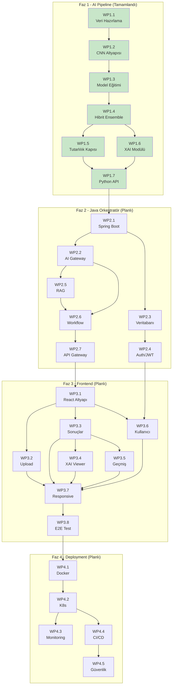
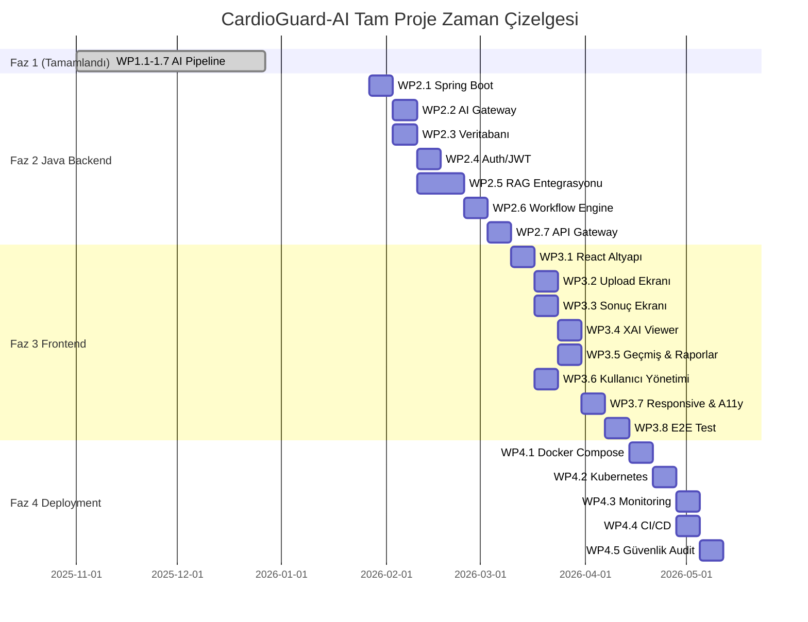

# CardioGuard-AI
# İş Paketleri ve Zamanlama Planı

---

**Proje Adı:** CardioGuard-AI  
**Doküman Tipi:** İş Kırılım Yapısı (Work Breakdown Structure - WBS)  
**Versiyon:** 2.0.0  
**Tarih:** 22 Ocak 2026  
**Hazırlayan:** CardioGuard-AI Geliştirme Ekibi

---

## 1. Genel Bakış

Bu doküman, CardioGuard-AI projesinin tüm fazlarını, tamamlanan iş paketlerini ve gelecekte planlanmış çalışmaları kapsamaktadır. Proje üç ana fazdan oluşmaktadır:

- **Faz 1 (Tamamlandı):** Temel AI pipeline ve Python backend
- **Faz 2 (Planlanan):** Java orkestratör ve entegrasyon
- **Faz 3 (Planlanan):** Frontend ve klinik kullanıma hazırlık

---

## 2. Faz 1: Temel AI Pipeline (TAMAMLANDI)

### Tablo 1. Tamamlanan İş Paketleri

| WP ID | İş Paketi Adı | Durum | Çıktılar | Tamamlanma |
|:-----:|---------------|:-----:|----------|:----------:|
| **WP1.0** | Proje Altyapısı | ✅ | Repo yapısı, config, CI/CD | %100 |
| **WP1.1** | Veri Hazırlama | ✅ | PTB-XL loader, etiketleme, cache sistemi | %100 |
| **WP1.2** | CNN Model Altyapısı | ✅ | ECGBackbone, BinaryHead, MultiClassHead, FiveClassHead | %100 |
| **WP1.3** | Model Eğitimi | ✅ | Binary MI, Superclass, Lokalizasyon modelleri | %100 |
| **WP1.4** | Hibrit Ensemble | ✅ | XGBoost OvR, embedding pipeline | %100 |
| **WP1.5** | Tutarlılık Kapısı | ✅ | ConsistencyGuard, AgreementType, triage | %100 |
| **WP1.6** | XAI Modülü | ✅ | Grad-CAM, SHAP, SanityChecker, Reporter | %100 |
| **WP1.7** | Python API | ✅ | FastAPI, AIResult v1.0 kontratı | %100 |

### Faz 1 Çıktı Özeti

```
📁 src/
├── 📁 models/      → CNN model tanımları (ECGBackbone, heads)
├── 📁 data/        → PTB-XL loader, etiketleyiciler, normalizer
├── 📁 pipeline/    → Eğitim, çıkarım, tutarlılık kontrolü
├── 📁 xai/         → Grad-CAM, SHAP, sanity, raporlama
├── 📁 backend/     → FastAPI servisi
└── 📁 contracts/   → AIResult v1.0 mapper
```

---

## 3. Faz 2: Java Orkestratör & Entegrasyon (PLANLI)

### Tablo 2. Faz 2 İş Paketleri

| WP ID | İş Paketi Adı | Amaç | Alt İşler | Çıktılar | Kabul Kriteri | Bağımlılık | Süre |
|:-----:|---------------|------|-----------|----------|----------------|:----------:|:----:|
| **WP2.1** | Java Spring Boot Altyapısı | Orkestrasyon katmanını oluşturmak | Spring Boot setup, Maven/Gradle, JPA entity'ler | Çalışan Spring Boot projesi | Build başarılı, health endpoint çalışır | WP1.7 | 1 hafta |
| **WP2.2** | AI Gateway Servisi | Python AI servisine köprü | RestTemplate/WebClient, retry logic, circuit breaker | Gateway controller + service | Python API ile iletişim kuruldu | WP2.1 | 1 hafta |
| **WP2.3** | Veritabanı Katmanı | Analiz geçmişi ve kullanıcı yönetimi | PostgreSQL schema, JPA repository'ler, migration | DB schema + CRUD operasyonları | Veri kalıcı, tekrar okunabilir | WP2.1 | 1 hafta |
| **WP2.4** | Kimlik Doğrulama | JWT tabanlı auth sistemi | Spring Security, JWT token, rol yönetimi | Auth endpoint'ler + token üretimi | Login/logout çalışır | WP2.3 | 1 hafta |
| **WP2.5** | RAG Entegrasyonu | Klinik bilgi bankası sorgusu | LangChain4j, ChromaDB, embedding modeli | RAG pipeline çalışır | Sorgu-cevap akışı tamamlandı | WP2.2 | 2 hafta |
| **WP2.6** | İş Akışı Motoru | Çok adımlı analiz orkestasyonu | State machine, async işlem, event'ler | Workflow engine çalışır | Analiz adımları sıralı çalışır | WP2.2, WP2.5 | 1 hafta |
| **WP2.7** | API Gateway & Dokümantasyon | Dış dünyaya açık API | OpenAPI spec, Swagger UI, rate limiting | API dokümantasyonu | Swagger'dan test edilebilir | WP2.6 | 1 hafta |

---

## 4. Faz 3: Frontend & Klinik Hazırlık (PLANLI)

### Tablo 3. Faz 3 İş Paketleri

| WP ID | İş Paketi Adı | Amaç | Alt İşler | Çıktılar | Kabul Kriteri | Bağımlılık | Süre |
|:-----:|---------------|------|-----------|----------|----------------|:----------:|:----:|
| **WP3.1** | Frontend Altyapısı | Modern web arayüzü temeli | React/Next.js setup, design system, routing | Boş proje + temel yapı | Build başarılı | WP2.7 | 1 hafta |
| **WP3.2** | EKG Yükleme Ekranı | Kullanıcı dosya upload akışı | Drag-drop, format validasyon, preview | Upload sayfası çalışır | Dosya başarıyla yüklenebilir | WP3.1 | 1 hafta |
| **WP3.3** | Analiz Sonuç Ekranı | Tahmin sonuçlarının gösterimi | Olasılık chart'ları, triage badge, özet | Sonuç dashboard'u | Tüm tahmin verileri görünür | WP3.1 | 1 hafta |
| **WP3.4** | XAI Görselleştirme | Açıklama artefact'larının gösterimi | 12-lead overlay, SHAP grafikler, narrative | XAI viewer komponenti | Grad-CAM ve SHAP görünür | WP3.3 | 1 hafta |
| **WP3.5** | Geçmiş & Raporlar | Analiz geçmişi ve PDF export | Tablo listeleme, filtreleme, PDF üretimi | Geçmiş sayfası + export | PDF indirilebilir | WP3.3 | 1 hafta |
| **WP3.6** | Kullanıcı Yönetimi | Login, profil, ayarlar | Auth akışı, profil düzenleme | Kullanıcı sayfaları | Giriş/çıkış çalışır | WP3.1, WP2.4 | 1 hafta |
| **WP3.7** | Responsive & A11y | Mobil uyum ve erişilebilirlik | Mobile-first CSS, ARIA labels, contrast | Test raporu | WCAG 2.1 AA uyumlu | WP3.2-3.6 | 1 hafta |
| **WP3.8** | E2E Test & QA | Uçtan uca test otomasyonu | Playwright/Cypress, test senaryoları | Test suite + raporlar | %80 coverage | WP3.7 | 1 hafta |

---

## 5. Faz 4: Deployment & Operasyon (PLANLI)

### Tablo 4. Faz 4 İş Paketleri

| WP ID | İş Paketi Adı | Amaç | Alt İşler | Çıktılar | Kabul Kriteri | Bağımlılık | Süre |
|:-----:|---------------|------|-----------|----------|----------------|:----------:|:----:|
| **WP4.1** | Docker Compose | Tüm servislerin konteynerizasyonu | Python, Java, DB, Redis container'ları | docker-compose.yml | Tek komutla ayağa kalkar | Faz 2-3 | 1 hafta |
| **WP4.2** | Kubernetes Manifests | Ölçeklenebilir deployment | Deployment, Service, Ingress YAML'ları | K8s manifest'leri | K8s cluster'da çalışır | WP4.1 | 1 hafta |
| **WP4.3** | Monitoring Stack | Sistem izleme altyapısı | Prometheus, Grafana, alerting | Dashboard + alert kuralları | Metrikler görünür | WP4.2 | 1 hafta |
| **WP4.4** | CI/CD Pipeline | Otomatik build ve deploy | GitHub Actions, staging/prod ortamları | Pipeline YAML'ları | Push'ta otomatik deploy | WP4.2 | 1 hafta |
| **WP4.5** | Güvenlik Audit | Penetrasyon testi ve güvenlik | OWASP kontrolleri, bağımlılık taraması | Güvenlik raporu | Kritik açık yok | WP4.4 | 1 hafta |

---

## 6. Tam Proje Bağımlılık Diyagramı



---

## 7. Zamanlama Planı (24 Haftalık)

### Tablo 5. Haftalık Zamanlama ve Kilometre Taşları

| Hafta | Faz | Aktif İş Paketleri | Kilometre Taşı |
|:-----:|:---:|-------------------|----------------|
| 1-8 | **Faz 1** | WP1.1 → WP1.7 | ✅ **M1:** AI Pipeline tamamlandı |
| 9 | Faz 2 | WP2.1 | **M2:** Spring Boot altyapısı hazır |
| 10 | Faz 2 | WP2.2, WP2.3 | **M3:** AI Gateway + DB katmanı |
| 11 | Faz 2 | WP2.4 | **M4:** Kimlik doğrulama çalışır |
| 12-13 | Faz 2 | WP2.5 | **M5:** RAG entegrasyonu tamamlandı |
| 14 | Faz 2 | WP2.6 | **M6:** Workflow engine çalışır |
| 15 | Faz 2 | WP2.7 | **M7:** Java API dokümante edildi |
| 16 | Faz 3 | WP3.1 | **M8:** Frontend altyapısı hazır |
| 17 | Faz 3 | WP3.2, WP3.3 | **M9:** Upload + Sonuç ekranları |
| 18 | Faz 3 | WP3.4, WP3.5 | **M10:** XAI viewer + Geçmiş |
| 19 | Faz 3 | WP3.6 | **M11:** Kullanıcı yönetimi |
| 20 | Faz 3 | WP3.7 | **M12:** Responsive + A11y |
| 21 | Faz 3 | WP3.8 | **M13:** E2E testler pass |
| 22 | Faz 4 | WP4.1, WP4.2 | **M14:** Konteyner altyapısı |
| 23 | Faz 4 | WP4.3, WP4.4 | **M15:** Monitoring + CI/CD |
| 24 | Faz 4 | WP4.5 | **M16:** Güvenlik audit tamamlandı |

---

## 8. Gantt Şeması



---

## 9. Görsel Gantt Tablosu (24 Hafta)

### Tablo 6. Haftalık İş Paketi Dağılımı

| İş Paketi | 1-8 | 9 | 10 | 11 | 12 | 13 | 14 | 15 | 16 | 17 | 18 | 19 | 20 | 21 | 22 | 23 | 24 |
|-----------|:---:|:-:|:--:|:--:|:--:|:--:|:--:|:--:|:--:|:--:|:--:|:--:|:--:|:--:|:--:|:--:|:--:|
| **Faz 1** | ██ | · | · | · | · | · | · | · | · | · | · | · | · | · | · | · | · |
| **WP2.1** | · | ◼ | · | · | · | · | · | · | · | · | · | · | · | · | · | · | · |
| **WP2.2** | · | · | ◼ | · | · | · | · | · | · | · | · | · | · | · | · | · | · |
| **WP2.3** | · | · | ◼ | · | · | · | · | · | · | · | · | · | · | · | · | · | · |
| **WP2.4** | · | · | · | ◼ | · | · | · | · | · | · | · | · | · | · | · | · | · |
| **WP2.5** | · | · | · | · | ◼ | ◼ | · | · | · | · | · | · | · | · | · | · | · |
| **WP2.6** | · | · | · | · | · | · | ◼ | · | · | · | · | · | · | · | · | · | · |
| **WP2.7** | · | · | · | · | · | · | · | ◼ | · | · | · | · | · | · | · | · | · |
| **WP3.1** | · | · | · | · | · | · | · | · | ◼ | · | · | · | · | · | · | · | · |
| **WP3.2** | · | · | · | · | · | · | · | · | · | ◼ | · | · | · | · | · | · | · |
| **WP3.3** | · | · | · | · | · | · | · | · | · | ◼ | · | · | · | · | · | · | · |
| **WP3.4** | · | · | · | · | · | · | · | · | · | · | ◼ | · | · | · | · | · | · |
| **WP3.5** | · | · | · | · | · | · | · | · | · | · | ◼ | · | · | · | · | · | · |
| **WP3.6** | · | · | · | · | · | · | · | · | · | · | · | ◼ | · | · | · | · | · |
| **WP3.7** | · | · | · | · | · | · | · | · | · | · | · | · | ◼ | · | · | · | · |
| **WP3.8** | · | · | · | · | · | · | · | · | · | · | · | · | · | ◼ | · | · | · |
| **WP4.1** | · | · | · | · | · | · | · | · | · | · | · | · | · | · | ◼ | · | · |
| **WP4.2** | · | · | · | · | · | · | · | · | · | · | · | · | · | · | · | ◼ | · |
| **WP4.3** | · | · | · | · | · | · | · | · | · | · | · | · | · | · | · | ◼ | · |
| **WP4.4** | · | · | · | · | · | · | · | · | · | · | · | · | · | · | · | ◼ | · |
| **WP4.5** | · | · | · | · | · | · | · | · | · | · | · | · | · | · | · | · | ◼ |

**Açıklama:** ██ = Tamamlandı | ◼ = Planlı aktif çalışma | · = Pasif

---

## 10. Faz Bazlı Çıktı Özeti

### Tablo 7. Tüm Fazların Çıktıları

| Faz | Ana Çıktılar | Teknolojiler |
|:---:|--------------|--------------|
| **Faz 1** | AI modeller, Python API, XAI artefact'ları | PyTorch, FastAPI, SHAP |
| **Faz 2** | Java orkestratör, RAG sistemi, workflow engine | Spring Boot, PostgreSQL, LangChain4j |
| **Faz 3** | Web arayüzü, dashboard, raporlama | React/Next.js, TypeScript |
| **Faz 4** | Deployment altyapısı, CI/CD, monitoring | Docker, K8s, Prometheus, GitHub Actions |

---

## 11. Kritik Yol Analizi

```
Faz 1 (✅) → WP2.1 → WP2.2 → WP2.5 → WP2.6 → WP2.7 → WP3.1 → WP3.3 → WP3.4 → WP3.7 → WP3.8 → WP4.1 → WP4.2 → WP4.4 → WP4.5
```

**Toplam Proje Süresi:** ~24 hafta (Faz 1 dahil)  
**Kalan Süre:** ~16 hafta (Faz 2-4)

---

## 12. Risk Değerlendirmesi

| Risk | Etki | Olasılık | Azaltma Stratejisi |
|------|:----:|:--------:|---------------------|
| Python-Java entegrasyon sorunları | Yüksek | Orta | Kontrat-first, erken test |
| RAG model performansı | Orta | Orta | Türkçe embedding model seçimi |
| Frontend-Backend uyumsuzluğu | Orta | Düşük | OpenAPI spec paylaşımı |
| Deployment karmaşıklığı | Orta | Orta | Docker Compose önce, K8s sonra |
| Güvenlik açıkları | Yüksek | Düşük | OWASP checklist, bağımlılık taraması |

---

## Onay Sayfası

| Rol | Ad Soyad | Tarih | İmza |
|-----|----------|-------|------|
| Proje Yöneticisi | | | |
| Teknik Lider | | | |
| Yazılım Mimarı | | | |

---

**Doküman Sonu**
