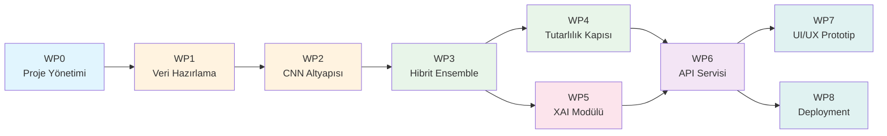
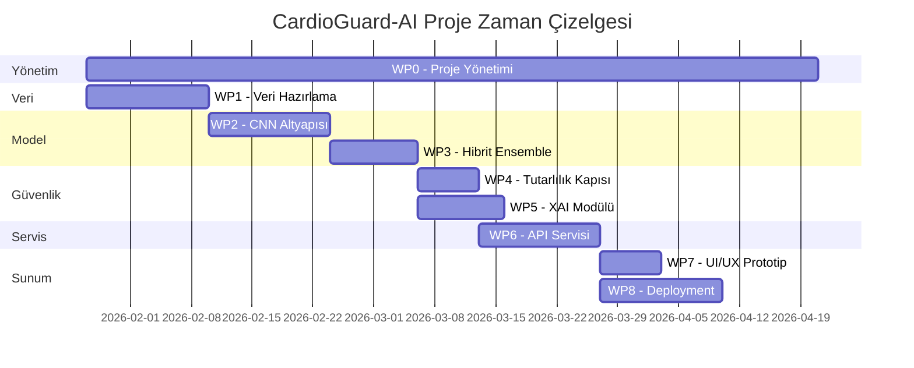

# CardioGuard-AI
# İş Paketleri ve Zamanlama Planı

---

**Proje Adı:** CardioGuard-AI  
**Doküman Tipi:** İş Kırılım Yapısı (Work Breakdown Structure - WBS)  
**Versiyon:** 1.0.0  
**Tarih:** 22 Ocak 2026  
**Hazırlayan:** CardioGuard-AI Geliştirme Ekibi

---

## 1. Genel Bakış

Bu doküman, CardioGuard-AI projesinin uçtan uca geliştirilebilmesi için gerekli iş paketlerini, her paketin somut teslimatlarını ve zamanlama planını tanımlamaktadır.

---

## 2. İş Paketleri Tablosu (WBS)

### Tablo 1. İş Paketleri Detayları

| WP ID | İş Paketi Adı | Amaç | Alt İşler | Çıktılar | Kabul Kriteri | Bağımlılık | Süre |
|:-----:|---------------|------|-----------|----------|----------------|:----------:|:----:|
| **WP0** | Proje Yönetimi & Dokümantasyon | Planı yönetmek ve izlenebilirlik sağlamak | Risk/karar kayıtları, toplantı notları, repo düzeni | Proje planı, risk tablosu, karar günlüğü | Dokümanlar güncel ve sürüm numaralı | — | Sürekli |
| **WP1** | Veri Hazırlama | PTB-XL'den MI için kullanılabilir veri üretmek | Filtreleme, etiket haritalama, normalizasyon, cache | Temizlenmiş dataset + etiket haritası + önbellek | Train/Val/Test ayrımı tekrar üretilebilir | WP0 | 2 hafta |
| **WP2** | Model Altyapısı (CNN) | ECGBackbone ve temel modelleri hazırlamak | Backbone tasarımı, eğitim iskeleti, metrik tanımları | Eğitim scripti + model checkpoint'ları | Baseline metrikler raporlanmış | WP1 | 2 hafta |
| **WP3** | Hibrit/Ensemble Katmanı | Embedding→XGBoost→Ensemble akışını kurmak | Feature pipeline, schema lock, ensemble logic | Hibrit çıkarım pipeline'ı | Çıktı formatı stabil, deterministik | WP2 | 1–2 hafta |
| **WP4** | Tutarlılık Kapısı | Çelişkili kararları yakalamak | Eşik yönetimi, triage kuralları, uyum kontrolü | Triage etiketleri + uyarı listesi | Çelişkilerde "REVIEW" üretiliyor | WP3 | 1 hafta |
| **WP5** | XAI Modülü | Açıklama üretimi ve artefact kaydı | Grad-CAM, SHAP, sanity check, artefact store | XAI görselleri + açıklama skorları | Her analizde XAI artefact'ı üretiliyor | WP3 | 1–2 hafta |
| **WP6** | API Servisi & Kontrat | Servisleştirme ve standart çıktı | FastAPI endpoint, AIResult v1.0, fail-fast | Çalışan API + örnek response | Response şeması geçerli (valid) | WP4, WP5 | 1–2 hafta |
| **WP7** | UI/UX Prototip | Kullanıcı akışını doğrulamak | 3 ekran wireframe, temel akış tasarımı | 3 sayfa UX şeması | Akış use-case ile uyumlu | WP6 | 1 hafta |
| **WP8** | Deployment & İzleme | Üretime taşınabilirlik | Docker, gateway, healthcheck, log yapılandırması | Deployment diyagramı + çalıştırma adımları | Sistem ayağa kalkıyor, health OK | WP6 | 1 hafta |

---

## 3. İş Paketi Bağımlılık Diyagramı



---

## 4. Zamanlama Planı (12 Haftalık)

### Tablo 2. Haftalık Zamanlama ve Kilometre Taşları

| Hafta | Aktif İş Paketleri | Kilometre Taşı (Milestone) | Açıklama |
|:-----:|-------------------|----------------------------|----------|
| 1 | WP0, WP1 | **M1:** Veri kapsamı netleşti | PTB-XL filtresi ve etiket stratejisi belirlendi |
| 2 | WP1 | **M2:** Veri pipeline hazır | Cache oluşturuldu, train/val/test bölündü |
| 3 | WP2 | **M3:** Baseline eğitim başladı | ECGBackbone ve eğitim scripti çalışır |
| 4 | WP2 | **M4:** Baseline checkpoint | İlk model ağırlıkları ve metrik raporu |
| 5 | WP3 | **M5:** Hibrit pipeline çalışır | Embedding→XGBoost akışı tamamlandı |
| 6 | WP4 | **M6:** Triage mekanizması hazır | ConsistencyGuard + uyum kontrolleri |
| 7 | WP5 | **M7:** XAI çıktıları üretiliyor | Grad-CAM/SHAP + sanity check |
| 8 | WP6 | **M8:** API sözleşmesi hazır | FastAPI endpoint'ler çalışır |
| 9 | WP6, WP8 | **M9:** Deployment iskeleti | Docker + healthcheck konfigürasyonu |
| 10 | WP7 | **M10:** UX şemaları tamam | 3 ekran wireframe onaylandı |
| 11 | WP8 | **M11:** Entegrasyon testleri | Uçtan uca test senaryoları |
| 12 | WP0 | **M12:** Final dokümantasyon | Tüm dokümanlar güncel, proje kapanışı |

---

## 5. Gantt Şeması



---

## 6. Görsel Gantt Tablosu

### Tablo 3. Haftalık İş Paketi Dağılımı

| İş Paketi | H1 | H2 | H3 | H4 | H5 | H6 | H7 | H8 | H9 | H10 | H11 | H12 |
|-----------|:--:|:--:|:--:|:--:|:--:|:--:|:--:|:--:|:--:|:---:|:---:|:---:|
| **WP0** | ◼ | ◼ | ◼ | ◼ | ◼ | ◼ | ◼ | ◼ | ◼ | ◼ | ◼ | ◼ |
| **WP1** | ◼ | ◼ | · | · | · | · | · | · | · | · | · | · |
| **WP2** | · | · | ◼ | ◼ | · | · | · | · | · | · | · | · |
| **WP3** | · | · | · | · | ◼ | ◻ | · | · | · | · | · | · |
| **WP4** | · | · | · | · | · | ◼ | · | · | · | · | · | · |
| **WP5** | · | · | · | · | · | · | ◼ | ◻ | · | · | · | · |
| **WP6** | · | · | · | · | · | · | · | ◼ | ◼ | ◻ | · | · |
| **WP7** | · | · | · | · | · | · | · | · | · | ◼ | · | · |
| **WP8** | · | · | · | · | · | · | · | · | ◼ | ◼ | ◼ | · |

**Açıklama:** ◼ = Aktif çalışma | ◻ = Devam eden (opsiyonel) | · = Pasif

---

## 7. Çıktılar Özeti

### Tablo 4. İş Paketi Çıktıları

| WP ID | Ana Çıktı | Detay |
|:-----:|-----------|-------|
| WP0 | Proje yönetim dokümanları | Risk tablosu, karar günlüğü, toplantı notları |
| WP1 | Veri seti ve etiketleme dokümanı | Temizlenmiş PTB-XL, etiket haritası, NPZ cache |
| WP2 | CNN temel modeli ve checkpoint | ECGBackbone + BinaryHead/MultiClassHead ağırlıkları |
| WP3 | Hibrit çıkarım pipeline'ı | Embedding çıkarımı + XGBoost ensemble |
| WP4 | Triage mekanizması | ConsistencyGuard + AgreementType enum |
| WP5 | XAI artefact'ları | Grad-CAM ısı haritaları, SHAP özet grafikleri |
| WP6 | API sözleşmesi ve servis | FastAPI endpoint'ler, AIResult v1.0 response |
| WP7 | UX şemaları | 3 ekran wireframe (upload, sonuç, detay) |
| WP8 | Deployment planı | Docker compose, healthcheck, log yapısı |

---

## 8. Kritik Yol Analizi

Projenin kritik yolu aşağıdaki iş paketlerinden oluşmaktadır:

```
WP0 → WP1 → WP2 → WP3 → WP4 → WP6 → WP8
```

**Toplam Kritik Süre:** ~11 hafta

> [!IMPORTANT]
> WP4 (Tutarlılık Kapısı) ve WP5 (XAI Modülü) paralel yürütülebilir. Bu sayede toplam proje süresi 12 haftaya sığdırılmaktadır.

---

## 9. Risk Değerlendirmesi

| Risk | Etki | Olasılık | Azaltma Stratejisi |
|------|:----:|:--------:|---------------------|
| PTB-XL veri kalitesi sorunları | Yüksek | Düşük | WP1'de detaylı veri validasyonu |
| Model eğitim süresi uzaması | Orta | Orta | GPU kaynağı önceden ayırma |
| API entegrasyon gecikmeleri | Orta | Düşük | Kontrat-first yaklaşım (WP6) |
| XAI sanity check başarısızlığı | Düşük | Orta | Alternatif açıklama yöntemleri |

---

## Onay Sayfası

| Rol | Ad Soyad | Tarih | İmza |
|-----|----------|-------|------|
| Proje Yöneticisi | | | |
| Teknik Lider | | | |
| Yazılım Mimarı | | | |

---

**Doküman Sonu**
